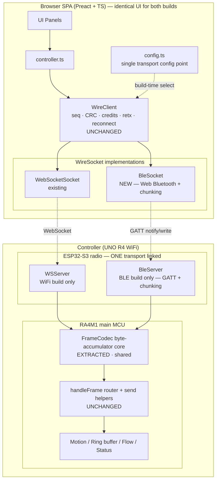
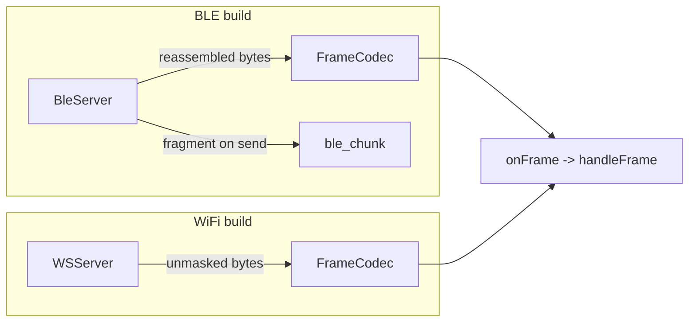
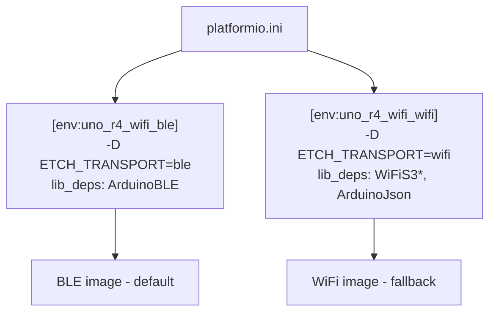

# Design Document

## Overview

This feature makes Bluetooth Low Energy (BLE) the primary browser↔Controller transport for the Etch-a-Sketch Drawing Machine, while keeping the existing WiFi (HTTP + WebSocket) transport in the tree as a **compile-time-selectable** fallback. On the Arduino UNO R4 WiFi the WiFi stack (`WiFiS3`) and BLE stack (`ArduinoBLE`) share one ESP32-S3 radio co-processor and cannot run concurrently in stock firmware, so exactly one transport is linked per image, chosen by a build flag — never at runtime.

The guiding principle is **the wire protocol does not change**. The 4-byte frame envelope (`version`/`type`/`length`/`payload`), the 16-byte `Drawing_Command` with its inner CRC-16/CCITT, the control-message layout, and every telemetry frame (`STATUS`/`STATE`/`CREDIT`/`HELLO`/`ERROR`/`PROGRESS`/`ACK`/`NACK`/`RETX_REQUEST`) stay **byte-identical** across BLE and WiFi (Req 4.2, 13.3). What changes is purely:

1. the **byte transport** that moves a complete frame between the two endpoints,
2. a thin **MTU chunking/reassembly** layer that fragments a frame into BLE-notification-sized pieces and reassembles it exactly, and
3. the **build-flag selection** (firmware) / **single config point** (browser) that picks the transport.

This means the protocol-bearing code is reused verbatim:

- **Firmware:** the framing/dispatch core inside `protocol::WSServer` (the byte accumulator that splits a stream into `Frame`s and dispatches each via `onFrame`, plus single-client enforcement) is extracted so a new `protocol::BleServer` exposes the **exact same seam** (`begin()` / `serviceLoop()` / `sendBinary()` / `onFrame()` / `isClientConnected()`). The sketch's frame router (`handleFrame`) and every send helper (`sendAck` / `sendNack` / `sendStatus` / …) are unchanged regardless of transport.
- **Browser:** `WireClient` already abstracts its socket behind the injectable `WireSocket` + `SocketFactory` interfaces. A new `BleSocket` satisfies `WireSocket` over Web Bluetooth GATT, so **all** of `WireClient`'s protocol logic — per-session sequence counter, inner CRC, credit-based flow control, bounded retransmission, 60-second reconnect window, and typed-event decoding — is reused **unchanged**.

This spec does not address drawing-output calibration/orientation (off-canvas drawing); that is a separate effort.

### Goals

- BLE as the default transport with full WiFi feature parity preserved behind a build flag (Req 1, 13).
- Identical SPA UI and identical wire bytes across both transports (Req 4, 13.3).
- Robust frame chunking/reassembly over BLE with guaranteed round-trip byte identity (Req 5).
- Reuse the existing protocol layer (`frame.*`, `WireClient`) and transport seam without behavioral change (Req 6, 7, 9, 10, 11, 12).

### Non-Goals

- Concurrent WiFi+BLE operation (hardware-precluded; Req 1.6).
- Runtime transport switching (compile-time only; Req 1.1).
- Changing any protocol byte layout (Req 13.3, 13.4).
- Drawing calibration/orientation fixes.

## Architecture

### 1. System Architecture



Exactly one of `{WSk, WSrv}` or `{BSk, BSrv}` is active in a deployed pair. The grey boxes labelled UNCHANGED carry the full protocol semantics and are identical between builds.

### 2. The Transport Seam (the heart of this design)

Both endpoints already isolate the byte transport behind a narrow seam; this feature plugs BLE into those seams instead of inventing parallel stacks.

**Firmware seam (mirrored exactly by `BleServer`):**

| Method | Contract |
|---|---|
| `begin()` | Initialise the radio transport; reset parse state. |
| `serviceLoop()` | Cooperative tick: accept/poll connection, drain inbound bytes into the framing core, detect disconnect. |
| `sendBinary(const uint8_t*, size_t)` | Transmit one complete `Frame_Envelope` to the active client. |
| `onFrame(FrameHandler)` | Register the per-frame dispatch callback. |
| `isClientConnected()` | Single-session predicate. |

**Browser seam (`WireSocket`, satisfied by `BleSocket`):**

```ts
interface WireSocket {
    binaryType: 'blob' | 'arraybuffer';
    readyState: number;
    send(data: ArrayBufferView | ArrayBufferLike): void;
    close(code?: number, reason?: string): void;
    onopen / onmessage / onerror / onclose;
}
```

`WireClient` calls `socket.send(frameBytes)` with a **complete** frame and expects `onmessage({data: ArrayBuffer})` to deliver a **complete** frame. `BleSocket` honours that contract by chunking on `send` and reassembling before firing `onmessage`. Because the contract is "complete frame in, complete frame out," `WireClient`'s entire state machine is reused with zero edits.

### 3. Firmware Module Layout

The transport-independent framing/dispatch core currently lives inside `ws_server.cpp` (`feedBytes` / `drainFrames`) and `ws_server.h` (the parse buffer + single-client logic). This design **extracts** that core into a shared, Arduino-free, host-testable unit so both servers share one implementation:

```
firmware/src/protocol/
  frame.{h,cpp}            (unchanged) envelope encode/decode/build
  frame_codec.{h,cpp}      NEW  extracted byte-accumulator + single-client core
  ws_server.{h,cpp}        REFACTORED to delegate framing to FrameCodec (WiFi build)
  ble_server.{h,cpp}       NEW  ArduinoBLE GATT transport + chunking (BLE build)
  ble_chunk.{h,cpp}        NEW  pure fragment()/reassembler — host-testable
```

`FrameCodec` owns the parse buffer, `feedBytes()`, `drainFrames()`, `onFrame()`, and single-client state (`handleNewConnection` / `closeConnection` / `buildSessionBusyFrame`). `WSServer` and `BleServer` each own only their radio plumbing and call into `FrameCodec` for byte→frame splitting and into `ble_chunk`/RFC6455 framing for the wire encoding. Extraction is behaviour-preserving: the existing host tests that drive `WSServer::ingestForTest()` continue to pass against the delegated core.



### 4. Build Architecture (Compile-Time Transport Selection)

Selection is a PlatformIO build flag `ETCH_TRANSPORT` resolved into a macro the sketch and modules switch on. Two new environments produce the two images; library dependencies are partitioned so each radio stack links only into its own image (Req 1.2, 1.3) — `ArduinoBLE` only in the BLE env, `WiFiS3`/`ArduinoJson` only in the WiFi env, avoiding linking both radios.



A central header `transport_config.h` maps the flag to a compile error on unset/unknown values (Req 1.5) and to a transport typedef the sketch uses, so the frame router and send helpers are written once.

## Components and Interfaces

### 3.1 Firmware: `FrameCodec` (extracted shared core)

Header is Arduino-include-free (compiles under `platform = native`). Carries the existing parse-buffer behaviour verbatim.

```cpp
namespace etch { namespace protocol {

inline constexpr std::size_t PARSE_BUFFER_CAPACITY = 256;  // unchanged from WS

class FrameCodec {
 public:
  using FrameHandler = std::function<void(const Frame&)>;
  void onFrame(FrameHandler h);

  // Append raw bytes; dispatch every complete §4.5 frame; compact remainder.
  // Identical algorithm to the current WSServer::feedBytes/drainFrames:
  // version-byte resync, oversize-frame desync, canonical decodeFrameHeader.
  void feedBytes(const std::uint8_t* bytes, std::size_t n);

  // Single-client enforcement (moved verbatim from WSServer).
  bool isClientConnected() const;
  bool handleNewConnection(std::uint8_t* rejectOut, std::size_t cap, std::size_t* len);
  void closeConnection();
  static std::size_t buildSessionBusyFrame(std::uint8_t* out, std::size_t cap);

  void ingestForTest(const std::uint8_t* bytes, std::size_t n) { feedBytes(bytes, n); }
 private:
  void drainFrames();
  FrameHandler handler_{};
  std::uint8_t buf_[PARSE_BUFFER_CAPACITY] = {0};
  std::size_t  buf_len_ = 0;
  bool client_connected_ = false;
};

}}  // namespace
```

### 3.2 Firmware: `BleServer` (new, BLE build)

`firmware/src/protocol/ble_server.{h,cpp}`. Mirrors the `WSServer` seam exactly so the sketch is transport-agnostic. Uses `ArduinoBLE`. The header is Arduino-free in the same style as `ws_server.h`; all `ArduinoBLE` includes live behind `#if defined(ARDUINO)` in the `.cpp`, with the chunking core and `FrameCodec` exercised on the host.

```cpp
class BleServer {
 public:
  using FrameHandler = std::function<void(const Frame&)>;
  void begin();                                            // start GATT + advertise
  void serviceLoop();                                      // BLE.poll(); drain RX; detect disconnect; readback RSSI
  void sendBinary(const std::uint8_t* data, std::size_t len);  // fragment -> notify on TX char
  void onFrame(FrameHandler h) { codec_.onFrame(std::move(h)); }
  bool isClientConnected() const { return codec_.isClientConnected(); }
  int  lastRssiDbm() const;                                // BLEDevice::rssi() snapshot for STATUS (Req 9.4)
 private:
  FrameCodec   codec_;
  Reassembler  rx_;     // inbound chunk -> frame (ble_chunk.h)
  // ArduinoBLE objects (service, rxChar, txChar) behind ARDUINO guard in .cpp
};
```

**Inbound path:** ArduinoBLE write-handler on the RX characteristic appends each received chunk to `rx_` (the reassembler). When a frame completes, the exact `Frame_Envelope` bytes are passed to `codec_.feedBytes(...)`, which dispatches via the **same** `onFrame` handler the WiFi build uses. On incomplete/out-of-order-beyond-recovery, `rx_` drops the partial frame and `BleServer` emits an `ERROR` (transmit-error) so the SPA retransmits (Req 5.5).

**Outbound path:** `sendBinary(frame)` runs `fragment(frame, mtuPayload)` and writes each chunk as a notification on the TX characteristic.

**Single client (Req 2.4, 3.4, 3.5, 3.7):** ArduinoBLE accepts one central connection. On `BLE.central()` connect, `codec_.handleNewConnection(...)` adopts the session; advertising is stopped while connected (Req 2.4) and resumed on disconnect within 5 s (Req 2.5). A second central cannot connect while one is active because advertising is suppressed; if the stack surfaces a concurrent attempt, it is rejected, preserving the active session (Req 3.5, 3.7).

### 3.3 Firmware: GATT Service & Characteristics

A single bidirectional pipe carries the existing framed byte stream, so `FrameCodec` (the frame router) is reused verbatim. Fixed, randomly-generated 128-bit UUIDs:

| Element | UUID | Properties | Direction |
|---|---|---|---|
| `GATT_Service` (Etch-a-Sketch wire) | `6b1d0001-5f8e-4b3a-9c2d-1e7a4f8b2c10` | — | advertised |
| RX characteristic (frames in) | `6b1d0002-5f8e-4b3a-9c2d-1e7a4f8b2c10` | Write, WriteWithoutResponse | browser → controller |
| TX characteristic (frames out) | `6b1d0003-5f8e-4b3a-9c2d-1e7a4f8b2c10` | Notify | controller → browser |

Advertised device name: `EtchASketch` (human-readable, Req 2.2), with the 128-bit service UUID in the advertisement so a Web Bluetooth `requestDevice({filters:[{services:[SERVICE_UUID]}]})` lists it (Req 2.1, 2.3).

**Design decision — one RX / one TX vs per-message-type characteristics.** We choose the single bidirectional pipe (one RX, one TX) over per-type characteristics. Rationale: (a) the existing `Frame_Envelope` already self-describes type and length, so the on-device frame router and the browser `WireClient` dispatcher work unchanged; (b) per-type characteristics would duplicate routing logic, multiply MTU-chunking state machines, and risk interleaving/ordering hazards across characteristics; (c) one TX-notify pipe preserves global frame ordering, which the credit/ACK/RETX protocol assumes. The single pipe reuses the most code and keeps both transports byte-identical.

### 3.4 Browser: `BleSocket` (new, `WireSocket` adapter)

`web/src/net/ble_socket.ts`. Presents the `WireSocket` surface over Web Bluetooth so `WireClient` is reused unchanged. Dependencies (the GATT device/characteristics) are injectable so it is unit-testable with a fake characteristic, mirroring how `WireClient` is tested with a fake socket.

```ts
export interface BleGattDeps {
    requestDevice(): Promise<BleDeviceLike>;     // wraps navigator.bluetooth.requestDevice(filter)
}

export class BleSocket implements WireSocket {
    binaryType: 'blob' | 'arraybuffer' = 'arraybuffer';
    readyState = 0; // CONNECTING -> OPEN(1) -> CLOSING -> CLOSED
    onopen / onmessage / onerror / onclose;

    send(data: ArrayBufferView | ArrayBufferLike): void; // fragment frame -> writeWithoutResponse(RX)
    close(): void;                                        // GATT disconnect
    // internal: startNotifications(TX); on notification -> reassemble -> onmessage({data: ArrayBuffer})
}
```

**Connect flow (Req 3.1, 3.2):** `requestDevice` with the service-UUID filter → `gatt.connect()` → `getPrimaryService(SERVICE_UUID)` → `getCharacteristic(RX/TX)` → `txChar.startNotifications()` and subscribe `characteristicvaluechanged` → set `readyState=OPEN`, fire `onopen`. The Controller then sends `HELLO` over TX, decoded by the unchanged `WireClient.onHello`.

**Send:** `fragment(frameBytes, negotiatedMtuPayload)` → `rxChar.writeValueWithoutResponse(chunk)` per chunk (Req 5.1, 5.2, 5.4 — streaming, incremental).

**Receive:** each TX notification is a chunk; the reassembler yields complete frames and fires `onmessage({data: ArrayBuffer})` with the exact `Frame_Envelope` bytes (Req 5.3). Unrecoverable reassembly failure surfaces as an `onerror` so `WireClient` treats it as a transmit fault (Req 5.5).

**Error distinction (Req 3.6):** a failure during `requestDevice`/service/characteristic discovery rejects connect as a *discovery* error; a drop after open routes through `onclose` as a *disconnect*, which `WireClient` maps to its reconnect window.

### 3.5 Browser: Transport Selection (single config point)

`web/src/app/config.ts` gains a single build-time switch. The active transport is chosen by a Vite define / env constant (e.g. `ESK_TRANSPORT = 'ble' | 'websocket'`), resolved once and handed to `WireClient` as the `SocketFactory` (Req 4.4):

```ts
export const TRANSPORT: 'ble' | 'websocket' = (import.meta.env.VITE_ESK_TRANSPORT ?? 'ble');

export function makeSocketFactory(): SocketFactory {
    if (TRANSPORT === 'ble') {
        if (!('bluetooth' in navigator)) {
            throw new TransportUnavailableError(
                'ble',
                'Bluetooth requires Chrome or Edge. Use the WiFi build for Safari/Firefox.',
            ); // Req 4.5
        }
        return (_url) => new BleSocket(defaultBleDeps());
    }
    return (url) => new WebSocket(url) as unknown as WireSocket;
}
```

If the configured transport is unavailable at runtime, the layer fails with a clear error naming the unavailable transport and does **not** silently fall back to the other transport (Req 4.6). Missing `navigator.bluetooth` reports Chrome/Edge guidance and names the WiFi build as the alternative (Req 4.5). The UI renders identically regardless of transport because only the `SocketFactory` differs (Req 4.3, 3.x parity).

### 3.6 MTU Chunking / Reassembly (`ble_chunk` / browser reassembler)

This is the riskiest component (Req 5). BLE ATT MTU defaults to 23 bytes (20 usable after the 3-byte ATT header), negotiable to ~185–512. A `CMD` frame is `4 + 16 = 20` bytes, which fits in the default MTU's 20-byte usable payload; but `HELLO`/`STATUS` and any future larger frames can exceed one notification. We therefore **always** chunk (even when a frame fits) for a uniform, robust path, and we request a larger MTU/connection interval to sustain throughput (Req 8.4).

**Chunk wire format.** Each chunk = 1-byte header + body. The header is a `(index, total)` micro-header so reassembly detects completeness and ordering without ambiguity:

```
Chunk:
  Offset Size Field   Notes
  0      1    hdr     bits[7:4] = total_chunks (1..15), bits[3:0] = chunk_index (0..total-1)
  1      N    body    slice of the Frame_Envelope bytes

Reassembly target = concatenation of bodies in index order == original Frame_Envelope.
```

A 4/4-bit split supports up to 15 chunks per frame. With a negotiated MTU giving even ~100-byte bodies, 15 chunks cover 1500 bytes — well beyond any current frame (`HELLO` ≈ 29-byte payload + 4 = 33 bytes; `STATUS` = 20 bytes). The largest theoretical frame (`4 + 65535`) is not produced by this protocol; the reassembler rejects any frame requiring `total > 15` as unrecoverable (Req 5.5), and the firmware/browser never emit such frames. (If larger frames are ever introduced, the header widens to a 2-byte `(u8 index, u8 total)` form; documented here as the extension path.)

**Round-trip guarantee (Req 5.3):** `reassemble(fragment(frame, body)) == frame` for every frame `frame` with `len ≤ 15 * body` and every `body ≥ 1`. `fragment` slices the frame into `ceil(len/body)` ordered pieces; `reassemble` concatenates bodies in `index` order and emits when `received == total`.

**Failure detection (Req 5.5):** the reassembler tracks `total` and a bitmask of received indices for the in-flight frame. It signals unrecoverable error and discards the partial frame when: a chunk arrives with a different `total` than the in-flight frame, a duplicate index arrives, an index `≥ total` arrives, or `total > 15`. On any of these the partial frame is dropped and a transmit error is signalled upstream.

```mermaid
sequenceDiagram
    participant WC as WireClient.send(frame)
    participant BS as BleSocket
    participant RX as RX char (write)
    participant FW as BleServer / Reassembler
    participant FC as FrameCodec.onFrame
    WC->>BS: send(frameBytes)
    BS->>BS: fragment(frame, mtuBody)
    loop each chunk (index,total)
        BS->>RX: writeValueWithoutResponse(chunk)
        RX->>FW: onWrite(chunk)
        FW->>FW: reassemble; validate (index,total)
    end
    alt complete & valid
        FW->>FC: feedBytes(frame)  %% identical to WiFi path
    else incomplete/out-of-order
        FW-->>BS: ERROR (transmit) -> retransmit (Req 5.5)
    end
```

### 3.7 Sketch Wiring (transport-agnostic)

`transport_config.h` resolves the build flag and a transport typedef; the sketch constructs the selected server but keeps `handleFrame` and the send helpers identical (Req 1.2, 1.3, 1.6):

```cpp
// transport_config.h
#if !defined(ETCH_TRANSPORT)
#  error "ETCH_TRANSPORT unset. Set -D ETCH_TRANSPORT=ble or =wifi."   // Req 1.5
#elif ETCH_TRANSPORT == ETCH_TRANSPORT_BLE
#  include "protocol/ble_server.h"
namespace app { using Transport = etch::protocol::BleServer; }
#elif ETCH_TRANSPORT == ETCH_TRANSPORT_WIFI
#  include "protocol/ws_server.h"
namespace app { using Transport = etch::protocol::WSServer; }
#else
#  error "ETCH_TRANSPORT invalid. Valid options: ble, wifi."           // Req 1.5
#endif
```

```cpp
// etchasketch.ino  (unchanged router + helpers)
app::Transport g_transport;                 // was: protocol::WSServer g_ws;
void sendFrame(FrameType t, const uint8_t* p, uint16_t n) {
    uint8_t f[FRAME_HEADER_SIZE + 64];
    const size_t m = buildFrame(t, p, n, f, sizeof(f));
    if (m > 0) g_transport.sendBinary(f, m);   // identical helper bodies
}
// setup(): g_transport.begin(); g_transport.onFrame(handleFrame);
// loop():  g_transport.serviceLoop(); ... g_transport.isClientConnected();
```

In the BLE build, WiFi managers (`g_wifi`, `g_http`, `g_ws`) are excluded from compilation behind the same flag, so WiFi is never initialised at runtime (Req 1.6, 2). The complete WiFi source remains in the tree (Req 1.4, 13.1).

### 3.8 Telemetry: RSSI Mapping (Req 9.4)

Web Bluetooth does **not** expose connection RSSI to the page. RSSI is therefore read on the **Controller** side via ArduinoBLE `BLEDevice::rssi()` during `serviceLoop()` and placed into the existing `STATUS` frame's `Signal_Strength` field (offset 9, `i8` dBm — see Data Models). Because the byte layout is unchanged, the browser's existing `WireClient.onStatus` decode and the `rssi` event are reused with no edits; the SPA's RSSI read-out works identically (Req 9.1–9.6). This is the only telemetry-source difference between transports and is fully contained in `BleServer`.

### 3.9 Disconnect / Reconnect (Req 12)

The browser side is already implemented by `WireClient`'s reconnect state machine (60-second window, `reconnecting` status, fail-all-pending on timeout). `BleSocket` maps GATT events onto the `WireSocket` lifecycle so that machine runs unchanged:

- GATT `gattserverdisconnected` → `BleSocket.onclose` → `WireClient` enters `reconnecting` (Req 12.5).
- Reconnect attempts re-`gatt.connect()` to the **same** `BluetoothDevice` (retained reference; no new chooser prompt) within the window (Req 12.5).
- On the Controller, a BLE drop while drawing pauses motion and retains position + `Command_Ring_Buffer` (Req 12.1); advertising resumes within 5 s (Req 2.5); within the 60 s window a reconnecting client gets a fresh `HELLO` carrying paused state, last-acked seq, and position so the SPA resumes (Req 12.3). If the window expires, the Controller aborts, retains last position, and reports a `CONN_TIMEOUT` `ERROR` on next connect (Req 12.4).

```mermaid
sequenceDiagram
    participant SPA
    participant BLE as BLE link
    participant CTRL as Controller
    Note over CTRL: drawing in progress
    BLE--xCTRL: link drops
    CTRL->>CTRL: pause motion; retain position + ring buffer (12.1)
    CTRL->>CTRL: resume advertising within 5s (2.5)
    SPA->>SPA: WireClient -> reconnecting (12.5)
    alt reconnect within 60s
        SPA->>CTRL: gatt.connect(same device) + discover + notify
        CTRL->>SPA: HELLO {paused, lastAckSeq, position} (12.3)
        SPA->>CTRL: resume stream
    else window expires
        CTRL->>CTRL: abort, retain last position (12.4)
        CTRL-->>SPA: CONN_TIMEOUT ERROR on next connect (12.4)
    end
```

## Data Models

### 4.1 Frame Envelope (unchanged — shared by both transports)

```
Offset Size Field    Notes
0      1    version  0x01
1      1    type     FrameType code (CMD=0x01 … PROGRESS=0x32)
2      2    length   u16 LE, payload length
4      var  payload  per-type
```
`FRAME_HEADER_SIZE = 4`, max payload `0xFFFF`. Type codes are wire-stable and shared (`frame.h` / `frame.ts`): CMD 0x01, CTL 0x02, ACK 0x10, NACK 0x11, RETX_REQUEST 0x12, STATUS 0x20, CREDIT 0x21, HELLO 0x22, STATE 0x30, ERROR 0x31, PROGRESS 0x32. **Not modified by this feature** (Req 13.3, 13.4).

### 4.2 Drawing_Command (unchanged)

Fixed 16-byte LE payload: `seq u32, dx i16, dy i16, feed_sps u16, flags u16, reserved u16, crc16 u16`. Inner CRC-16/CCITT covers the 16-byte command independent of the envelope, so it survives chunking unchanged (Req 6.1).

### 4.3 BLE Chunk (new — transport-internal, never crosses into the protocol layer)

```
Offset Size Field  Notes
0      1    hdr    bits[7:4]=total_chunks(1..15), bits[3:0]=chunk_index(0..total-1)
1      N    body   slice of Frame_Envelope; N <= negotiatedMtu - 3 (ATT) - 1 (hdr)
```
Reassembled body concatenation (index order) == original `Frame_Envelope`. This header exists **only** between `BleSocket` and `BleServer`; once reassembled, the bytes handed to `WireClient`/`FrameCodec` contain no chunk metadata (Req 5.3).

### 4.4 STATUS frame (unchanged layout; BLE fills Signal_Strength from BLEDevice::rssi)

Per existing §4.7: logical X/Y (i32 LE), pct complete (u8), `Signal_Strength` (i8 dBm @ offset 9), active speed, state code (u8 @ offset 12), flags (u8 @ offset 13). BLE build populates offset 9 with the controller-read RSSI (Req 9.3, 9.4).

### 4.5 GATT UUIDs (new — fixed constants)

| Constant | Value |
|---|---|
| `ESK_BLE_SERVICE_UUID` | `6b1d0001-5f8e-4b3a-9c2d-1e7a4f8b2c10` |
| `ESK_BLE_RX_CHAR_UUID` | `6b1d0002-5f8e-4b3a-9c2d-1e7a4f8b2c10` |
| `ESK_BLE_TX_CHAR_UUID` | `6b1d0003-5f8e-4b3a-9c2d-1e7a4f8b2c10` |
| Advertised name | `EtchASketch` |

Defined once in firmware (`ble_server.h`) and browser (`ble_socket.ts` / `config.ts`) and kept in sync.

## Correctness Properties

*A property is a characteristic or behavior that should hold true across all valid executions of a system — essentially, a formal statement about what the system should do. Properties serve as the bridge between human-readable specifications and machine-verifiable correctness guarantees.*

These properties target the genuinely input-varying logic introduced or relied upon by this feature: the MTU chunking/reassembly core, the transport seam's single-session enforcement, and the (reused, transport-independent) flow-control, retransmission, validation, and reconnect logic. The byte transport itself (real ArduinoBLE/Web Bluetooth radio behavior, advertising, cadence, throughput) is verified by integration/HIL tests, not properties (see Testing Strategy).

### Property 1: Chunking round-trip byte identity

*For any* `Frame_Envelope` byte sequence `frame` (`4 ≤ frame.length ≤ 15 × body`) and *any* chunk body size `body ≥ 1`, `reassemble(fragment(frame, body))` produces a byte sequence identical to `frame`. As corollaries, a `CMD` frame delivers its exact 16-byte `Drawing_Command` payload and a `CTL` frame delivers its exact control payload to the protocol layer, byte-for-byte, regardless of the negotiated MTU; and because the bytes are identical, the layouts are identical across the BLE and WiFi builds.

**Validates: Requirements 4.2, 5.1, 5.2, 5.3, 10.1, 13.3**

### Property 2: Chunk reassembly rejects malformed sequences

*For any* sequence of chunks that is incomplete, contains a duplicate index, contains an index `≥ total`, presents an inconsistent `total` across chunks of one in-flight frame, or requires `total > 15`, the reassembler discards the partial frame and signals a transmit error, and never emits a frame to the protocol layer for that sequence.

**Validates: Requirements 5.5**

### Property 3: Single BLE session invariant

*For any* sequence of connect, reject, and disconnect events, at most one client session is active at any time: a connection attempt while a session is active is rejected (and the active session is preserved), and a session becomes available again only after the active client disconnects.

**Validates: Requirements 3.4, 3.5, 3.7**

### Property 4: Bounded retransmission

*For any* sequence of `RETX_REQUEST`s for an outstanding command, the client retransmits that command at most `MAX_RETRANSMISSIONS` additional times (three total attempts counting the original), after which it reports exactly one unrecoverable transmit error and stops retransmitting the command.

**Validates: Requirements 6.5, 11.4**

### Property 5: Flow-control credit gating

*For any* sequence of command sends and `CREDIT` grants, the number of unacknowledged commands in flight never exceeds the credits granted, and while the client holds zero credits no further command is transmitted; while it holds at least one credit a pending command is permitted to send.

**Validates: Requirements 7.2, 7.4, 7.6**

### Property 6: Credit hysteresis around the buffer water marks

*For any* `Command_Ring_Buffer` occupancy trajectory, while occupancy is at or above the high-water mark (28) the controller withholds `CREDIT` increments until occupancy drains to the low-water mark (16) or below.

**Validates: Requirements 7.3**

### Property 7: Range-checked control fields are rejected, never clamped

*For any* control message whose range-checked field is outside its defined range (`speedPct` ∉ 25..100, jog step count or backlash value out of range), the controller rejects the message with a `NACK` identifying the out-of-range field and does not clamp or apply the value.

**Validates: Requirements 10.10, 10.11**

### Property 8: CRC failure short-circuits range validation

*For any* `Drawing_Command` that fails CRC validation (regardless of its field values), the controller requests a `RETX` for that command and emits no range `NACK` for it — a CRC-invalid command never produces both a RETX and a range NACK.

**Validates: Requirements 6.7**

### Property 9: One ERROR frame per distinct simultaneous fault

*For any* set of distinct faults detected simultaneously, the controller emits one separate `ERROR` frame per distinct fault type and never combines multiple fault types into a single `ERROR` frame.

**Validates: Requirements 11.5**

### Property 10: Reconnect-window acceptance

*For any* reconnection attempt occurring at time `t` after a drop, the attempt is accepted into the resume path if and only if `t` is within the 60-second reconnect window; once the window elapses the session is failed (all pending commands rejected) and a connection-timeout error is produced.

**Validates: Requirements 12.2, 12.4**

### Property 11: CRC validity is preserved across transport and detects tampering

*For any* `Drawing_Command`, encoding it, transporting it through chunking/reassembly, and decoding it preserves its CRC validity (a valid command stays valid → `ACK`), while any mutation of the 16-byte command body causes CRC validation to fail → `RETX`.

**Validates: Requirements 6.1, 6.3**

## Error Handling

Errors are handled in three layers — the BLE byte transport (chunking), the shared protocol/validation layer, and the browser connection layer — each with a defined detection point, recovery, and user-visible surface. The protocol/validation layer and its surfaces are **unchanged** from the WiFi design; only the transport-layer rows are new.

### 6.1 BLE transport / chunking errors (new)

| Condition | Detection | Recovery | User-visible surface | Req |
|---|---|---|---|---|
| Incomplete chunk set (missing index) | Reassembler `received < total` when a new-frame chunk starts | Discard partial frame; signal transmit error → SPA retransmits | Transient; surfaces only if retx exhausts | 5.5 |
| Out-of-order beyond recovery / duplicate / inconsistent total / index ≥ total / total > 15 | Reassembler validation | Discard partial frame; signal transmit error | As above | 5.5 |
| GATT discovery failure (service/char/notify) | `requestDevice`/`getCharacteristic`/`startNotifications` throws before open | Reject `connect()` as a discovery error (distinct from disconnect) | "Could not connect to the machine (discovery failed)" | 3.6 |
| Post-open GATT disconnect | `gattserverdisconnected` event | `WireClient` enters `reconnecting`; reconnect same device within window | "Reconnecting…" | 12.5 |
| Web Bluetooth unavailable | `'bluetooth' in navigator` is false | Throw `TransportUnavailableError`; no fallback | "BLE requires Chrome or Edge. Use the WiFi build for Safari/Firefox." | 4.5, 4.6 |

### 6.2 Reused protocol/motion error handling (unchanged)

CRC failures (→ `RETX`), buffer-full (→ `NACK` buffer-full), range-invalid control (→ `NACK` field), motor stall/fault (→ `ERROR`), unrecoverable transmit after exhausted retransmissions (→ `ERROR` + client report), and connection-timeout after the 60-second window (→ `CONN_TIMEOUT` `ERROR`) all behave exactly as in the WiFi design (base spec §6) — the same code paths run because the frame router and `WireClient` are shared. The session-busy rejection (`ERROR` kind `0x06`) is reused for the single-session rule (Req 3.5, 3.7).

### 6.3 Failure boundaries

The chunk layer is the only new failure boundary. It is strictly additive and **fails closed**: a frame is delivered to the protocol layer only when it is fully and consistently reassembled (Property 1, 2). A corrupt or partial reassembly never reaches the protocol layer; it is discarded and surfaced as a transmit error, which the existing retransmission machinery already knows how to handle. The chunk header carries no protocol semantics, so a chunk-layer bug can at worst drop or delay a frame (triggering retx) — it cannot forge a valid protocol frame.

## Testing Strategy

The strategy is a dual approach: property-based tests for the universal invariants above, plus example-based unit tests, integration tests, and hardware-in-the-loop (HIL) tests for the parts that depend on real radios or specific scenarios. The bias is to make as much logic as possible **pure and host-testable**, exactly as the existing `frame.*` core and `WireClient` already are.

### 7.1 Property-based tests

Use the repository's existing PBT stacks — **rapidcheck + Catch2** on firmware (`pio test -e host_test`) and **fast-check + Vitest** on web. Minimum **100 iterations** per property. Each test is tagged with a comment referencing its design property in the form **Feature: ble-transport-switch, Property {n}: {property text}**.

| Property | Where | Notes |
|---|---|---|
| 1 Round-trip identity | firmware `ble_chunk` (rapidcheck) + web reassembler (fast-check) | Generate arbitrary frames (incl. min 4-byte and large `HELLO`/`STATUS`) × arbitrary body sizes. The pure `fragment`/`reassemble` core is shared-spec across both languages. |
| 2 Chunk error detection | firmware + web | Generate malformed chunk sequences (drop/dup/reorder/wrong-total/oversize); assert discard + error, never emit. |
| 3 Single-session invariant | firmware `FrameCodec` (rapidcheck) | Reuses/extends the existing `WSServer` single-client host tests against the extracted core. |
| 4 Bounded retransmission | web `WireClient` (fast-check) | Existing transport-independent logic; drive arbitrary RETX sequences with a fake socket. |
| 5 Flow-control gating | web `WireClient` | Arbitrary send/CREDIT interleavings; in-flight ≤ credits. |
| 6 Credit hysteresis | firmware `FlowController` | Arbitrary occupancy trajectories around 28/16. |
| 7 Range-validation no-clamp | firmware command/control validator | Arbitrary out-of-range control fields. |
| 8 CRC short-circuit | firmware validator | Arbitrary CRC-invalid commands with arbitrary field values. |
| 9 One ERROR per fault | firmware error path | Arbitrary fault-set subsets. |
| 10 Reconnect window | web `WireClient` (fake clock) | Arbitrary attempt times around 60 s. |
| 11 CRC preservation/tamper | shared command codec through chunk round-trip | Valid stays valid; any body mutation fails CRC. |

The pure chunking core is implemented **once per language** (firmware `ble_chunk.{h,cpp}`, web reassembler in `ble_socket.ts` or a sibling pure module) and is the primary PBT surface. PBT is **not** applied to the radio transport, advertising, throughput, or telemetry cadence (those are integration/HIL).

### 7.2 Unit / example tests

- `BleSocket` with a **fake GATT characteristic** (injected `BleGattDeps`), mirroring how `WireClient` is tested with a fake socket: assert connect ordering (discover → `startNotifications` → `onopen`), `send` fragments and calls `writeValueWithoutResponse` per chunk, inbound notifications reassemble and fire `onmessage({data})`, discovery-failure vs post-open-disconnect distinction (3.6), and reconnect-to-same-device on drop (12.5).
- `makeSocketFactory` config branches (4.4), Web-Bluetooth-unavailable guidance and no-silent-fallback (4.5, 4.6).
- Per-control-kind encode/deliver examples (10.2–10.8), ACK/NACK semantics (10.9), STATUS/STATE/PROGRESS field decode (9.3, 9.5, 9.6), HELLO-on-connect (3.3), initial 32 credits (7.1), buffer-full NACK (7.5), starvation pause+report (8.3), disconnect-during-draw retain (12.1), reconnect HELLO resume fields (12.3), window-expiry abort (12.4).
- RSSI placement: unit-assert the controller writes `BLEDevice::rssi()` into STATUS offset 9 (9.4 logic half).

### 7.3 Build / smoke tests (transport selection)

- Build both new envs: `uno_r4_wifi_ble` and `uno_r4_wifi_wifi`. Assert the BLE image links `ArduinoBLE` and excludes WiFi networking symbols, and vice versa (Req 1.2, 1.3, 1.6).
- Negative build: `ETCH_TRANSPORT` unset and set to a bogus value each fail with the documented diagnostic listing valid options (Req 1.5).
- Source-presence check: complete WiFi transport remains in the tree regardless of flag (Req 1.4); WiFi build retains STA/AP/HTTP/WS (Req 13.1, 13.5); single shared `frame.*` module (no per-transport fork) (Req 13.4).
- Type/compile check: `BleSocket implements WireSocket` and `BleServer` satisfies the transport seam (Req 4.1).

### 7.4 Integration / HIL tests (real BLE, cannot be unit-tested)

Run against a real UNO R4 WiFi flashed with the BLE image and a Chromium browser:

- Advertising with service UUID + name `EtchASketch`, discoverable via `requestDevice` filter (Req 2.1, 2.2, 2.3).
- Not connectable while a central is connected; re-advertise within 5 s of disconnect (Req 2.4, 2.5).
- End-to-end connect → HELLO → stream a drawing → telemetry, confirming byte-identity with the WiFi build (Req 3.1, 3.2, 4.2).
- Throughput: sustain command delivery ≥ motor feed rate for 100–1000 sps without starvation; confirm negotiated MTU and connection interval (Req 8.1, 8.2, 8.4).
- STATUS cadence ≥ 1 Hz drawing / ≥ 0.2 Hz idle; RSSI reflects link RSSI (Req 9.1, 9.2, 9.4).
- Mid-draw disconnect/reconnect within 60 s resumes; window-expiry aborts with `CONN_TIMEOUT` on next connect (Req 12).

### 7.5 Regression

The existing WiFi host tests and `WireClient` tests must continue to pass unchanged after the `FrameCodec` extraction and the `WireSocket`/`SocketFactory` wiring, demonstrating the protocol layer is reused without behavioral change (Req 13.1, 13.2, 13.3).
