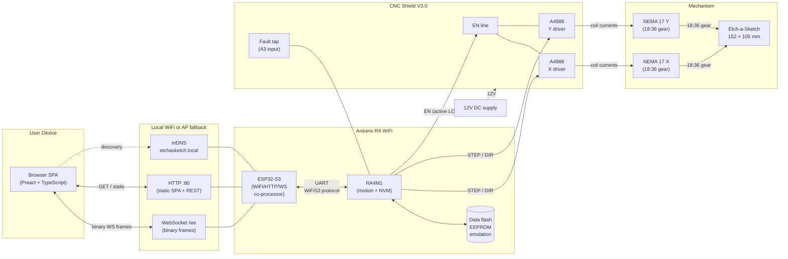
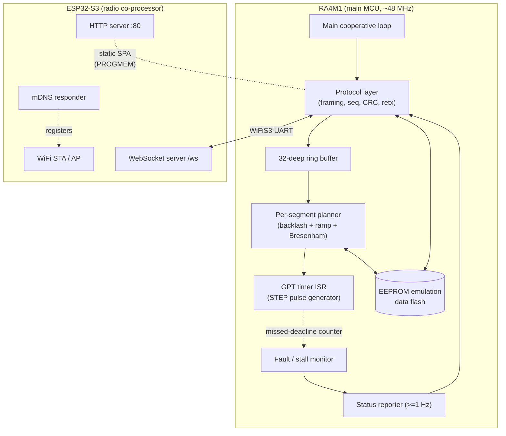
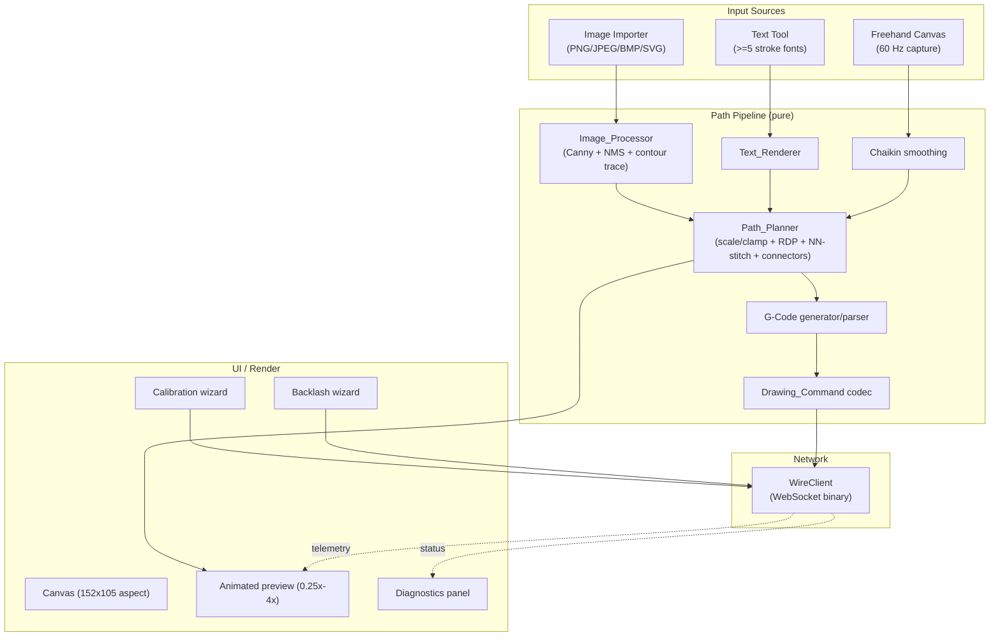
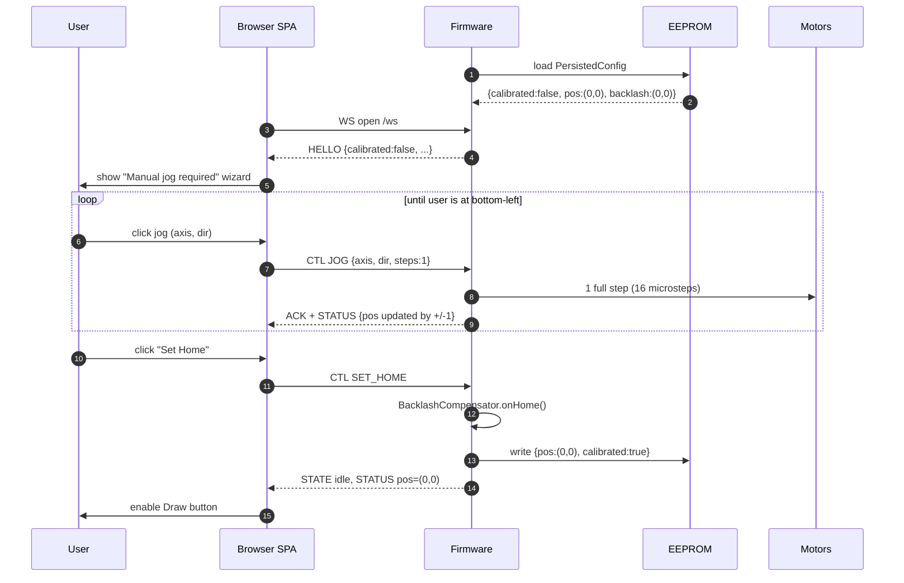
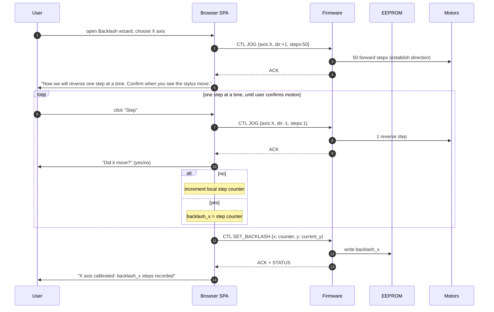
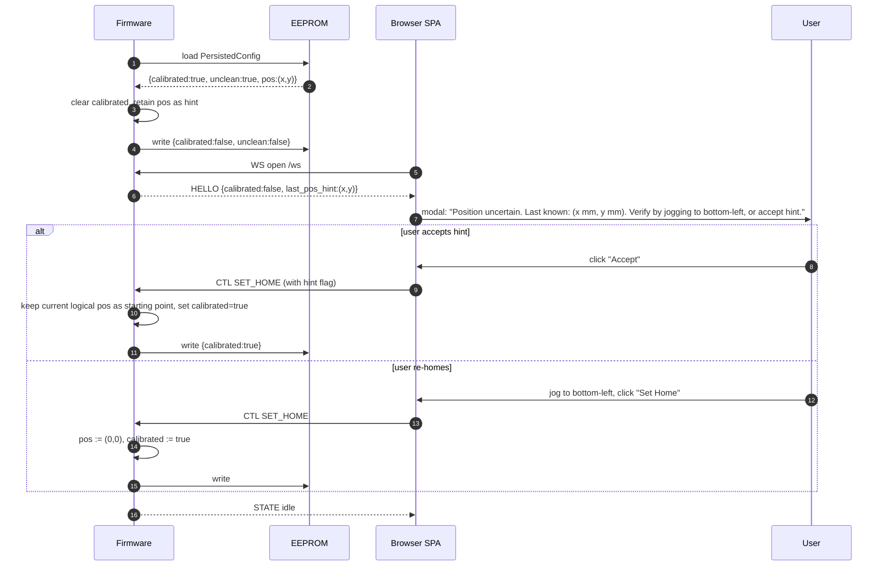
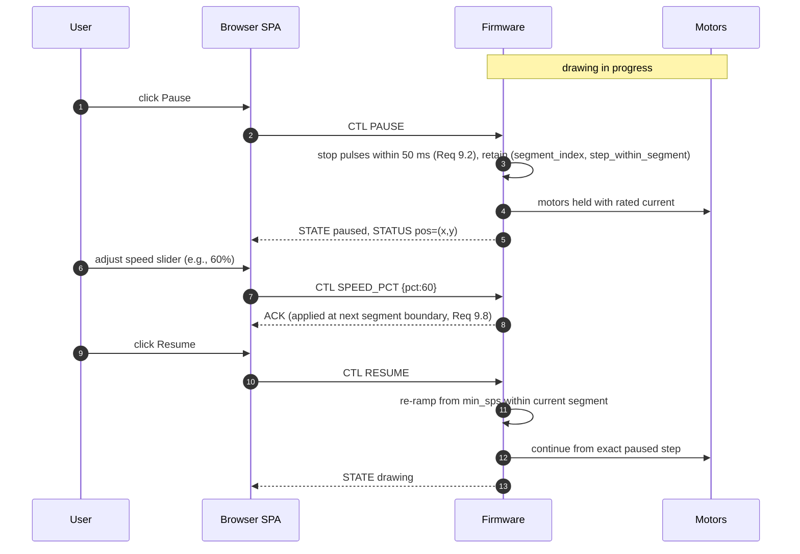

# Design Document

## Overview

The Etch-a-Sketch Drawing Machine turns a stock Etch-a-Sketch into a two-axis CNC plotter. An Arduino R4 WiFi (Renesas RA4M1 main MCU + ESP32-S3 radio co-processor) drives two NEMA 17 stepper motors through A4988 drivers seated on a CNC Shield V3.0. Each motor turns an Etch-a-Sketch knob through an 18:36 pinion-on-knob gear pair (motor rotates twice per knob revolution). A browser SPA, hosted from the Controller's flash, lets users import images, type text, or freehand-draw, generates a single continuous stroke path, and streams it over WebSocket to the Controller for execution.

Two physical realities shape every part of this design:

1. **The stylus cannot be lifted.** Every motion produces a visible line, so the path pipeline must linearize multi-contour input into one continuous stroke and visibly preview the unavoidable connector segments before commit (Req 14).
2. **The mechanism has measurable backlash.** Gear lash plus play in the Etch-a-Sketch knobs means the stylus stalls for some integer number of motor steps after each direction reversal. The system measures backlash per axis through a wizard, persists it in non-volatile memory, and silently injects compensation steps in firmware on every reversal — without ever counting those steps against the logical position relative to home (Req 13).

The system is split cleanly along workload lines. The browser owns everything pixel-shaped (image processing, text shaping, freehand input, RDP simplification, nearest-neighbor connector planning, G-code generation, animated preview, calibration and backlash wizards, WebSocket client). The firmware owns everything motion-shaped (WiFi/AP/HTTP/WebSocket/mDNS, validated command parsing with CRC, 32-deep buffer with flow control, trapezoidal-ramped Bresenham step generation through a hardware-timer ISR, backlash injection, fault and stall detection, position persistence). This split keeps the firmware small and deterministic, and lets the heavy lifting happen where memory and CPU are cheap.

The drawable area is 152 mm × 105 mm. Home is the bottom-left corner, +X is right, +Y is up. The Controller persists logical position in NVM and automatically returns to home at the end of every drawing as a connector segment. The user is only required to manually jog to the corner during first-time setup or after an unclean shutdown. Shaking the device does not move the knobs, so the stored position stays valid across erase cycles.

Connectivity is WiFi only — STA mode primary, AP mode `EtchSketch_*` fallback, mDNS hostname `etchasketch.local`. The wire protocol is binary WebSocket frames with a 32-bit sequence number and CRC-16/CCITT checksum, with up to three retransmissions per command and a 60-second reconnect window during drawing.

## Architecture

### 2.1 System Architecture



The browser is the only client. A single WebSocket session at a time is allowed; additional clients are rejected with a `session-busy` frame. The Controller hosts both the SPA over HTTP and the realtime command channel over WebSocket on the same port.

### 2.2 Hardware Architecture

**Power.** The CNC Shield V3.0 takes 12V DC from a user-supplied bench supply (≥5A recommended for two NEMA 17s at 64 oz·in holding torque). The Arduino R4 WiFi is powered separately via USB-C or the shield's onboard regulator (jumper-configurable). Logic levels on STEP/DIR/EN are 5V; the R4 WiFi's Uno-pin headers are 5V-tolerant on these pins.

**Microstepping.** All three MS1/MS2/MS3 jumpers are populated under each A4988 socket, selecting 1/16 microstepping (Req 6.2). Each motor revolution is therefore 200 × 16 = 3200 microsteps; one knob revolution is 6400 microsteps because of the 18:36 reduction. The wire-format `steps` unit is a *full motor step*; firmware multiplies by 16 internally when emitting STEP pulses.

**Gear math (canonical constants).** Every step↔mm conversion in the system derives from these:

```
motor_steps_per_rev    = 200            // 1.8°/step NEMA 17
microstep_factor       = 16             // 1/16 microstepping
gear_ratio_motor:knob  = 36 / 18 = 2    // motor turns 2× per knob turn
full_steps_per_knob_rev    = 200 * 2 = 400
microsteps_per_knob_rev    = 400 * 16 = 6400
mm_per_knob_rev_x      = MM_PER_REV_X   // calibrated; default 100.0 mm
mm_per_knob_rev_y      = MM_PER_REV_Y   // calibrated; default 100.0 mm
steps_per_mm_x         = 400 / MM_PER_REV_X
steps_per_mm_y         = 400 / MM_PER_REV_Y
```

`MM_PER_REV_X` and `MM_PER_REV_Y` are persisted in EEPROM and refined in the calibration wizard.

**Fault detection.** The A4988 has no dedicated FAULT pin, so the design uses two complementary signals:

- *Software stall detection* in the motion executor: a missed-deadline counter ≥4 within a single segment raises `Stall{axis}` (Req 12.3).
- *Aggregate driver-health input on A3* with internal pull-up. A simple in-line inrush detector or thermal sensor (e.g., a thermistor pad on each A4988) can pull A3 LOW to indicate a hardware fault. If the user does not wire any external sensor, the firmware falls back to software stall detection only and clearly labels this in the diagnostics panel.

### 2.3 Firmware Architecture

The RA4M1 main MCU runs the deterministic motion code; the ESP32-S3 acts as the WiFi/HTTP/WebSocket co-processor and is reached from the RA4M1 via the `WiFiS3` UART protocol. We do not run a preemptive RTOS — instead a single cooperative loop drives most logic, with a high-priority hardware-timer ISR handling the per-pulse stepping. This is sufficient because the step problem is deterministic and the network is offloaded to the ESP32-S3.



### 2.4 Architecture Decisions

#### 2.4.1 Browser Framework — Preact

The SPA must fit alongside the firmware in the R4's 256 KB code flash, so bundle size dominates the choice. Three options were considered:

| Option | Runtime size (gzipped) | Pros | Cons |
| --- | --- | --- | --- |
| **Preact 10 + signals** | **~4 KB** | Tiny, JSX/hooks ergonomics, drop-in for React-shaped APIs, Vite plugin available, mature ecosystem | Slight indirection vs DOM, virtual-DOM diffing cost (negligible at this scale) |
| Lit 3 | ~6 KB | Web-component standard, no build step technically required | Custom-element ceremony adds boilerplate, less convenient for canvas-heavy UI |
| Vanilla TS | 0 KB | No framework cost | Hand-rolled state and rendering for a non-trivial UI is a maintenance hazard |

**Decision: Preact + `@preact/signals` for state.** A target SPA budget of ≤120 KB gzipped (HTML + JS + CSS + 5 stroke fonts as JSON) leaves ~50 KB headroom against a 170 KB firmware image, comfortably under the 256 KB flash ceiling. Heavy CV work (Canny, NMS) lives in a lazy-loaded `opencv.js` WASM module that is fetched on demand the first time an image is imported, so it does not count against the always-resident bundle.

If the bundle ever does outgrow the on-chip flash, the SPA can be hosted externally (GitHub Pages, the user's own server) and pointed at `etchasketch.local` via a configurable URL — see §10.4.

#### 2.4.2 Firmware Stepper Library — Custom Timer ISR (not AccelStepper)

`AccelStepper` is the obvious incumbent on Arduino but does not fit our requirements:

- It does *not* provide multi-segment lookahead or buffered planning. Our 32-deep command buffer with flow control (Req 6.4, 6.5) needs to plan trapezoidal ramps across segment boundaries.
- It does *not* provide coordinated multi-axis stepping (Bresenham). It steps each motor independently, which produces staircased diagonals.
- Its `runSpeed()` is a busy-wait that does not free CPU for WebSocket I/O.
- Its acceleration model is per-instance, making cross-axis trapezoid synchronization fiddly.

**Decision: custom motion stack on top of `FspTimer` (Renesas FSP general-purpose timer wrapper bundled with the Arduino R4 core).** The motion planner runs in the main loop and fills a per-segment `StepProgram` describing pulse intervals. The GPT ISR, configured at the planner's per-tick rate, advances Bresenham state and pulses STEP pins. The ISR is short and deterministic (≈1 µs per call). This gives:

- Real-time per-axis coordination via integer Bresenham.
- Per-segment trapezoidal ramps with min 100 sps, max 1000 sps (Req 5.5, 6.3).
- Backlash sub-segments inserted before the actual segment (Req 13.6, 13.7).
- Cross-segment speed continuity when direction is preserved.

#### 2.4.3 NVM Strategy — RA4M1 EEPROM Emulation

The R4 has no LittleFS. The RA4M1 exposes its internal data flash as emulated EEPROM through the bundled `EEPROM` library, which provides 8 KB of byte-addressable, wear-leveled storage. That is enough headroom for our entire persisted state with margin.

**Decision: persist a single packed `PersistedConfig` record at offset 0**, with magic, version, all fields, and a trailing CRC-32. Field layout is in §4.4. The record is read once at boot; writes are only triggered by user actions (WiFi save, backlash calibration save, declare home, drawing-progress checkpoint). Every drawing-progress write is gated by a 250 ms minimum interval to avoid wear.

The record holds:

- WiFi creds (SSID, password)
- Backlash X, Y
- mm-per-rev calibration X, Y
- Logical position X, Y (steps from home)
- `calibrated` flag
- `unclean_shutdown` marker (cleared on graceful idle, set on any in-progress write)

#### 2.4.4 Web Asset Hosting — Embedded in RA4M1 PROGMEM, Fallback to External Host

**Primary:** The SPA bundle (HTML/JS/CSS/fonts) is gzip-compressed at build time and embedded into the firmware as a `const uint8_t[] PROGMEM` blob via `xxd -i`. The HTTP handler streams it with `Content-Encoding: gzip`. Budget: ≤120 KB. The firmware image, including this blob, must fit in 256 KB program flash.

**Fallback A (SD card on CNC Shield):** The CNC Shield V3.0 has no native SD slot, but exposes the SPI pins. If the bundle outgrows flash (e.g., once raster import ships full OpenCV.js inline), an SD breakout on D11/D12/D13 plus CS on D4 (the unused Z step pin) can host the SPA from an SD card via `SD.h`. This is documented as an upgrade path, not the default.

**Fallback B (external static hosting):** As a zero-effort escape hatch, the SPA can be deployed to GitHub Pages (or any static host). At first load the user enters the controller's address (`etchasketch.local` or the AP IP) and the page connects via WebSocket. The Controller serves only a tiny stub `index.html` redirecting to the configured external SPA URL. This eliminates the size constraint entirely at the cost of one extra hop on first connect.

The build system supports all three modes via a build flag (`SPA_HOST=embedded|sd|external`).

## Components and Interfaces

### 3.1 Web Interface Modules

The browser SPA is a thin shell of UI components plus a set of pure-function modules that make up the path pipeline. Pure modules are the property-test surface.



#### 3.1.1 `Image_Processor`

Decodes PNG/JPEG/BMP via `<canvas>` pipelines and SVG via DOM parsing. For raster inputs runs Gaussian blur → Sobel → non-maximum suppression → double-threshold + hysteresis (Canny) using a lazy-loaded `opencv.js` WASM module. For SVG, walks the DOM and converts `<path>`, `<line>`, `<polyline>`, `<polygon>`, `<rect>`, `<circle>`, `<ellipse>` into polylines via tessellation with chord error ≤ 0.5 px; unsupported elements (text, filters, gradients) are skipped with a notification listing what was skipped.

```ts
interface ImageProcessor {
  loadFile(file: File): Promise<DecodedImage>;
  toPolylines(img: DecodedImage, opts: EdgeOptions): Polyline[];
  nearestNeighborOrder(polys: Polyline[], from: Point): Polyline[];
}
interface EdgeOptions { lowerThreshold: number; upperThreshold: number; blurSigma: number; }
```

Output polylines satisfy the pixel-adjacency invariant: consecutive points differ by Chebyshev distance ≤ 1 (Req 4.6). Empty contour sets surface as a typed `NoEdgesFound` error with a "tweak threshold" CTA (Req 4.8).

#### 3.1.2 `Text_Renderer`

Holds at least five single-line stroke fonts (Hershey-derived, public domain) as JSON glyph dictionaries. Each glyph is a list of polylines in a unit-em box. Shapes a string into positioned glyph polylines respecting `fontSize` (5–100 mm) and `letterSpacing` (0–200 % of glyph width). Reports unsupported codepoints and proposes a covering font (Req 3.5).

```ts
interface TextRenderer {
  fonts(): StrokeFont[];
  render(text: string, opts: TextOptions): { polylines: Polyline[]; missing: number[]; suggestion?: string };
}
```

#### 3.1.3 `Freehand_Capture`

Samples pointer events at ≥60 Hz between `pointerdown` and `pointerup` (Req 11.2). Discards strokes with fewer than 3 points (Req 11.6). Applies two iterations of Chaikin's corner-cutting on `pointerup` (Req 11.3). Maintains an undo stack of ≥50 strokes (Req 11.4).

#### 3.1.4 `Path_Planner` (the deterministic core)

```ts
interface PathPlanner {
  plan(input: PathInput, opts: PlanOptions): PlannedPath;
  toGCode(path: PlannedPath): GCodeProgram;
  fromGCode(prog: GCodeProgram): PlannedPath;
  toCommands(path: PlannedPath, home: { x: number; y: number }): DrawingCommand[];
  estimateMillis(path: PlannedPath, feedSps: number): number;
}
```

Plans in this order:

1. **Scale and clamp.** Convert input polylines into millimetres in the 152 × 105 mm drawable area, clamping any out-of-bounds points to the boundary (Req 5.2, Req 8.6 highlights pre-clamp violations).
2. **Step conversion.** Map mm → integer full motor steps using `steps_per_mm_axis = 400 / mm_per_rev_axis`.
3. **Simplify.** Run Ramer–Douglas–Peucker with user tolerance ε ∈ [0.1, 5.0] steps (Req 5.4).
4. **Stitch.** Order polylines using nearest-neighbor with per-polyline endpoint flipping, starting from the current home offset; insert straight-line `connector` segments between successive polylines so the result is a single continuous stroke (Req 4.7, 14.1, 14.2, 14.3).
5. **Auto-return.** Append a final `connector` segment from the last point to home (0, 0) (Req 10.7, 14.7).
6. **Emit G-Code.** `G1 X<steps> Y<steps> F<sps>` lines, with `M3` / `M5` markers around connector runs.
7. **Emit Drawing_Commands.** Convert each G1 to one or more `Drawing_Command` records sized to the wire delta limit; attach sequence numbers and CRC.

#### 3.1.5 `WireClient` (WebSocket Binary)

Frames `Drawing_Command`, `Control` (pause/resume/cancel/jog/home/motorTest/faultReset/speed), and `Telemetry` messages onto a binary WebSocket channel. Owns sequence numbers, CRC-16/CCITT, retransmission (≤3 per command), flow-control credits, and 60-second reconnect window (Req 7.1, 7.3, 7.5, 7.6, 7.7).

```ts
interface WireClient {
  connect(url: string): Promise<void>;
  sendCommand(cmd: DrawingCommand): Promise<Ack>;
  sendControl(ctl: ControlMessage): Promise<Ack>;
  on(event: 'state' | 'progress' | 'fault' | 'stall' | 'rssi' | 'flow' | 'home', h: Handler): void;
  state(): ConnectionState;
}
```

#### 3.1.6 UI / Canvas

Drawing canvas at 152:105 aspect ratio, ≥300 CSS px wide (Req 8.1). Animated preview at 0.25×–4× speed (Req 8.2). Connector segments rendered as dashed grey while strokes are solid black (Req 14.4). Estimated time and total step count (Req 8.3, 14.5). Real-time pause/resume/cancel and 25–100 % speed slider in 1 % increments (Req 9). Manual jog UI (single full-step per click, Req 10.3). Re-home button (Req 10.13). Backlash wizard with manual-edit fields 0–200 (Req 13). Diagnostics panel with connection status, RSSI (Req 12.1, 12.2), motor test (Req 12.4), fault reset (Req 12.6).

### 3.2 Controller Firmware Modules

#### 3.2.1 `WiFiManager`

Owns STA connect, AP fallback, mDNS, and credential lifecycle.

```cpp
class WiFiManager {
public:
  void begin();              // STA attempt up to 30 s (Req 1.1)
  bool isSTAConnected();
  void enterAP();            // SSID "EtchSketch_<MAC4>" (Req 1.3)
  void registerMDNS();       // etchasketch.local (Req 1.7)
  bool saveCreds(const char* ssid, const char* pw); // 1..32, 8..63 (Req 1.4, 1.5)
  int8_t rssiDbm();          // for Req 12.2
  void supervise();          // 30 s reconnect, then AP (Req 1.6)
};
```

#### 3.2.2 HTTP Server

Hosted on the ESP32-S3 co-processor on port 80. Surface:

| Method | Path | Purpose |
| --- | --- | --- |
| GET | `/` | SPA index (gzipped) |
| GET | `/static/*` | SPA assets (gzipped) |
| GET | `/api/info` | firmware version, IP, RSSI, hostname, calibration state |
| POST | `/api/wifi` | submit WiFi credentials (AP mode only) |

#### 3.2.3 WebSocket Server (`/ws`)

Single client at a time. Binary frames per §4.5. Owns the wire transport: sequence numbers, CRC-16 validation, ACK/NAK, retransmission requests, flow-control credits.

```cpp
class WSServer {
public:
  void begin();
  void serviceLoop();
  void sendBinary(const uint8_t* data, size_t len);
  void onFrame(std::function<void(const Frame&)> handler);
};
```

#### 3.2.4 `CommandParser`

Validates frame structure; recomputes CRC-16/CCITT over the canonical byte form and compares with the transmitted CRC; range-checks every field (`100 <= feedSps <= 1000`, `|dx|, |dy| < 65536`, defined flag bits only); on failure emits `NACK` (parse error) or `RETX_REQUEST` (CRC error) per Req 6.7, 7.3.

#### 3.2.5 `MotionPlanner`

Pulls one `Drawing_Command` at a time from the 32-deep ring buffer. For each, asks `BacklashCompensator` whether to prepend a compensation phase per axis (uncounted), then computes the trapezoidal speed schedule, then runs Bresenham coordination through the GPT timer ISR, advancing the logical position counter only on counted steps.

```cpp
class MotionPlanner {
public:
  bool submit(const DrawingCommand& cmd);  // false if buffer full
  void serviceLoop();                       // called from main loop
  void onStepIsr();                         // called from GPT ISR
  void pause();                             // stop pulses within 50 ms (Req 9.2)
  void resume();
  void cancel();                            // <100 ms drain (Req 9.5)
  void stop();                              // <50 ms decel (Req 6.6)
  Position position() const;                // logical, in steps from home
  uint8_t freeSlots() const;
};
```

#### 3.2.6 `BacklashCompensator`

```cpp
struct BacklashConfig { uint8_t x; uint8_t y; }; // 0..200 (Req 13.8)

class BacklashCompensator {
public:
  void load();
  void save();
  BacklashConfig get() const;
  void set(BacklashConfig cfg);
  // Returns count of compensation steps to prepend on this axis on this move,
  // or 0 if no reversal. Updates internal last-direction state. The caller
  // MUST mark these steps as `count_into_position = false` (Req 13.7).
  uint8_t prepareForMove(Axis axis, int8_t newDir);
  void onHome();   // resets last_dir to 0 (unknown)
};
```

#### 3.2.7 `NVMManager`

Owns the single `PersistedConfig` record in EEPROM emulation (§4.4). Caches a hot copy in RAM. Writes are debounced (250 ms minimum interval) and atomic per record (write-then-CRC-verify, retry on mismatch).

```cpp
class NVMManager {
public:
  void begin();
  const PersistedConfig& get() const;
  void mutate(std::function<void(PersistedConfig&)> fn); // marks dirty
  void flushIfDue();                                     // called from loop
  bool wasUncleanShutdown() const;                       // Req 10.12
  void markCleanIdle();
  void markBusy();
};
```

#### 3.2.8 `Diagnostics` (Fault & Stall)

Polls A3 every loop; on assertion, drops EN HIGH (active-low → drivers disabled) within 10 ms and emits `Error{kind=FAULT, axis=?}` (Req 12.5). The motion planner's stall detector raises `Error{kind=STALL, axis}` when missed-deadline counter ≥ 4 in a single segment (Req 12.3). Both are cleared by a `FAULT_RESET` control message (Req 12.6).

#### 3.2.9 `StatusReporter`

Aggregates current logical position, percent complete, RSSI, fault/stall flags into a `STATUS` frame. ≥ 1 Hz during drawing (Req 7.4); 0.2 Hz idle (Req 12.2).

### 3.3 Public API Contracts (between browser and firmware)

The browser-side `WireClient` and the firmware's `CommandParser` share an identical canonicalization routine and frame layout (§4.5). All messages flow over a single WebSocket and share a binary envelope. The HTTP API in §3.2.2 is used only for static asset delivery and one-time WiFi credential submission in AP mode.

## Data Models

### 4.1 Geometry (Browser internal)

```ts
type Point = { x: number; y: number };          // floats while in browser
type Polyline = Point[];                        // length >= 2 for any kept polyline

type SegmentKind = 'stroke' | 'connector';

interface PlannedSegment {
  kind: SegmentKind;
  pointsSteps: { x: number; y: number }[];      // integer steps from home
}

interface PlannedPath {
  drawableSteps: { w: number; h: number };      // 152 * stepsPerMmX, 105 * stepsPerMmY
  segments: PlannedSegment[];                   // contiguous: A.last == B.first
}
```

Path Planner invariants:

- Every emitted point: `0 <= x <= drawableSteps.w` and `0 <= y <= drawableSteps.h` (Req 5.2).
- All `pointsSteps` are integers, no zero-length sub-segments.
- `segments[i].pointsSteps.last == segments[i+1].pointsSteps.first` so the path is a single continuous stroke (Req 14.1).
- The final segment ends at `(0, 0)` and is `kind: 'connector'` (Req 10.7, 14.7).

### 4.2 G-Code AST (Browser internal)

```ts
type GCodeLine =
  | { op: 'G1'; x: number; y: number; f: number; kind: SegmentKind }
  | { op: 'G90' }
  | { op: 'G91' }
  | { op: 'M3' }     // begin connector run
  | { op: 'M5' }     // end connector run
  | { op: 'M2' }     // end of program
  | { op: 'comment'; text: string };

interface GCodeProgram {
  units: 'steps';
  origin: 'home';
  lines: GCodeLine[];
}
```

The textual form is canonical: one G1 per line, integer X/Y/F, connector runs delimited by `M3`/`M5`. The round-trip property `fromGCode(toGCode(p)) ≡ p` holds within 1 step on every coordinate (Req 5.6).

### 4.3 `Drawing_Command` Binary Wire Format

Each `Drawing_Command` is a fixed-size 16-byte little-endian payload carried inside a binary WebSocket frame envelope (§4.5).

```
Offset  Size  Field        Type    Range / Notes
------  ----  -----------  ------  ----------------------------------------
  0      4   seq           u32     monotonic per session
  4      2   dx_steps      i16     signed delta on X, [-32768, 32767]
  6      2   dy_steps      i16     signed delta on Y, [-32768, 32767]
  8      2   feed_sps      u16     [100, 1000]
 10      2   flags         u16     bit0=connector, bit1=last-of-batch,
                                    other bits MUST be zero
 12      2   reserved      u16     MUST be zero
 14      2   crc16_payload u16     CRC-16/CCITT over bytes [0..14)

Total payload = 16 bytes
```

Validation (Req 6.7): `100 <= feed_sps <= 1000`; `|dx_steps|, |dy_steps| <= 32767`; `flags & ~0b11 == 0`; `reserved == 0`. Out-of-range → `NACK { reason: RANGE }`. CRC mismatch → `RETX_REQUEST { seq }`.

The Path Planner's `toCommands` splits any logical motion exceeding the 16-bit deltas into multiple consecutive `Drawing_Command`s such that the concatenation reproduces the logical motion exactly (Req 7.8 round-trip is preserved at the command-list level).

### 4.4 NVM Layout (RA4M1 EEPROM Emulation)

A single packed `PersistedConfig` record at offset 0 in the 8 KB emulated EEPROM. Total size: 132 bytes.

```
Offset  Size  Field                Type        Notes
------  ----  -------------------  ----------  -----------------------------
  0      4   magic                u32         0x45534B31 ("ESK1")
  4      2   version              u16         current = 1
  6      2   reserved             u16         padding
  8     33   wifi_ssid            char[33]    null-terminated, max 32 chars
 41      1   _pad0                u8
 42     64   wifi_password        char[64]    null-terminated, max 63 chars
106      2   backlash_x_steps     u16         [0, 200]
108      2   backlash_y_steps     u16         [0, 200]
110      4   mm_per_rev_x         f32         default 100.0
114      4   mm_per_rev_y         f32         default 100.0
118      4   logical_pos_x        i32         steps from home
122      4   logical_pos_y        i32         steps from home
126      1   flags                u8          bit0=calibrated,
                                              bit1=unclean_shutdown
127      1   _pad1                u8
128      4   record_crc32         u32         CRC-32 over bytes [0..128)

Total = 132 bytes
```

`flags.unclean_shutdown` is set whenever the firmware writes mid-drawing or accepts any motion command, and cleared only when the planner is idle and the buffer is empty. On boot, if `unclean_shutdown == 1`, the firmware clears `calibrated`, retains `logical_pos_*` as a hint for the user, and requires the manual jog flow before drawing (Req 10.12). Loading with bad magic or bad CRC returns documented defaults: empty WiFi creds, backlash 0/0, mm/rev 100/100, position (0, 0), `calibrated = false`.

Drawing-progress writes during execution are debounced to one write per 250 ms to limit flash wear; the position written may lag actual logical position by up to one debounce window. This is acceptable because §10.12 requires the user to verify position after any unclean shutdown anyway.

### 4.5 WebSocket Frame Format

All frames are binary. Each frame is a fixed 4-byte envelope header followed by a typed payload.

```
Envelope:
Offset  Size  Field     Type   Notes
------  ----  --------  -----  ----------------------------------------
  0      1   version   u8     current = 0x01
  1      1   type      u8     see table below
  2      2   length    u16    little-endian, length of payload in bytes
  4    var   payload   bytes  per-type layout

Type codes:
  0x01  CMD            client -> ctrl   §4.3 Drawing_Command (16 bytes)
  0x02  CTL            client -> ctrl   §4.6 Control (variable)
  0x10  ACK            ctrl -> client   { u32 seq }                 (4)
  0x11  NACK           ctrl -> client   { u32 seq, u8 reason }      (5)
  0x12  RETX_REQUEST   ctrl -> client   { u32 seq }                 (4)
  0x20  STATUS         ctrl -> client   §4.7                        (16)
  0x21  CREDIT         ctrl -> client   { u8 n }                    (1)
  0x22  HELLO          ctrl -> client   §4.8                        (var)
  0x30  STATE          ctrl -> client   { u8 state_code }           (1)
  0x31  ERROR          ctrl -> client   { u8 kind, u8 axis,
                                          u16 detail }              (4)
  0x32  PROGRESS       ctrl -> client   { u32 done_steps,
                                          u32 total_steps }         (8)

NACK reasons:
  0x01 PARSE   0x02 CRC   0x03 RANGE   0x04 BUFFER_FULL   0x05 NOT_READY

ERROR kinds:
  0x01 STALL   0x02 FAULT   0x03 UNRECOVERABLE_TX   0x04 CONN_TIMEOUT
  0x05 HOME_REQUIRED
```

For `CMD` frames the per-frame envelope is independent of the inner CRC: the inner CRC-16 covers only the 16-byte command payload (excluding the envelope) so it survives any framing change. Both ends share the canonical CRC implementation (CRC-16/CCITT, poly 0x1021, init 0xFFFF, no final XOR) to keep the round-trip property well-defined (Req 7.8).

### 4.6 Control Messages (CTL)

```
Layout:
Offset  Size  Field       Type
------  ----  ----------  -----
  0      1   ctl_kind    u8
  1     var  ctl_payload bytes

ctl_kind values and payloads:
  0x01 PAUSE         (no payload)
  0x02 RESUME        (no payload)
  0x03 CANCEL        (no payload)
  0x04 STOP          (no payload)
  0x05 JOG           { u8 axis, i8 dir, u16 steps }
  0x06 SET_HOME      (no payload)
  0x07 RE_HOME       (no payload)
  0x08 BEGIN_DRAW    { u32 total_segments, u32 total_steps }
  0x09 END_DRAW      (no payload)
  0x0A SPEED_PCT     { u8 pct }      // 25..100, Req 9.7
  0x0B SET_BACKLASH  { u16 x, u16 y } // 0..200
  0x0C MOTOR_TEST    (no payload)
  0x0D FAULT_RESET   (no payload)
```

### 4.7 STATUS Frame

```
Offset  Size  Field           Type
------  ----  --------------  -----
  0      4   logical_x_steps i32
  4      4   logical_y_steps i32
  8      1   pct_complete    u8       0..100
  9      1   rssi_dbm        i8       Req 12.2
 10      2   active_sps      u16
 12      1   state_code      u8       0=idle,1=drawing,2=paused,
                                       3=fault,4=stall,5=aborted
 13      1   flags           u8       bit0=calibrated, bit1=buffer_full
 14      2   reserved        u16
```

### 4.8 HELLO Frame

Sent by the Controller on every WebSocket open. Carries the firmware version, current calibration state, and persisted configuration so the client can rehydrate UI state.

```
Offset  Size  Field             Type
------  ----  ----------------  -----
  0      4   firmware_version  u32        semver-packed: maj<<16 | min<<8 | patch
  4      2   max_sps           u16        1000
  6      2   reserved          u16
  8      2   backlash_x        u16
 10      2   backlash_y        u16
 12      4   mm_per_rev_x      f32
 16      4   mm_per_rev_y      f32
 20      4   logical_x_steps   i32
 24      4   logical_y_steps   i32
 28      1   flags             u8         bit0=calibrated, bit1=unclean
 29      1   reserved          u8
 30      2   buffer_capacity   u16        32
```

### 4.9 Coordinate System Summary

```
+Y
 ^       drawable area 152 mm x 105 mm
 |       (drawableSteps.w x drawableSteps.h in steps)
 |
 +-----> +X
Home (0, 0) = bottom-left corner
```

All coordinates on the wire and in the firmware are non-negative integer step coordinates relative to home, increasing right and up.


## Sequence Diagrams

### 5.1 First-Time Calibration Flow

The user has just flashed the firmware and powered the machine on. The Controller's `calibrated` flag is false, so the SPA blocks all drawing affordances and walks the user through manual jogging to the bottom-left corner.



### 5.2 Normal Drawing Flow with Auto-Return

A drawing has been planned in the browser. The user clicks "Send to machine."

```mermaid
sequenceDiagram
    autonumber
    participant SPA as Browser SPA
    participant FW as Firmware
    participant NVM as EEPROM
    participant M as Motors

    SPA->>FW: CTL BEGIN_DRAW {total_segments, total_steps}
    FW->>NVM: mark unclean=true
    FW-->>SPA: CREDIT {n:32}, STATE drawing
    loop for each Drawing_Command (k = 1..N)
        SPA->>FW: CMD seq=k {dx,dy,sps,flags,crc16}
        FW->>FW: parse + CRC + range check
        alt valid
            FW-->>SPA: ACK seq=k
            FW->>FW: enqueue (32-deep ring)
        else CRC mismatch
            FW-->>SPA: RETX_REQUEST seq=k
        else range error
            FW-->>SPA: NACK {seq:k, reason:RANGE}
        end
        FW->>FW: pop, backlash inject if reversal, ramp + Bresenham
        FW->>M: STEP / DIR pulses (1/16 microstep)
        FW-->>SPA: PROGRESS / STATUS (>=1 Hz)
        FW-->>SPA: CREDIT {n:1} on each consumed slot
    end
    Note over FW: last user segment complete
    FW->>FW: synthesize connector segment (current -> 0,0)
    FW->>M: execute auto-return as connector
    FW->>NVM: write pos=(0,0), unclean=false
    FW-->>SPA: STATE idle, STATUS pos=(0,0)
    SPA->>SPA: prompt "Shake to erase"
    Note over SPA: home stays valid; shaking does not move knobs (Req 10.8)
```

### 5.3 Backlash Calibration Wizard

Per axis. Shown for X; Y is identical with axis substituted.



### 5.4 Recovery After Unclean Shutdown

Power was lost during a drawing. On boot, `unclean_shutdown == 1`.



### 5.5 Pause / Resume During Drawing



### 5.6 Connection Loss Mid-Drawing

```mermaid
sequenceDiagram
    autonumber
    participant SPA as Browser SPA
    participant FW as Firmware

    Note over FW: ping/pong missed twice
    FW->>FW: pause executor, retain position, start 60 s timer
    FW-->>FW: keep buffer; do not erase queued commands
    alt SPA reconnects within 60 s
        SPA->>FW: WS open /ws
        FW-->>SPA: HELLO {state:paused, last_seq, pos}
        SPA->>FW: CTL RESUME (after re-syncing seq window)
        FW-->>SPA: STATE drawing
    else 60 s elapsed
        FW->>FW: abort drawing, retain last_pos
        FW->>NVM: write pos, unclean=false
        Note over SPA,FW: on next reconnect, FW emits ERROR CONN_TIMEOUT
    end
```


## Error Handling

The system has three layers in which errors must be handled cleanly: the network and protocol layer, the controller's motion stack, and the browser UI. Each error has a defined detection point, a defined recovery, and a defined surface to the user.

### 6.1 Motor Faults

| Condition | Detection | Recovery | User-visible surface | Req |
| --- | --- | --- | --- | --- |
| A4988 fault input on A3 asserted (LOW) | Polled in main loop, ≤ 10 ms latency | Drop EN HIGH (active-low → drivers disabled), drain remaining commands, set `state=fault` | `ERROR {kind:FAULT}` frame; UI red banner with axis label and "Reset" button | 12.5 |
| Software stall: missed-deadline counter ≥ 4 in a single segment | Per-tick check inside motion ISR | Pause execution, retain position, set `state=stall` | `ERROR {kind:STALL, axis}` frame; UI banner with axis | 12.3 |
| Fault reset requested by user | `CTL FAULT_RESET` | Clear latch, re-enable EN, transition to idle | `STATE idle` | 12.6 |
| Motor test fail (200 fwd + 200 rev) | Test routine runs and any axis stalls or fault asserts | Report per-axis pass/fail | UI shows pass/fail for X and Y | 12.4 |

The firmware never silently retries a fault. The user must explicitly clear it.

### 6.2 WiFi Loss

| Condition | Detection | Recovery | User-visible surface | Req |
| --- | --- | --- | --- | --- |
| STA association fails on boot within 30 s | `WiFiManager.begin()` timeout | Enter AP mode (`EtchSketch_<MAC4>`), serve `/config` | AP SSID visible | 1.3, 1.6 |
| STA link drops mid-drawing | WiFi event callback | Pause executor, retain position, retry STA for 30 s, else AP fallback | UI cannot reach controller; shows "reconnecting" or "AP fallback" | 1.6 |
| WS disconnect mid-drawing | Ping/pong miss × 2 | Pause executor, hold position, accept reconnect within 60 s | "Reconnecting…" toast | 7.5 |
| 60 s window exceeded | Timer in firmware | Abort drawing, retain last position, write NVM clean | On next reconnect, `ERROR {kind:CONN_TIMEOUT}` | 7.6 |
| Bad credentials submitted in AP mode | Validation `1..32` SSID, `8..63` pw | Reject with inline error | Form error message | 1.4 |

### 6.3 Checksum Failures and Invalid Commands

| Condition | Detection | Recovery | User-visible surface | Req |
| --- | --- | --- | --- | --- |
| CRC-16 mismatch on incoming `CMD` | Parser CRC verification | `RETX_REQUEST {seq}`; client retries up to 3 times | Silent unless final failure | 7.3 |
| 4th retransmission failure on a single seq | Counter in firmware | Pause drawing, send `ERROR {kind:UNRECOVERABLE_TX, seq}` | Red banner with seq | 7.7 |
| `feed_sps` out of [100, 1000], `flags` undefined bits, `reserved != 0`, dx/dy out of i16 | Range check after CRC | `NACK {seq, reason:RANGE}`, do not enqueue, continue with next | Console log; drawing continues | 6.7 |
| Frame malformed (length mismatch, bad envelope) | Parser early reject | `NACK {seq, reason:PARSE}` | Console log | 6.7 |

### 6.4 Buffer Overflow / Flow Control

| Condition | Detection | Recovery | User-visible surface | Req |
| --- | --- | --- | --- | --- |
| 32-deep buffer at high-water (28) | Producer accounting | Withhold `CREDIT` increments until low-water (16) | Client stalls send queue | 6.4, 6.5 |
| Push attempted when full (race) | Buffer push returns false | `NACK {reason:BUFFER_FULL}`; no requeue | Client retries | 6.5 |
| Cancel during draw | `CTL CANCEL` | Drain buffer to 0, decel within 100 ms | "Cancelled, returning to ready" | 9.5, 9.6 |
| Stop during draw | `CTL STOP` | Decel within 50 ms, keep state for resume | "Stopped" | 6.6, 9.2 |

### 6.5 Position Uncertainty

| Condition | Detection | Recovery | User-visible surface | Req |
| --- | --- | --- | --- | --- |
| Power-on with `unclean_shutdown == 1` | NVM load | Clear `calibrated`, retain `pos` as hint, require user verification | Modal: "Position uncertain — verify or re-home" | 10.12 |
| First boot ever (`magic` invalid) | NVM CRC fail / magic mismatch | Use defaults; require manual jog | Modal: "Manual home required" | 10.2 |
| Drawing initiated while uncalibrated | `BEGIN_DRAW` arrives without `calibrated` flag | Refuse with `ERROR {kind:HOME_REQUIRED}` | UI: "Set home first" modal | 10.11 |
| User clicks "Re-home" | `CTL RE_HOME` | Clear `calibrated`, enter manual jog flow | Wizard | 10.13 |
| Drawing started with backlash 0 and never calibrated | UI pre-flight warning | Soft warning; user may proceed | Modal: "Uncalibrated — discontinuities expected at reversals" | 13.11 |

### 6.6 Browser-Side Input Errors

| Condition | Detection | Recovery | User-visible surface | Req |
| --- | --- | --- | --- | --- |
| Unsupported file format | MIME / extension check | Reject upload | Inline error listing supported formats | 2.5 |
| File > 10 MB | File size check | Reject upload | Inline error with limit | 2.6 |
| Corrupt or unreadable file | Decode failure | Reject and prompt re-pick | Inline error | 2.7 |
| Empty / whitespace text | Length check | Disable Draw button | Inline message | 3.6 |
| No edges detected after Canny | Empty contour set | Allow threshold adjust + retry | Inline notification | 4.8 |
| SVG with unsupported elements | Element walk filter | Skip and notify which element types skipped | Toast | 4.5 |
| Text contains unsupported codepoints | Glyph lookup miss | Highlight characters and propose covering font | Inline annotation | 3.5 |
| Path coordinates out of 152 × 105 mm | Bounding-box check pre-clamp | Highlight offending segments and warn | Red dashed segment + warning | 8.6 |
| Freehand stroke < 3 points | Length check on `pointerup` | Discard silently | None needed | 11.6 |

### 6.7 Failure Boundaries

The browser is the sole authority for path geometry. The Controller validates each incoming command against its own bounds and trusts the result if it parses, so a logic bug in the browser-side Path Planner cannot corrupt firmware state beyond the current drawing — at worst, the drawing is wrong. Conversely, firmware faults (stall, A4988 fault) immediately disable motor outputs and surface to the user; the firmware never silently retries them.


## Correctness Properties

*A property is a characteristic or behavior that should hold true across all valid executions of a system — essentially, a formal statement about what the system should do. Properties serve as the bridge between human-readable specifications and machine-verifiable correctness guarantees.*

The Etch-a-Sketch firmware and its browser-side path pipeline are highly amenable to property-based testing because most of the work is in pure functions (geometry, codecs, scheduling, validation, persistence). The properties below were derived from the prework classification of every acceptance criterion (PROPERTY / EXAMPLE / EDGE_CASE / INTEGRATION / SMOKE) and consolidated to remove redundancy. Each property is universally quantified, contains an explicit "for all" / "for any" statement, and references the requirements it validates.

### Property 1: Drawing_Command serialization round-trip

*For any* `DrawingCommand` `c` with `dx_steps`, `dy_steps ∈ [-32767, 32767]`, `feed_sps ∈ [100, 1000]`, `flags ∈ {0, connector, last, connector|last}`, and `seq ∈ [0, 2^32)`, `decode(encode(c)) == c` and `recompute_crc16(encode(c).bytes_excluding_crc) == encode(c).crc16`. Furthermore, mutating any single byte of the encoded payload (excluding the CRC field) causes the recomputed CRC to differ from the transmitted CRC.

**Validates: Requirements 7.2, 7.8**

### Property 2: G-Code program round-trip

*For any* `PlannedPath` `p` produced by the Path Planner, `fromGCode(toGCode(p))` produces a `PlannedPath` `p'` such that `p` and `p'` have identical segment counts, identical per-segment kinds (`stroke` / `connector`), and per-vertex coordinates equal within 1 step on each axis. The same property holds for `Connector_Segment`s, which are emitted as `G1` lines with the same syntax as stroke segments.

**Validates: Requirements 5.1, 5.6, 14.6**

### Property 3: Planner clamp, scale, and home-relative offset

*For any* canvas-space input polyline `P`, calibration values `(mm_per_rev_x, mm_per_rev_y)` and home offset `H`, every output coordinate `(x_steps, y_steps)` produced by `plan(P)` satisfies `0 ≤ x_steps ≤ round(152 * 400 / mm_per_rev_x)` and `0 ≤ y_steps ≤ round(105 * 400 / mm_per_rev_y)`. *For any* `PathInput` and `homeOffsetSteps`, every coordinate emitted by `toCommands` equals the corresponding planner output minus `homeOffsetSteps`.

**Validates: Requirements 5.2, 5.3, 10.10**

### Property 4: RDP simplification distance bound and idempotence

*For any* polyline `P` and tolerance `ε ∈ [0.1, 5.0]` steps, the simplified polyline `P' = simplify(P, ε)` satisfies: `|P'| ≤ |P|`; `P'.first == P.first` and `P'.last == P.last`; the maximum distance from any point in `P` to `P'` (treated as a piecewise-linear curve) is at most `ε`; and `simplify(P', ε) == P'` (idempotence).

**Validates: Requirements 5.4**

### Property 5: Trapezoidal speed schedule monotonicity and bounds

*For any* segment of length `L ≥ 1` steps with configured peak `v_peak ∈ [v_min, 1000]`, `v_min = 100`, accel `a > 0`, and live speed-percent scaling `s ∈ [0.25, 1.0]`, the emitted speed schedule `v[0..L-1]` satisfies: every `v[k] ∈ [v_min, s * v_peak]`; the schedule is non-decreasing then non-increasing (unimodal); `v[0] = v[L-1] = v_min`; and consecutive speeds differ by no more than the configured per-step acceleration step.

**Validates: Requirements 5.5, 6.3, 9.7, 9.8**

### Property 6: Bresenham line-error bound

*For any* segment with deltas `(dx, dy)` where `|dx| + |dy| > 0`, the step sequence emitted by the Bresenham coordinator contains exactly `|dx|` X-steps in direction `sign(dx)` and `|dy|` Y-steps in direction `sign(dy)`, and the maximum perpendicular distance from any intermediate stylus position to the ideal line from origin to `(dx, dy)` is at most one step.

**Validates: Requirements 6.1**

### Property 7: Command buffer is a bounded FIFO with flow control

*For any* sequence of `push` / `pop` operations on the 32-slot SPSC ring buffer, the buffer's occupancy never exceeds 32; the order in which commands are popped equals the order in which they were successfully pushed. *For any* push that would exceed capacity, the push returns false, no element is added, and `NACK { reason: BUFFER_FULL }` is emitted. When buffer occupancy reaches the high-water mark (28), the protocol layer ceases emitting `CREDIT` increments; when it drains to the low-water mark (16), `CREDIT` emission resumes.

**Validates: Requirements 6.4, 6.5**

### Property 8: Command parser rejects out-of-range fields without enqueuing

*For any* candidate `Drawing_Command`, the parser accepts the command if and only if all of: `feed_sps ∈ [100, 1000]`, `|dx_steps| ≤ 32767`, `|dy_steps| ≤ 32767`, `flags & ~0b11 == 0`, `reserved == 0`, and the recomputed CRC equals the transmitted CRC. Rejected commands never enter the motion buffer; the parser emits `NACK` (range or parse error) or `RETX_REQUEST` (CRC error) and continues processing the next command.

**Validates: Requirements 6.7**

### Property 9: Reliable delivery with bounded retransmission

*For any* sequence of inbound `CMD` frames in which a particular `seq = s` arrives with a CRC error, the Controller emits `RETX_REQUEST { seq: s }` at most three times. After the third failed attempt the Controller emits exactly one `ERROR { kind: UNRECOVERABLE_TX, seq: s }` and pauses drawing. Duplicate arrivals of an already-applied `seq` produce idempotent `ACK`s; gaps in `seq` are filled by retransmission requests before the planner consumes any command past the gap.

**Validates: Requirements 7.3, 7.7**

### Property 10: Backlash compensation preserves logical position

*For any* finite move sequence `M` issued from home with the compensator in its post-`onHome()` state, and *for any* `BacklashConfig (b_x, b_y) ∈ [0, 200]²`, the final logical stylus position computed by the firmware (counting only "counted" steps) equals the position computed under the same sequence with `BacklashConfig {0, 0}`. Furthermore: on each direction reversal of axis `a` after the first move on `a`, exactly `b_a` compensation steps are emitted in the new direction immediately before the actual segment; on the first move per axis after `onHome()`, no compensation is emitted; consecutive same-direction moves emit no compensation between them.

**Validates: Requirements 13.4, 13.6, 13.7, 13.10**

### Property 11: Continuous-stroke construction

*For any* list of polylines `L = [P_1, …, P_n]` with `n ≥ 1`, `connectAll(L)` produces a single continuous path `S` such that: every `P_i` appears in `S` exactly once (possibly reversed); successive emitted segments are coincident (`segments[i].last == segments[i+1].first`); each emitted segment is tagged either `stroke` (sub-curve of some `P_i`) or `connector` (straight-line bridge); the total `connector` length under the NN-with-flip ordering is no greater than the total under the identity ordering of `L`; and the number of `connector` segments equals the number of polyline transitions plus the auto-return segment.

**Validates: Requirements 4.7, 11.7, 14.1, 14.2, 14.3**

### Property 12: Auto-return ends at home

*For any* `PlannedPath` produced by `Path_Planner.plan`, the final emitted segment is `kind: connector` and ends at coordinates `(0, 0)`. *For any* execution of such a path with `BacklashConfig {0, 0}`, the firmware's logical position after the last counted step equals `(0, 0)`.

**Validates: Requirements 10.7, 14.7**

### Property 13: NVM round-trip and corruption defaults

*For any* `PersistedConfig` value `c` whose fields lie in their documented ranges (SSID 1..32 chars, password 8..63 chars, backlash 0..200, mm_per_rev > 0, finite logical pos, defined flag bits), `load(save(c)) == c`. *For any* byte sequence whose magic or trailing CRC-32 does not match, `load` returns the documented defaults: empty creds, backlash `(0, 0)`, mm_per_rev `(100.0, 100.0)`, position `(0, 0)`, `calibrated = false`.

**Validates: Requirements 1.5, 13.5, 13.10**

### Property 14: NVM position consistency at quiescent points

*For any* sequence of `Drawing_Command`s ending in a quiescent state (`STATE = idle | paused | aborted`), the persisted `logical_pos` in NVM equals the firmware's in-RAM `logical_pos` at the moment the quiescent state is entered, modulo a debounce window of at most one write interval. (At true idle the persisted value is exact; during drawing it may lag by up to 250 ms.)

**Validates: Requirements 10.6**

### Property 15: Unclean shutdown clears calibration and retains hint

*For any* `PersistedConfig` loaded with `flags.unclean_shutdown == 1`, the post-boot in-RAM state has `calibrated = false`, `unclean_shutdown = 0` (cleared after read), and `logical_pos == previous logical_pos` (retained as a hint). No drawing may proceed until the user verifies or re-declares home.

**Validates: Requirements 10.12**

### Property 16: Single full-step jog

*For any* jog click on axis `a` in direction `d ∈ {-1, +1}` while the system is in calibration or idle state, the position observed after the resulting `JOG { steps: 1 }` ACK equals the previous position offset by exactly one full step on axis `a` in direction `d`, with the other axis unchanged. (Backlash injection on jogs is suppressed because jogs intentionally probe mechanical state.)

**Validates: Requirements 10.3**

### Property 17: Send-gate on calibration

*For any* attempt to send a `BEGIN_DRAW` or `CMD`, the `WireClient` emits the frame if and only if its session-local `calibrated` flag is true. After firmware-reported `STATE = idle` following `DRAW_DONE`, `calibrated` remains true (because shake-to-erase does not move the knobs, Req 10.8). Therefore there exists no execution in which a `CMD` is sent while `calibrated` is false.

**Validates: Requirements 10.11**

### Property 18: Pause/resume position fidelity

*For any* `PlannedPath` `prog` and any pause point `i` along its execution timeline, the position observed at `STATE = paused` equals the position resulting from executing `prog[0..i]`, and the suffix executed after `RESUME` produces the same final position as executing `prog` without pause. No segment is partially repeated or skipped.

**Validates: Requirements 9.4**

### Property 19: Stall-detector threshold

*For any* per-axis sequence of `(expected_steps_at_t, observed_steps_at_t)` measurements during a single segment, the stall flag is raised for that axis if and only if `max_t (expected - observed) ≥ 4` at some point in the segment, with the offending axis correctly identified.

**Validates: Requirements 12.3**

### Property 20: Polyline pixel-adjacency

*For any* polyline emitted by the `Image_Processor`, every pair of consecutive points `(p_i, p_{i+1})` satisfies `max(|p_{i+1}.x - p_i.x|, |p_{i+1}.y - p_i.y|) ≤ 1`. Every emitted polyline has at least 2 points; no empty polyline is emitted.

**Validates: Requirements 4.6**

### Property 21: Non-maximum suppression yields single-pixel-width contours

*For any* binary edge image, the output of non-maximum suppression contains no 2×2 sub-region in which all four pixels are set.

**Validates: Requirements 4.3**

### Property 22: SVG path round-trip

*For any* SVG path string built from the supported subset (`M`, `L`, `H`, `V`, `Z`, `C`, `S`, `Q`, `T`, `A`) with finite-precision parameters, parsing the path into polylines and tessellating with chord error ≤ 0.5 px produces polylines whose endpoints match the SVG node positions exactly. Unsupported elements (text, filters, gradients, etc.) are excluded from the polyline output but reported in the skip list.

**Validates: Requirements 4.4, 4.5**

### Property 23: Chaikin smoothing bounded deviation

*For any* freehand polyline `P` with `|P| ≥ 3`, every point in `chaikin²(P)` lies within Euclidean distance 5 px of the polyline `P` treated as a piecewise-linear curve. The captured stroke equals exactly the ordered points sampled between `pointerdown` and `pointerup`; if the captured stroke has fewer than 3 points it is discarded.

**Validates: Requirements 11.1, 11.3, 11.6**

### Property 24: Undo and clear semantics

*For any* sequence of `k ≤ 50` stroke additions `s_1, …, s_k` followed by `k` undo operations, the resulting canvas state equals the state before any additions. *For any* canvas state, after `clear()` the strokes list is empty.

**Validates: Requirements 11.4, 11.5**

### Property 25: Out-of-bounds detection

*For any* generated path `S`, the set of preview-highlighted segments equals exactly the set of segments whose endpoints lie outside the rectangle `[0, 152] × [0, 105]` mm or that intersect the rectangle's boundary from outside.

**Validates: Requirements 8.6**

### Property 26: Estimated drawing time formula

*For any* `PlannedPath` `prog` and constant `feed_sps ∈ [100, 1000]`, the displayed estimated drawing time in seconds equals `sum_segments(segment_length_steps) / feed_sps`, rounded to the nearest second. The displayed total path length includes connector segments. *For any* preview playback rate `r ∈ [0.25, 4.0]`, the animated preview's wall-clock duration equals `estimateMs(prog) / r`.

**Validates: Requirements 8.2, 8.3, 14.4, 14.5**

### Property 27: Input validators (parameterized)

*For all* candidate inputs, the validators accept exactly the documented ranges and reject everything else:

- WiFi credentials: accept iff `1 ≤ |ssid| ≤ 32` and `8 ≤ |password| ≤ 63` (Req 1.4).
- Image upload: accept iff extension ∈ {png, jpeg, bmp, svg} (Req 2.1) AND `size_bytes ≤ 10 * 1024 * 1024` (Req 2.4).
- Image transform: accept scale `s ∈ [0.10, 5.00]`, rotation `θ ∈ [0, 359]` integer degrees, and position such that the transformed bounding box intersects the drawable area (Req 2.3).
- Text shaping: empty or all-whitespace text disables drawing (Req 3.6).
- Text params: accept font size `∈ [5, 100]` mm and letter spacing `∈ [0, 200]` % (Req 3.3).
- Speed slider: integer percent `∈ [25, 100]` (Req 9.7).
- Backlash edit: integer `∈ [0, 200]` (Req 13.8).
- Drawing_Command (parser): see Property 8 (Req 6.7).

**Validates: Requirements 1.4, 2.1, 2.3, 2.4, 3.3, 3.6, 6.7, 9.7, 13.8**

### Property 28: Unsupported codepoint highlight matches missing set

*For any* (text, font) pair, the set of characters highlighted by the UI as unsupported equals `{ c ∈ text : codepoint(c) ∉ font.glyphs }`, and the suggested covering font (if any) is the bundled font that supplies the largest fraction of the missing codepoints.

**Validates: Requirements 3.5**


## Testing Strategy

The system mixes pure functional logic (path pipeline, codecs, schedulers, validators), stateful firmware logic (motion executor, buffer, NVM, backlash compensator), and external hardware (motors, A4988, WiFi, ESP32-S3 co-processor). Each surface gets the testing approach that matches its character. Property-based tests cover the high-leverage pure logic; example-based unit tests cover specific UI flows and small state transitions; integration tests cover timing budgets and external-stack behaviour; smoke tests cover one-shot configuration checks.

### 8.1 Browser Unit Tests (TypeScript)

Tooling: **Vitest** for unit tests, **fast-check** for property-based tests, **Playwright** for end-to-end flows that need a real browser (canvas events, file uploads, pointer events).

Example-based unit tests:

- File-format error paths: `.gif` upload, oversize file, corrupt PNG (Req 2.5–2.7).
- Empty / whitespace-only text input disables Draw button (Req 3.6).
- Unsupported SVG element notification (Req 4.5).
- Connector segment rendered with dashed style in preview (Req 14.4).
- Manual jog UI emits one full-step `JOG` per click (Req 10.3).
- Backlash wizard completes and persists value via `CTL SET_BACKLASH` (Req 13.1–13.5).
- Speed slider clamps to [25, 100] in 1 % increments (Req 9.7).
- Pause / Resume / Cancel buttons appear in correct UI states (Req 9.1, 9.3, 9.6).
- Motor test reports per-axis pass / fail (Req 12.4).
- Fault reset control re-enables motors (Req 12.6).
- "Re-home" control clears `calibrated` and enters the jog wizard (Req 10.13).
- "Set Home" with shake-to-erase prompt does NOT invalidate position (Req 10.8).
- Draw blocked when uncalibrated (Req 10.11).

Latency-sensitive Playwright tests:

- Preview update ≤ 500 ms after threshold slider change (Req 4.2, 8.4).
- Connection-status indicator changes within 2 s of WS state change (Req 12.1).
- RSSI display refreshes every 5 s (Req 12.2).
- Freehand sample rate ≥ 60 Hz (Req 11.2).

### 8.2 Firmware Unit Tests (C++ on Host)

Tooling: **Catch2** for unit tests, **rapidcheck** for property-based tests. The motion planner, Bresenham coordinator, backlash compensator, command parser, NVM codec, and CRC are written as plain C++ (`.cpp` files compilable both for the R4 and for the host) and tested under Catch2 on the developer machine. Tests that require real Renesas peripherals run on-device under PlatformIO.

Example-based firmware tests:

- `Stop` halts pulses within 50 ms of receipt (Req 6.6, 9.2; checked in deterministic simulation).
- `Cancel` clears the buffer to 0 within 100 ms (Req 9.5).
- Idle disables `EN` after the configured timeout (Req 6.8).
- Fault assertion drops `EN` HIGH within 10 ms (Req 12.5; deterministic simulation with mocked GPIO).
- Motor test routine moves 200 fwd + 200 rev and reports pass/fail (Req 12.4).
- Sequence number monotonicity over a session (sanity).
- AP fallback SSID matches `EtchSketch_<MAC4>` (Req 1.3).
- Bottom-left = `(0, 0)` after `SET_HOME` (Req 10.1, 10.5).
- Re-home clears `calibrated` (Req 10.13).

### 8.3 Property-Based Tests (the high-leverage layer)

Each property in §7 is implemented as a single property-based test. Configuration:

- **Minimum 100 iterations** per property (codec / validator properties run 500).
- **Shrinking enabled** so failing inputs are minimised automatically.
- **Seed recorded** on CI for reproducibility.
- **Tag comment** of the form `// Feature: etch-a-sketch-drawing-machine, Property N: <property text>` on every PBT for direct traceability to §7.

Browser-side properties (in fast-check):

| Property | Generators | Property focus |
| --- | --- | --- |
| 1 Drawing_Command round-trip | `arbDrawingCommand` (full domain) | encode/decode equivalence + CRC |
| 2 G-Code round-trip | `arbPlannedPath` | parse∘emit ≡ id within 1 step |
| 3 Planner clamp/scale/offset | `arbPolyline`, `arbCalibration`, `arbHome` | bounded outputs and linear offset |
| 4 RDP simplification | `arbPolyline`, `ε ∈ [0.1, 5.0]` | distance bound + idempotence |
| 5 Trapezoidal schedule | `arbSegmentLen`, `arbSpeeds` | unimodal, bounded |
| 11 Continuous-stroke | `arbPolylineList` | order-preserving + connector ≤ baseline |
| 12 Auto-return | `arbPlannedPath` | ends at (0,0), final = connector |
| 17 Send-gate | `arbSessionState` | gating predicate |
| 20 Pixel adjacency | `arbBinaryEdgeImage` | Chebyshev gap ≤ 1 |
| 21 NMS single-pixel-width | `arbBinaryEdgeImage` | no 2×2 fully-set region |
| 22 SVG path round-trip | `arbSVGPathSubset` | tessellation tolerance |
| 23 Chaikin deviation | `arbFreehandStroke` (≥3 pts) | within 5 px |
| 24 Undo / clear | `arbStrokeAddSeq` (≤50) | empty after k undos |
| 25 OOB detection | `arbPath`, `arbViewport` | highlighted set equals OOB set |
| 26 Time / preview duration | `arbPlannedPath`, `arbFeed`, `arbRate` | sum/feed identity |
| 27 Validators (parameterised) | each input domain | accept iff in range |
| 28 Codepoint highlight | `arbText`, `arbFont` | highlighted ≡ missing |

Firmware-side properties (in rapidcheck on host):

| Property | Generators | Property focus |
| --- | --- | --- |
| 6 Bresenham bound | `dx, dy ∈ [-10000, 10000]` | perpendicular distance ≤ 1 |
| 7 Buffer FIFO + flow | `arbPushPopTrace` | bounded, FIFO, credit semantics |
| 8 Parser rejection | `arbCommandBytes` (mixed valid/invalid) | accept iff in range |
| 9 Reliable delivery | `arbCRCErrorPattern` | retry ≤ 3 then UNRECOVERABLE_TX |
| 10 Backlash invariance | `arbMoveSequence`, `arbBacklashConfig` | end pos == end pos with 0/0 |
| 13 NVM round-trip + defaults | `arbPersistedConfig`, `arbCorruptBytes` | save/load identity, defaults on corruption |
| 14 NVM consistency at idle | `arbCommandSeq`, with idle marker | persisted == in-RAM at quiescent points |
| 15 Unclean shutdown | `arbPersistedConfig` with unclean=1 | calibrated=false, pos retained |
| 16 Single full-step jog | `axis ∈ {X,Y}, dir ∈ {-1,+1}` | exact 1-step delta |
| 18 Pause/resume fidelity | `arbPlannedPath`, pause index | end pos identical |
| 19 Stall threshold | `arbStepTrace` | raise iff diff ≥ 4 |

Generator catalogue:

- `arbDrawingCommand` — `dx, dy ∈ [-32767, 32767]`, `feed_sps ∈ [100, 1000]`, `flags ∈ {0..3}`.
- `arbPolyline` — 2..256 points with realistic jitter.
- `arbPolylineList` — 1..16 polylines, varied lengths, occasional duplicate endpoints to stress the NN heuristic.
- `arbBacklashConfig` — `(b_x, b_y) ∈ [0, 200]²`, with weighted bias toward `0` to stress the default-path branches.
- `arbMoveSequence` — 0..256 moves with mixed signs to trigger many reversals.
- `arbBinaryEdgeImage` — small (≤64×64) binary images with tunable density.
- `arbCanvasGeometry` — viewport widths in `[300, 4000]` to verify aspect-ratio invariants.
- `arbFreehandStroke` — pointer-event sequences with realistic timestamps and occasional <3-point traces.

### 8.4 Integration Tests (Browser ↔ Controller)

These run against a real Arduino R4 WiFi (or a Renode emulator stand-in for CI) and exercise timing and external-stack behaviour:

- HTTP/WS one-way latency ≤ 500 ms (Req 1.2, 7.1).
- STATUS frequency ≥ 1 Hz during draw, ≥ 0.2 Hz idle (Req 7.4, 12.2).
- Pause-within-50-ms (Req 9.2), Cancel-within-100-ms (Req 9.5), Stop-within-50-ms (Req 6.6).
- Fault-disable-within-10-ms (Req 12.5).
- 60-second WS reconnect window (Req 7.5, 7.6).
- WiFi STA → AP transition after 30 s (Req 1.3, 1.6).
- mDNS resolution: `etchasketch.local` resolves on the local network (Req 1.7).
- Position-display update ≥ 1 Hz during drawing (Req 10.9).
- End-to-end "send a known shape, draw it, return to home" with logical-position assertion at end (Req 10.7).

### 8.5 Hardware-in-the-Loop Manual Tests

These run on the assembled mechanism with a stylus / pen and a real Etch-a-Sketch:

- HIL.1 — Drive each axis 200 steps fwd / 200 steps rev; oscilloscope-verify pulse rate ≤ 1000 sps and clean STEP/DIR edges.
- HIL.2 — Draw a 10 × 10 mm calibration grid; measure with calipers; verify the actual mm/rev calibration matches the configured one within ±1 %.
- HIL.3 — End-to-end backlash wizard run for X and Y; verify subsequent drawings show no visible step-loss at reversals.
- HIL.4 — Long-running drawing (≥10 min) with a forced 30 s WiFi outage; verify pause and reconnect (Req 7.5).
- HIL.5 — Same as HIL.4 with a 70 s outage; verify abort and `CONN_TIMEOUT` reporting (Req 7.6).
- HIL.6 — Power-cycle mid-drawing; verify next boot enters the unclean-shutdown recovery flow (Req 10.12).
- HIL.7 — Manually shake the device after a drawing; verify the Controller does not lose its `calibrated` flag and home stays at the same physical corner (Req 10.8).
- HIL.8 — Trigger an A4988 fault by intentionally over-driving current; verify EN drops within 10 ms and the fault-reset flow works (Req 12.5, 12.6).
- HIL.9 — Visual check that connector segments are visible on the physical drawing as expected (Req 14.4 ↔ physical reality).

### 8.6 Smoke Tests

One-shot configuration / existence checks that do not benefit from input variation:

- 1/16 microstepping configured on both A4988 sockets (jumpers populated, Req 6.2).
- Idle holding-torque disabled on both axes (Req 6.8).
- ≥ 5 stroke fonts present in the SPA bundle (Req 3.2).
- mDNS hostname is `etchasketch.local` (Req 1.7).
- Bottom-left convention: `getDrawingArea().home == (0, 0)` (Req 10.1).
- No limit-switch homing path in the firmware: limit pins D9–D11 are not read (Req 10.14).

### 8.7 Coverage Matrix (requirement → test layer)

| Requirement | Property | Example | Integration | Smoke |
|---|---|---|---|---|
| 1.1 |   |   | ✓ |   |
| 1.2 |   |   | ✓ |   |
| 1.3 |   | ✓ | ✓ |   |
| 1.4 | 27 |   |   |   |
| 1.5 | 13 |   |   |   |
| 1.6 |   |   | ✓ |   |
| 1.7 |   |   |   | ✓ |
| 2.1, 2.4 | 27 |   |   |   |
| 2.2 |   | ✓ |   |   |
| 2.3 | 27 |   |   |   |
| 2.5–2.7 |   | ✓ |   |   |
| 3.1 | 22 (path round-trip handles structure) | ✓ |   |   |
| 3.2 |   |   |   | ✓ |
| 3.3, 3.6 | 27 |   |   |   |
| 3.4 |   |   | ✓ |   |
| 3.5 | 28 |   |   |   |
| 4.1 |   |   |   | ✓ |
| 4.2 |   |   | ✓ |   |
| 4.3 | 21 |   |   |   |
| 4.4, 4.5 | 22 |   |   |   |
| 4.6 | 20 |   |   |   |
| 4.7 | 11 |   |   |   |
| 4.8 |   | ✓ |   |   |
| 5.1, 5.6 | 2 |   |   |   |
| 5.2, 5.3, 10.10 | 3 |   |   |   |
| 5.4 | 4 |   |   |   |
| 5.5, 6.3, 9.7, 9.8 | 5 |   |   |   |
| 6.1 | 6 |   |   |   |
| 6.2, 6.8 |   |   |   | ✓ |
| 6.4, 6.5 | 7 |   |   |   |
| 6.6 |   |   | ✓ |   |
| 6.7 | 8 |   |   |   |
| 7.1, 7.4, 7.5, 7.6 |   |   | ✓ |   |
| 7.2, 7.8 | 1 |   |   |   |
| 7.3, 7.7 | 9 |   |   |   |
| 8.1 | 26 (and CSS smoke) |   |   |   |
| 8.2, 8.3, 14.4, 14.5 | 26 |   |   |   |
| 8.4 |   |   | ✓ |   |
| 8.5 |   | ✓ (covered via Req 11) |   |   |
| 8.6 | 25 |   |   |   |
| 9.1, 9.3, 9.6 |   | ✓ |   |   |
| 9.2 |   |   | ✓ |   |
| 9.4 | 18 |   |   |   |
| 9.5 | 7 |   | ✓ |   |
| 10.1, 10.14 |   |   |   | ✓ |
| 10.2, 10.4, 10.5, 10.8, 10.13 |   | ✓ |   |   |
| 10.3 | 16 |   |   |   |
| 10.6 | 14 |   |   |   |
| 10.7, 14.7 | 12 |   |   |   |
| 10.9 |   |   | ✓ |   |
| 10.11 | 17 |   |   |   |
| 10.12 | 15 |   |   |   |
| 11.1, 11.3, 11.6 | 23 |   |   |   |
| 11.2 |   |   | ✓ |   |
| 11.4, 11.5 | 24 |   |   |   |
| 11.7 | 11 |   |   |   |
| 12.1, 12.2 |   |   | ✓ |   |
| 12.3 | 19 |   |   |   |
| 12.4, 12.6 |   | ✓ |   |   |
| 12.5 |   |   | ✓ |   |
| 13.1–13.3, 13.9, 13.11 |   | ✓ |   |   |
| 13.4, 13.6, 13.7, 13.10 | 10 |   |   |   |
| 13.5 | 13 |   |   |   |
| 13.8 | 27 |   |   |   |
| 14.1, 14.2, 14.3 | 11 |   |   |   |
| 14.6 | 2 |   |   |   |

Every acceptance criterion in the requirements document is covered by at least one test layer.

## Hardware Wiring / Pinout Reference

### 9.1 CNC Shield V3.0 → Arduino Uno-Compatible Pin Mapping

The CNC Shield V3.0 plugs directly into the Arduino R4 WiFi's Uno-compatible headers. The shield's standard pin map applies; we use only the X and Y axes.

| Function | Arduino Pin | A4988 Pin / Notes |
| --- | --- | --- |
| X step | D2 | A4988 X STEP |
| Y step | D3 | A4988 Y STEP |
| Z step | D4 | unused (drawing is 2-axis); free for SD CS in fallback A |
| X direction | D5 | A4988 X DIR |
| Y direction | D6 | A4988 Y DIR |
| Z direction | D7 | unused |
| Steppers ENABLE | D8 | active LOW; common to all drivers; firmware drives HIGH to disable |
| X limit switch | D9 | unused (no homing via limits, Req 10.14) |
| Y limit switch | D10 | unused |
| Z limit switch | D11 | unused; free for SD MOSI in fallback A |
| Spindle enable | D12 | unused; free for SD MISO in fallback A |
| Spindle dir | D13 | unused; free for SD SCK in fallback A |
| Abort | A0 | optional E-stop input (active LOW) |
| Hold | A1 | optional pause input (active LOW) |
| Resume | A2 | optional resume input (active LOW) |
| Coolant enable | A3 | **repurposed** as aggregate driver-fault input (pull-up + optional external sensor) |
| I2C SDA | A4 | reserved (future I2C peripherals) |
| I2C SCL | A5 | reserved |

### 9.2 A4988 Microstepping Jumpers

Under each A4988 socket on the CNC Shield V3.0 there are three jumper positions (MS1, MS2, MS3). For 1/16 microstepping (Req 6.2) all three jumpers must be populated:

| MS1 | MS2 | MS3 | Resolution |
| --- | --- | --- | --- |
| Open | Open | Open | Full step |
| Closed | Open | Open | 1/2 step |
| Open | Closed | Open | 1/4 step |
| Closed | Closed | Open | 1/8 step |
| **Closed** | **Closed** | **Closed** | **1/16 step ← used** |

Both X and Y sockets have all three jumpers closed. The Z socket is left unpopulated (no driver installed).

### 9.3 ENABLE Line Behaviour

`EN` (D8) is active LOW. The firmware's idle-state behaviour (Req 6.8) drives `EN` HIGH after a 5-second idle timeout to disable the drivers and remove holding torque, preventing thermal accumulation on long idle periods. `EN` is driven LOW again on the next motion command. On A4988 fault detection (§9.4) `EN` is forced HIGH within 10 ms (Req 12.5).

### 9.4 Fault-Pin Tap

The A4988 has no dedicated FAULT pin. The CNC Shield V3.0 does not expose driver health to the MCU by default. To satisfy Req 12.5 we use a software-plus-hardware approach:

- **Software stall detection** (always-on): the motion executor's missed-deadline counter raises `Stall{axis}` when ≥ 4 expected pulses fail to advance the segment.
- **Hardware fault input on A3** (optional): the user may wire any of:
  - a thermal switch glued to each A4988 heatsink, daisy-chained through normally-closed contacts to `A3` and GND;
  - a current-sense comparator on the 12V rail tripping when current drops to zero unexpectedly;
  - or no external sensor at all.

`A3` is configured `INPUT_PULLUP`. Any LOW transition triggers the fault path. If no external sensor is wired the line stays HIGH and the system falls back to software stall detection. The diagnostics panel surfaces which mode is active.

### 9.5 Power Topology

```
12V DC PSU --(barrel jack)--> CNC Shield V3.0 motor power rail --> A4988 VMOT
                                                              \-> A4988 VMOT
USB-C / barrel --> Arduino R4 WiFi 5V rail --> CNC Shield V3.0 logic rail (5V)
```

The R4 must NOT be powered solely from the CNC Shield's onboard regulator while the shield's 12V supply is off, and the 12V supply must NOT be hot-plugged while the R4 is running (the inrush can briefly drop the logic rail). The recommended sequence is: connect 12V first, then connect USB; and on shutdown, disconnect USB first. This is documented in the user setup guide.

### 9.6 NEMA 17 Wiring

Each NEMA 17 has four wires (two coil pairs). Coil pairs are identified by a continuity check (low-resistance pairs are coils). Each pair connects to the A4988's `A1/A2` and `B1/B2` socket pads on the CNC Shield. If a motor steps backward from the commanded direction, swap one pair's polarity at the socket. The current-limit potentiometer on each A4988 must be set to ≈ 1.0 V Vref (≈ 1.25 A per coil) per the A4988 datasheet for a 64 oz·in NEMA 17.

## Build / Deploy Plan

### 10.1 Repository Layout

```
etchasketchmachine/
├── firmware/                    # C++ Arduino sketch + libraries
│   ├── etchasketch.ino
│   ├── src/
│   │   ├── motion/              # MotionPlanner, Bresenham, ramps
│   │   ├── backlash/            # BacklashCompensator
│   │   ├── nvm/                 # PersistedConfig, EEPROM emulation
│   │   ├── protocol/            # WS frame parser, CRC, retx
│   │   ├── wifi/                # WiFiManager, AP fallback, mDNS
│   │   ├── diagnostics/         # Fault, stall, status reporter
│   │   └── web_assets.h         # generated: gzipped SPA blob
│   ├── platformio.ini
│   └── tests/                   # Catch2 + rapidcheck (host)
└── web/                         # TypeScript SPA
    ├── src/
    │   ├── image/               # Image_Processor
    │   ├── text/                # Text_Renderer + stroke fonts
    │   ├── freehand/            # Freehand_Capture
    │   ├── path/                # Path_Planner (RDP, NN, connectors)
    │   ├── gcode/               # G-code emit/parse
    │   ├── codec/               # Drawing_Command codec + CRC
    │   ├── net/                 # WireClient (WebSocket)
    │   ├── ui/                  # Preact components, canvas, wizards
    │   └── main.ts
    ├── tests/                   # Vitest + fast-check + Playwright
    ├── package.json
    └── vite.config.ts
```

### 10.2 Web Build (npm + Vite)

Commands:

```bash
cd web
npm ci
npm run build              # produces dist/ with index.html + chunks
npm test                   # vitest + fast-check, ~100+ iterations per property
npm run e2e                # playwright (requires real browser)
```

Vite is configured to:

- inline all assets ≤ 8 KB,
- gzip the entire `dist/` to `dist.gz/`,
- enforce a hard size budget of 120 KB gzipped (build fails if exceeded),
- emit a single-file `index.html` that lazy-imports `opencv.js` only when the user clicks "Import Image" (so the always-resident SPA fits comfortably).

The build produces `web/dist/index.html.gz` which is consumed by the firmware build.

### 10.3 Firmware Build (arduino-cli + PlatformIO)

The firmware builds with both `arduino-cli` (for one-shot uploads) and PlatformIO (for the unit-test runner). PlatformIO is the primary pipeline; `arduino-cli` is the user-facing flash command.

`platformio.ini`:

```ini
[platformio]
default_envs = uno_r4_wifi

[env:uno_r4_wifi]
platform = renesas-ra
board = uno_r4_wifi
framework = arduino
build_flags =
  -DSPA_HOST=embedded
  -Wall -Wextra
lib_deps =
  arduino-libraries/WiFiS3
  bblanchon/ArduinoJson @ ^7.0.0
  arduino-libraries/Arduino_LED_Matrix
extra_scripts = pre:scripts/embed_web_assets.py

[env:host_test]
platform = native
build_flags = -std=gnu++17 -DUNIT_TEST_HOST
test_framework = unity        # for Catch2/rapidcheck integration
```

The `embed_web_assets.py` pre-build script:

1. Reads `web/dist/index.html.gz`.
2. Verifies size ≤ 120 KB (fail otherwise).
3. Emits `firmware/src/web_assets.h` containing `static const uint8_t WEB_INDEX_GZ[] PROGMEM = { … };` and a length constant.

Build / upload commands:

```bash
# Web first (produces the embedded blob)
cd web && npm run build

# Firmware via arduino-cli
cd ../firmware
arduino-cli compile --fqbn arduino:renesas_uno:unor4wifi .
arduino-cli upload  --fqbn arduino:renesas_uno:unor4wifi --port /dev/cu.usbmodemXXXX .

# OR via PlatformIO
pio run -e uno_r4_wifi -t upload

# Host-side tests
pio test -e host_test
```

### 10.4 SPA Hosting Modes (build flag `SPA_HOST`)

- **`embedded`** (default): SPA blob is baked into firmware via `web_assets.h`. Upload is a single `arduino-cli upload`. Total flash footprint ≈ firmware (~150 KB) + SPA (≤ 120 KB) = well under the 256 KB R4 ceiling.
- **`sd`**: SPA blob is written to a FAT32 SD card at `/index.html.gz` and served via `SD.h` from a breakout wired to D4/D11/D12/D13. Used only if the SPA outgrows flash.
- **`external`**: Firmware serves a tiny stub `index.html` that redirects to a configurable external URL (e.g., `https://my-name.github.io/etchasketch/`). The external SPA opens a WebSocket back to `etchasketch.local`. Useful for development and for users who want to iterate on the SPA without re-flashing.

The default for end-user deployments is `embedded`; the default for development is `external` (the user runs `npm run dev` against a local Vite dev server pointed at the running controller's WebSocket).

### 10.5 Deployment Procedure (end user)

1. Plug in the CNC Shield to the R4 WiFi, populate microstepping jumpers (1/16 on X and Y), seat the A4988s, set Vref ≈ 1.0 V.
2. Wire NEMA 17 motors to the X and Y A4988 sockets.
3. Connect 12V DC supply.
4. Connect USB-C to a host computer, run `arduino-cli upload …` (or use the prebuilt `.uf2` / `.bin` from a release tag).
5. On first power-on the controller enters AP mode. Connect to `EtchSketch_<MAC4>`, browse to `http://192.168.4.1`, enter WiFi credentials.
6. After STA connect, browse to `http://etchasketch.local/` from any device on the same network.
7. Run the calibration wizard: jog to the bottom-left corner and click "Set Home."
8. Run the backlash wizard for X and Y.
9. Import an image, type text, or freehand-draw, then click "Send to machine."

### 10.6 CI Pipeline

GitHub Actions (or equivalent) runs:

1. `web/`: `npm ci && npm run lint && npm test && npm run build` — fails on any property-test failure or bundle-size overrun.
2. `firmware/`: `pio test -e host_test` — runs Catch2 + rapidcheck on the host.
3. Optional `hwtest` job runs nightly on a self-hosted runner with a real R4 + assembled mechanism, executing the HIL suite from §8.5.
