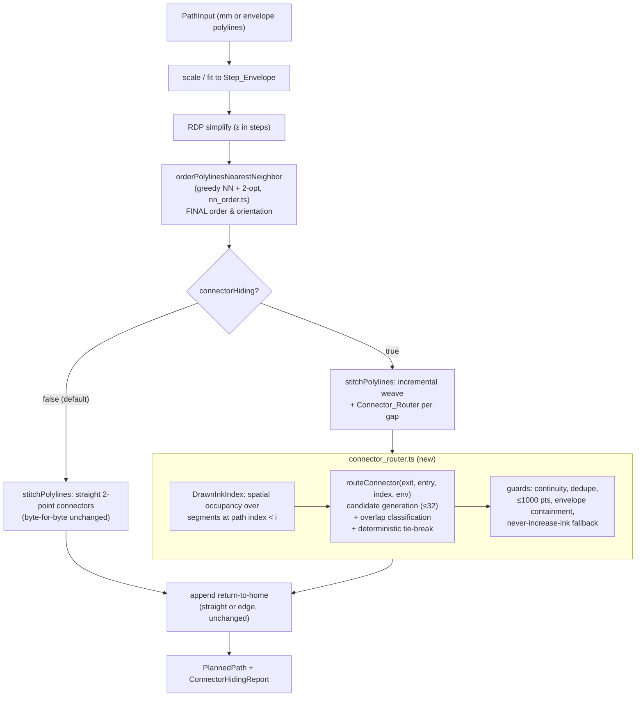

# Design Document: Hidden Connector Routing

## Overview

On the Etch-a-Sketch the stylus cannot lift, so every inter-stroke `connector`
segment is drawn as a visible line. The stitch stage today weaves a straight
2-point connector from one stroke's exit endpoint to the next stroke's entry
endpoint (`stitchPolylines` → `orderPolylinesNearestNeighbor`), and the only
existing mitigation routes the **return-to-home** connector along the envelope
perimeter (`appendEdgeReturnToHome`) instead of slashing across the art.

This feature introduces a **`Connector_Router`** that generalizes that
edge/over-ink routing to **all** inter-stroke connectors. The key physical
insight: **retracing ink that is already on the surface adds no new visible
line.** So instead of cutting a straight diagonal across blank surface, the
router builds each connector as a multi-point polyline that travels along
segments **already drawn earlier in the path order** (`Drawn_Ink`) and along
`Step_Envelope` perimeter edges. Travel that lands in an existing groove is
**Hidden_Travel** (invisible); only the residual gap not coverable by existing
ink remains visible (**Exposed_Travel**).

The feature is **opt-in** via a new `connectorHiding?: boolean` plan option
(default `false`). With it off, the planner output is **byte-for-byte
identical** to today (Req 7.1, 7.2). The router runs **after** the final stroke
order and orientation are decided (Req 7.5, 7.6), so it operates on a fixed
sequence of strokes and never reorders them. It is a pure, deterministic
function of its inputs (Req 3), stays inside the envelope (Req 4), and can only
ever reduce visible ink — it falls back to the straight connector whenever it
cannot strictly improve on it (Req 5, 6).

### Design Goals (traceability to requirements)

| Goal | Requirements |
|------|-------------|
| Route connectors over already-drawn ink, minimizing Exposed_Travel in Chebyshev steps | 1.1–1.7 |
| Preserve the continuity invariant; bounded, deduped, valid point lists | 2.1–2.7 |
| Deterministic, pure, order-of-Drawn_Ink-invariant | 3.1–3.4 |
| Every traversed integer step stays inside the envelope | 4.1–4.4 |
| Never increase visible ink (Exposed ≤ straight length) | 5.1–5.4 |
| Graceful fallback to the straight connector | 6.1–6.5 |
| Opt-in, backward-compatible; routing after final order | 7.1–7.6 |
| Performance bound: ≤5s/1000 strokes, ≤32 candidates/connector, ~linear | 8.1–8.4 |
| Observability: Hidden/Exposed totals and per-connector classification | 9.1–9.5 |
| Route geometry physically follows ink/edges; Hidden+Exposed == total | 10.1–10.4 |

## Architecture

### Where the router slots into the pipeline

The router is a **new stage** inserted between the stitch/weave step and the
return-home step, and it is only invoked on the opt-in branch. The existing
modules are reused, not rewritten:

- `web/src/path/nn_order.ts` — unchanged. Still the authoritative stroke
  ordering (greedy NN + deterministic 2-opt, Chebyshev metric).
- `web/src/path/stitch.ts` — gains an opt-in path: when `connectorHiding` is
  set, after ordering strokes it delegates connector construction to the
  router instead of emitting a straight 2-point hop. The straight-connector
  code path is preserved verbatim for the default branch.
- `web/src/path/planner.ts` — threads a new `connectorHiding?: boolean`
  through `PlanOptions` into `stitchPolylines`, and surfaces the observability
  report.
- `web/src/path/connector_router.ts` — **new module** owning the routing
  algorithm, the spatial index (`Drawn_Ink` occupancy), overlap
  classification, candidate generation, tie-break, and per-connector guards.



### Incremental construction (why ordering must be final first)

`Drawn_Ink` at connector index `i` is defined as **all segments at path indices
strictly less than `i`** (Req 1.3). That set only exists once stroke order and
orientation are frozen. Therefore the router runs strictly after
`orderPolylinesNearestNeighbor` returns (Req 7.5, 7.6) and builds the path
**incrementally**: walk the ordered strokes front to back, and for each gap
between the running pen position and the next stroke's entry point, route the
connector against the ink committed **so far**. Each stroke and routed connector
is added to the `DrawnInkIndex` as it is emitted, so later connectors can hide
over earlier ones. `i == 0` (the first connector, from `start`) sees an empty
`Drawn_Ink` set except for the envelope edges (Req 1.3, 6.3).

## Components and Interfaces

### New module: `web/src/path/connector_router.ts`

```typescript
import type { Point, PlannedSegment } from '../types';

/** Inclusive integer step rectangle [0,x] × [0,y] the drawing must stay in. */
export interface StepEnvelope { x: number; y: number; }

/**
 * An axis-aligned-or-diagonal piece of already-drawn ink, in integer motor
 * steps. Stored as the ordered endpoint pair of a single drawn sub-segment
 * (one inter-vertex move of a stroke or earlier connector). Chebyshev metric.
 */
export interface InkSegment { a: Point; b: Point; }

/** Per-connector outcome, used for observability (Req 9) and guards. */
export interface ConnectorResult {
    /** The emitted connector segment (routed multi-point, or straight 2-point). */
    segment: PlannedSegment;            // kind: 'connector'
    /** Chebyshev steps overlapping Drawn_Ink / envelope edges (invisible). */
    hiddenTravel: number;               // Req 9, 10.4
    /** Chebyshev steps NOT overlapping existing ink (visible). */
    exposedTravel: number;              // Req 9, 10.4
    /** Total Chebyshev length == hiddenTravel + exposedTravel exactly. */
    totalTravel: number;                // Req 10.4
    /** True when the straight 2-point fallback was emitted (no improvement). */
    fellBack: boolean;                  // Req 6
    /** True when a route was computed but rejected by a guard (Req 2.7, 4.4). */
    rejected: boolean;
}

/** Tuning knobs; all default to the documented performance bounds (Req 8). */
export interface RouterOptions {
    /** Max candidate routes evaluated per connector (Req 8.2). Default 32. */
    maxCandidates?: number;
    /** Hard cap on points in an emitted routed connector (Req 2.2, 2.7). Default 1000. */
    maxPoints?: number;
    /** Global routing time budget in ms (Req 8.1, 8.4). Default 5000. */
    timeBudgetMs?: number;
}

/**
 * Spatial occupancy structure over Drawn_Ink for bounded overlap queries.
 * Backed by a uniform grid (bucket size ~ envelope / sqrt(N)) keyed by integer
 * cell, so per-connector candidate queries touch O(local) ink rather than all
 * of it — keeping total routing cost ~linear in stroke count (Req 8.1, 8.2).
 */
export class DrawnInkIndex {
    constructor(env: StepEnvelope, cellSize?: number);
    /** Insert every inter-vertex sub-segment of an emitted segment. */
    add(segment: PlannedSegment): void;
    /** Drawn ink endpoints near a query point, for candidate snap targets. */
    nearbyEndpoints(p: Point, radius: number): Point[];
    /** Ink segments whose bbox (grown by 1 step) contains/intersects p. */
    coveringSegments(p: Point): InkSegment[];
    /** True iff [a,b] is collinear-and-contained in some ink piece within 1 step. */
    isHidden(a: Point, b: Point): boolean;   // Req 1.1, 10.1
}

/**
 * Route a single connector from `exit` to `entry`, given the ink drawn so far
 * and the envelope. Pure: depends only on its arguments (Req 3.1).
 *
 * Returns the best routed connector whose Exposed_Travel is STRICTLY less than
 * the straight 2-point connector's Chebyshev length; otherwise returns the
 * straight 2-point fallback (Req 1.6, 5.2, 6.1). Always begins at `exit` and
 * ends at `entry` (Req 2.1, 6.5).
 */
export function routeConnector(
    exit: Point,
    entry: Point,
    ink: DrawnInkIndex,
    env: StepEnvelope,
    opts?: RouterOptions,
): ConnectorResult;
```

### Changed: `web/src/path/stitch.ts`

`StitchOptions` gains an opt-in field and the envelope (needed for edge
routing and containment checks):

```typescript
export interface StitchOptions {
    start?: Point;
    twoOpt?: boolean;
    /** Opt-in connector hiding (Req 7.3). Requires `env` to route over edges. */
    connectorHiding?: boolean;
    /** Step envelope, required when connectorHiding is set (Req 1.4, 4.1). */
    env?: StepEnvelope;
    /** Router tuning (Req 8). */
    routerOptions?: RouterOptions;
}

/**
 * When `connectorHiding` is unset, behavior is byte-for-byte identical to
 * today (Req 7.2): the existing straight-connector loop runs untouched.
 *
 * When set, the function still orders strokes via the SAME
 * orderPolylinesNearestNeighbor call (so order/orientation are unchanged,
 * Req 7.5/7.6), then weaves connectors incrementally through routeConnector,
 * maintaining a DrawnInkIndex of everything emitted so far. Returns the
 * segments plus a per-connector report for the planner to aggregate (Req 9).
 */
export function stitchPolylines(
    polys: Polyline[],
    opts?: StitchOptions,
): PlannedSegment[];

/** Variant returning the observability report alongside the segments. */
export function stitchPolylinesWithReport(
    polys: Polyline[],
    opts: StitchOptions,
): { segments: PlannedSegment[]; connectors: ConnectorResult[] };
```

To keep Req 7.2 airtight, the default branch reuses the **exact existing
code**: `stitchPolylines` returns early through the current loop when
`connectorHiding` is falsy, and only the new branch touches the router. The
straight-connector emission (`{ kind: 'connector', pointsSteps: [current, segStart] }`)
is unchanged.

### Changed: `web/src/path/planner.ts`

```typescript
export interface PlanOptions {
    // ...existing fields unchanged...
    /**
     * Opt-in connector hiding (Req 7.3). Default false → output byte-for-byte
     * identical to today (Req 7.1). Independent of `twoOpt` and all other
     * options (Req 7.3). Only meaningful with `envelopeSteps` set (edge
     * routing + containment need the envelope).
     */
    connectorHiding?: boolean;
    /** Router tuning forwarded to the stitcher (Req 8). */
    routerOptions?: RouterOptions;
}

/** Aggregated connector-hiding observability, surfaced from plan() (Req 9). */
export interface ConnectorHidingReport {
    totalHiddenTravel: number;          // Σ per-connector hidden (Chebyshev)  Req 9.1
    totalExposedTravel: number;         // Σ per-connector exposed (Chebyshev) Req 9.1
    fullyHiddenCount: number;           // exposed == 0                        Req 9.2/9.3
    partiallyHiddenCount: number;       // hidden > 0 && exposed > 0           Req 9.2/9.3
    notHiddenCount: number;             // hidden == 0                         Req 9.2/9.3
    connectorCount: number;             // == sum of the three counts          Req 9.3
}
```

`plan()` returns the existing `PlannedPath`; the report is exposed via an
extended return (`PlannedPath & { connectorHiding?: ConnectorHidingReport }`)
or a sibling accessor `planWithReport()`. When `connectorHiding` is off, the
report still reflects the default accounting: every connector's full Chebyshev
length is Exposed_Travel, `totalHiddenTravel == 0`, all `notHidden` (Req 9.5).

In the envelope-fit branch, the wiring becomes:

```typescript
const stitched = opts.connectorHiding
    ? stitchPolylines(simplified, { start: home, twoOpt: true,
                                    connectorHiding: true, env,
                                    routerOptions: opts.routerOptions })
    : stitchPolylines(simplified, { start: home, twoOpt: true });
```

The return-home step is unchanged: `appendEdgeReturnToHome` already routes the
final connector over edges and remains the home-return mechanism.

## Data Models

### Drawn_Ink representation and the spatial index

`Drawn_Ink` is the set of inter-vertex **sub-segments** of every `stroke` and
`connector` already emitted at path indices `< i` (Req 1.3). A multi-point
segment contributes one `InkSegment {a, b}` per adjacent point pair. All
coordinates are integer motor steps.

Naively, classifying a candidate route against all prior ink is O(total ink)
per connector, i.e. O(N²) over the path — too slow for 1000 strokes (Req 8.1).
We therefore maintain a **uniform-grid spatial index** (`DrawnInkIndex`):

- The envelope `[0,env.x] × [0,env.y]` is partitioned into square cells of side
  `cellSize ≈ max(1, round(maxDim / sqrt(expectedSegments)))`. Each `InkSegment`
  is inserted into every grid cell its (1-step-grown) bounding box overlaps,
  using an integer DDA/Bresenham walk so diagonal ink registers in all cells it
  crosses.
- **Endpoint buckets**: drawn-ink endpoints are also stored per cell so
  `nearbyEndpoints(p, radius)` (candidate snap targets) returns only local
  endpoints, not all of them.
- **Overlap query**: `coveringSegments(p)` returns ink in `p`'s cell and the 8
  neighbors; `isHidden(a, b)` walks the integer steps of `[a,b]` and checks each
  against locally covering ink. With bounded local density this is O(len(a,b))
  not O(total ink).

Because each connector consults only a bounded neighborhood and evaluates at
most `maxCandidates` routes, total routing cost is ~linear in stroke count
(Req 8.2). The index is built incrementally — `add()` is called as each segment
is emitted — so it always reflects exactly the ink at indices `< i`.

### Route, classification, and Chebyshev accounting

A connector route is an ordered `Point[]` in integer steps. For accounting we
walk each adjacent route pair `[p, q]` (a "leg"):

- **Hidden leg**: collinear with and contained within some `InkSegment` or an
  envelope perimeter edge, every point within perpendicular distance 1 integer
  step (Req 10.1). Its `max(|dx|,|dy|)` Chebyshev length counts as
  Hidden_Travel.
- **Exposed leg**: not coverable by any ink/edge (a gap > 1 step, Req 10.3). Its
  Chebyshev length counts as Exposed_Travel.

A single leg may be partly hidden and partly exposed; we split it at the
integer step where coverage changes, so **every integer step is counted in
exactly one category** and `hiddenTravel + exposedTravel == totalTravel`
exactly (Req 10.4). Legs that cannot be placed on ink are reclassified as
Exposed and flagged (Req 10.2) while the routed connector is retained.

### Envelope edges as routable ink

The four inclusive perimeter edges of `[0,env.x] × [0,env.y]` are treated as
zero-Exposed routable pieces (Req 1.4, 4.1), exactly as `appendEdgeReturnToHome`
treats them. They are represented as four implicit `InkSegment`s (the rectangle
sides) that `isHidden`/classification consult in addition to the grid, so a
route hugging the border is fully Hidden even before any stroke is drawn near
it.

## Routing Algorithm

The router builds candidate routes from `exit` to `entry` and picks the one with
the least Exposed_Travel, subject to the per-connector candidate cap and a
deterministic tie-break.

**Straight baseline.** Compute `straightLen = chebyshev(exit, entry)`. The
straight 2-point connector `[exit, entry]` is always a valid fallback and its
Exposed_Travel equals `straightLen` (Req 5.1, 6.1). Any emitted route must beat
this strictly (Req 1.2, 5.2, 6.2).

**Candidate generation (snap-to-ink, traverse-along-ink).** Each candidate is a
3-phase polyline: *approach → traverse → depart*.

1. **Snap targets.** Query `ink.nearbyEndpoints(exit, R)` and
   `ink.nearbyEndpoints(entry, R)` plus the nearest point on each envelope edge.
   These are the entry/exit points onto existing ink. `R` grows geometrically
   over a few rounds until either a strictly-improving route is found or the
   candidate cap is hit.
2. **Traverse.** For a pair (`sExit` near exit on ink piece P, `sEntry` near
   entry on ink piece Q), build the route `exit → sExit → …along P…→ junction →
   …along Q…→ sEntry → entry`. Travel along an ink piece, and along shared
   envelope edges, is Hidden; the `exit→sExit` and `sEntry→entry` approach legs
   and any inter-piece gap are Exposed. The "along ink" traversal follows the
   ink piece's own vertices so it stays collinear within 1 step.
3. **Graph/greedy formulation.** Conceptually this is a shortest-path over a
   graph whose nodes are drawn-ink endpoints + envelope corners + the two
   connector endpoints, and whose edge weight is Exposed_Travel (0 along ink/
   edges, Chebyshev length across gaps). Because we cap work per connector, we
   do **not** run a full all-pairs search: we generate up to `maxCandidates`
   (default 32, Req 8.2) candidate routes via the snap-and-traverse heuristic —
   nearest endpoints first, then envelope-edge routes — and evaluate each by
   walking its legs through the classifier. The first phase that yields a
   strictly-improving route can stop early (Req 8.3); otherwise we keep the best
   improving candidate seen.

**Selection & tie-break (Req 1.5, 3.3, 5.3).** Among evaluated candidates:

1. minimize Exposed_Travel (Chebyshev);
2. tie → minimize total Chebyshev length;
3. tie → choose the route whose **ordered sequence of point coordinates is
   lexicographically smallest** (compare x before y at each index, shorter
   sequence smaller when it is a prefix). This total order leaves no tie
   unresolved, making selection deterministic regardless of candidate
   generation order or `Drawn_Ink` iteration order (Req 3.2, 3.4).

**Guards before emit** (applied in order; any failure → straight fallback for
those endpoints, recorded as `rejected`/`fellBack`):

- Collapse consecutive duplicate points, preserving first/last (Req 2.4).
- Require `2 ≤ points ≤ maxPoints` (1000) after collapse, else reject (Req 2.7).
- Require every adjacent pair differ in ≥1 coordinate (Req 2.3).
- Require first point `== exit` and last `== entry` exactly (Req 2.1, 6.5).
- Require every route point **and every traversed integer step** within the
  inclusive envelope; if not containable, do not emit and report the
  containment error (Req 4.1, 4.3, 4.4).
- Require `exposedTravel < straightLen` strictly; else emit straight (Req 5.2,
  6.2).

**Budget handling.** A monotonic step counter (not wall-clock inside the pure
core; the time budget is enforced by the orchestrating stitch loop checking an
injected clock between connectors) stops candidate evaluation at
`maxCandidates` per connector (Req 8.3) and stops the whole pass at
`timeBudgetMs`, emitting straight connectors for all unprocessed gaps and still
returning a complete plan (Req 8.4, 6.4).

## Correctness Properties

*A property is a characteristic or behavior that should hold true across all
valid executions of a system — essentially, a formal statement about what the
system should do. Properties serve as the bridge between human-readable
specifications and machine-verifiable correctness guarantees.*

This feature is squarely in the PBT sweet spot: the router is a **pure
geometric function** over integer-step inputs with strong universal invariants
(continuity, conservation, monotonicity, determinism). The properties below are
the consolidated, non-redundant set derived from the prework analysis. Each is
implemented by a single property-based test (fast-check, ≥100 iterations).

### Property 1: Never increase visible ink

*For all* connector endpoints `(exit, entry)`, any `Drawn_Ink` set, and any
envelope, the emitted connector's `Exposed_Travel` (Chebyshev) is less than or
equal to the straight 2-point connector's Chebyshev length
`max(|exit.x−entry.x|, |exit.y−entry.y|)`.

**Validates: Requirements 1.1, 5.1, 5.4**

### Property 2: Strictly-improving route is chosen when one exists

*For all* inputs where at least one evaluated candidate route has
`Exposed_Travel` strictly less than the straight Chebyshev length, the emitted
connector is a routed (multi-point) connector whose `Exposed_Travel` is strictly
less than the straight length and is the minimum among evaluated candidates.

**Validates: Requirements 1.1, 1.2, 5.2, 5.3**

### Property 3: Fallback to the straight 2-point connector

*For all* inputs where no evaluated candidate achieves `Exposed_Travel` strictly
less than the straight Chebyshev length (including an empty `Drawn_Ink` set, and
candidates whose Exposed equals the straight length), the emitted connector is
exactly the two-point polyline `[exit, entry]`.

**Validates: Requirements 1.6, 5.2, 6.1, 6.2, 6.3**

### Property 4: Continuity and endpoint anchoring

*For all* planned paths produced with connector hiding enabled, every emitted
connector's first point equals `exit` and last point equals `entry` exactly
(integer x and y), and across the whole `PlannedPath` each segment's last point
equals the next segment's first point exactly.

**Validates: Requirements 2.1, 2.5, 6.5**

### Property 5: Point-count bound and segment kind

*For all* emitted connectors, the segment has `kind: 'connector'` and its
`pointsSteps` length is at least 2 and at most 1000.

**Validates: Requirements 2.2, 2.7**

### Property 6: No zero-length sub-segments

*For all* emitted connectors, every adjacent point pair differs in at least one
integer step coordinate (x or y).

**Validates: Requirements 2.3**

### Property 7: Consecutive-duplicate collapse

*For all* routes, collapsing consecutive identical points yields a sequence with
no consecutive duplicates, preserves the first and last points unchanged, and is
idempotent (collapsing again is a no-op).

**Validates: Requirements 2.4**

### Property 8: Determinism

*For all* inputs, invoking the router two or more times on equal-value inputs
returns routes whose point sequences are identical in length, order, and integer
coordinates; and when two candidate routes have equal `Exposed_Travel` and equal
total Chebyshev length, the chosen route is the lexicographically smallest under
the fixed point-coordinate ordering (x before y).

**Validates: Requirements 1.5, 3.1, 3.2, 3.3**

### Property 9: Drawn_Ink reorder invariance

*For all* inputs, supplying the `Drawn_Ink` segments in different iteration
orders that are otherwise equal in value produces routes whose point sequences
are identical in length, order, and integer coordinates.

**Validates: Requirements 3.4**

### Property 10: Envelope containment of every traversed step

*For all* emitted routed connectors, every route point is an integer within the
inclusive envelope `0 ≤ x ≤ env.x`, `0 ≤ y ≤ env.y`, and every integer
motor-step position traversed along each leg also lies within that envelope.

**Validates: Requirements 4.1, 4.2, 4.3**

### Property 11: Opt-in identity (off ⇒ unchanged)

*For all* inputs, the `PlannedPath` produced with `connectorHiding` set to false
is deep-equal (byte-for-byte) to the `PlannedPath` produced with the option
absent, and the straight connectors woven are identical.

**Validates: Requirements 7.1, 7.2**

### Property 12: Stroke order/orientation invariance

*For all* inputs and for either value of `twoOpt`, the ordered sequence of
`stroke` segments (their order and per-stroke point sequences) is identical
whether connector hiding is on or off — hiding changes only `connector`
segments, confirming routing runs after the final order/orientation is decided.

**Validates: Requirements 7.5, 7.6**

### Property 13: Observability report aggregation

*For all* planned paths, the reported `totalHiddenTravel` equals the sum of
per-connector `hiddenTravel`, `totalExposedTravel` equals the sum of
per-connector `exposedTravel` (both non-negative integers in Chebyshev steps),
each connector is classified fully hidden (exposed == 0), not hidden
(hidden == 0), or partially hidden (both > 0), and the three counts are
non-negative and sum to the total number of connectors.

**Validates: Requirements 9.1, 9.2, 9.3, 9.4**

### Property 14: Off-mode accounting

*For all* planned paths produced with connector hiding disabled, the report
gives each connector's full Chebyshev length as its `Exposed_Travel`, a
`totalHiddenTravel` of 0, and every connector classified as not hidden.

**Validates: Requirements 9.5**

### Property 15: Hidden/Exposed classification and conservation

*For all* emitted routed connectors, every leg classified as Hidden_Travel is
collinear with and contained within an existing `Drawn_Ink` piece or a
`Step_Envelope` perimeter edge to within a perpendicular distance of 1 integer
step, every gap leg greater than 1 step is counted as Exposed_Travel, and the
sum of `hiddenTravel` and `exposedTravel` equals the connector's total Chebyshev
length exactly with each traversed step counted in exactly one category.

**Validates: Requirements 1.4, 10.1, 10.3, 10.4**

### Non-property criteria (covered by other test types)

The following acceptance criteria are not universal properties and are covered
by example, edge-case, or integration tests in the Testing Strategy:

- **2.6, 2.7 (>1000 / <2 guard), 4.4** — guard edge cases: covered by targeted
  tests that force the guard to fire and assert straight fallback + rejection
  reporting (continuity/containment properties guarantee the guards never let a
  bad route through).
- **6.4, 8.3 (per-connector candidate bound)** — edge-case tests with a low
  `maxCandidates` asserting a complete, valid plan with `Exposed ≤ straight`.
- **8.4 (time budget)** — edge-case test injecting a tiny `timeBudgetMs`,
  asserting a complete plan with straight connectors for unprocessed gaps.
- **8.1 (≤5s for 1000 strokes)** — a single performance/integration test.
- **8.2 (candidate counter ≤ 32)** — instrumented edge-case test.
- **7.3, 7.4 (flag shape/independence/default)** — example tests over the
  `{hiding} × {twoOpt}` option matrix.
- **10.2 (reclassify unhideable Hidden leg as Exposed)** — covered by the
  conservation side of Property 15.

## Error Handling

The router favors **graceful degradation** over throwing: on a no-pen-lift
device the path must always be complete and continuous, so an un-hideable or
malformed route silently falls back to the straight connector rather than
aborting the plan.

| Condition | Handling | Req |
|-----------|----------|-----|
| Drawn_Ink empty (or i == 0) | Skip the hiding search; emit straight `[exit, entry]` | 6.1, 6.3 |
| No candidate beats straight (Exposed not strictly lower) | Emit straight; `fellBack = true` | 1.6, 5.2, 6.1, 6.2 |
| Route < 2 points after collapse, or > 1000 points | Discard route, emit straight; `rejected = true` | 2.7 |
| Route would break continuity | Discard route, emit straight, keep neighbors; `rejected = true` | 2.6 |
| Hidden leg cannot be placed on ink within 1 step | Reclassify that leg as Exposed_Travel, flag it, retain the routed connector | 10.2 |
| Route cannot be contained in envelope | Do **not** emit the route; fall back to straight (always containable). Surface a containment error indication on the result | 4.4 |
| Per-connector candidate cap reached | Stop evaluating; emit best improving route found, else straight; continue other connectors | 6.4, 8.3 |
| Global time budget reached | Stop routing; emit remaining connectors straight; return a complete plan | 8.4 |

The straight 2-point connector between two in-envelope endpoints is always
itself in-envelope (the envelope is convex in the Chebyshev/box sense), so the
fallback can never violate containment — it is the safe universal default.

Invalid `RouterOptions` (e.g. `maxPoints < 2`, non-positive `maxCandidates`) are
clamped to documented minimums rather than throwing, consistent with the
planner's existing range-clamping style.

## Testing Strategy

This project uses property-based testing heavily; the router's pure, integer,
invariant-rich nature makes PBT the primary tool, complemented by example and
edge-case unit tests for guards, API shape, and budgets.

### Property-based tests (fast-check)

- Library: **fast-check** (already used across `web/src`).
- Each of Properties 1–15 above is implemented by exactly one property test.
- Minimum **100 iterations** per property.
- Each test is tagged with a comment referencing its design property:
  **`Feature: hidden-connector-routing, Property {n}: {property text}`**.
- **Generators**: random integer-step polyline sets inside a random envelope
  (varying stroke counts, lengths, orientations including pure-horizontal,
  pure-vertical, and diagonal ink so collinear-within-1-step coverage is
  exercised); random connector endpoints; degenerate cases (empty ink, single
  stroke, endpoints already coincident, endpoints on the envelope edge,
  endpoints in opposite corners). Generators also emit ink that **deliberately
  covers** the gap so Property 2 (strict improvement) is exercised, and ink that
  is irrelevant/far so Property 3 (fallback) is exercised.
- For Property 9, the same value set is shuffled before a second invocation and
  the two results compared.
- For Properties 11 and 12, a baseline `plan(..., { connectorHiding: false })`
  is compared against the option-absent plan and the hiding-on plan
  respectively.

### Unit / example tests

- **Guard edge cases**: force `> 1000` points and `< 2` points after collapse;
  assert straight fallback and `rejected` reporting (Req 2.7); force a
  would-be-discontinuous route and assert neighbors retained (Req 2.6).
- **API shape**: matrix over `{connectorHiding: true/false/absent} ×
  {twoOpt: true/false}` asserting flag independence, default-disabled, valid
  `PlannedPath`, no throw (Req 7.3, 7.4).
- **Edge routing**: a connector whose endpoints sit near the perimeter routes
  over envelope edges with zero Exposed (Req 1.4), mirroring
  `appendEdgeReturnToHome`'s existing tests.
- **Budgets**: low `maxCandidates` and tiny `timeBudgetMs` produce complete,
  valid plans (Req 6.4, 8.3, 8.4); instrumented candidate counter ≤ 32
  (Req 8.2).

### Performance / integration test

- A single test plans a synthetic 1000-stroke path (representative of the
  hatch-fill portrait) with hiding enabled and asserts completion **< 5 s**
  (Req 8.1). Run in the standard suite but tagged so it can be excluded from
  fast watch runs.

### Regression / observability

- Snapshot the `ConnectorHidingReport` for a representative portrait fixture to
  detect regressions in hidden-vs-exposed totals (Req 9), complementing the
  `compare.py` harness preview below.

## Python Mirror (compare.py harness) — scoped as optional

`tools/imagepath_service/vectorize.py` mirrors the web ordering
(`order_nearest_neighbor`, `two_opt_order`, `total_connector_travel_chebyshev`)
so `compare.py` can preview the **real machine order** and quantify connector
travel before/after 2-opt. The Connector_Router is the authoritative
hiding stage in the **web planner**; the Python service order never reaches the
machine.

**Recommendation: mirror the router in Python as an optional, additive harness
feature**, in the same spirit as `two_opt_order`:

- Add a pure `route_connectors_over_ink(ordered, env, start)` to `vectorize.py`
  mirroring `connector_router.ts`'s classification and Chebyshev accounting
  (snap-to-ink + traverse, same deterministic tie-break), plus
  `total_exposed_travel_chebyshev(...)` for the preview metric.
- Extend `compare.py` with a `--hide-connectors` flag that renders Exposed legs
  in connector-gray and Hidden legs invisibly (lands in existing ink), and
  prints **exposed travel before vs after hiding** alongside the existing
  greedy-vs-2-opt travel numbers, so the harness previews hidden vs exposed
  travel.

This mirror is **explicitly optional** and **not on the critical path**: the web
implementation and its property tests are the source of truth. If the harness
mirror is descoped, the only loss is the offline PNG preview of hidden travel;
the machine output is unaffected. If implemented, it should reuse the same
deterministic rules so the preview matches the web planner's choices. Mirror
parity is verified by a small cross-check fixture (same inputs → same
Exposed_Travel total in both implementations), not by full PBT on the Python
side.

