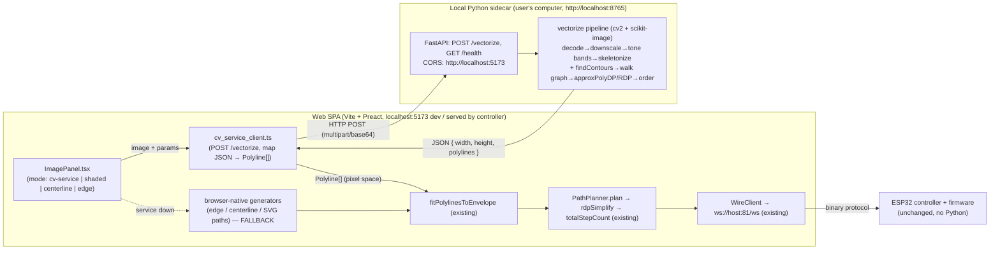

# Design: Image → Path via Local Python CV Sidecar (skeleton/centerline primary)

## Overview

Image → drawable-path generation moves **out of the browser** and into a
**local Python sidecar service** that runs real OpenCV (`cv2`) and
`scikit-image`. The web SPA POSTs an image (plus a few parameters) to the
service and receives **ready-to-draw polylines as JSON in image-pixel space**.
Those polylines feed the **existing, unchanged** web pipeline —
`fitPolylinesToEnvelope` → `PathPlanner.plan` → `totalStepCount` — exactly as
today. The result is clean, smooth, confident single strokes at a low step
count (~2k on the reference), instead of the noisy, fragmented, 34k–55k-step
output every browser-side attempt produced.

> **This supersedes ALL prior browser-side generators** — the
> amplitude-wiggle hatcher, the density flat-line hatcher, and the edge-first
> Sobel/silhouette generator described in earlier revisions of this document.
> The reasons are concrete and were proven on hardware:
>
> 1. **`opencv.js` (WASM) never loaded reliably in the browser.** The whole
>    edge/centerline plan assumed Canny/contours from real OpenCV; the WASM
>    module repeatedly failed to initialize, so the code fell back to pure-JS
>    Sobel/skeleton paths.
> 2. **The pure-JS Sobel/skeleton fallbacks produced gradient-edge lines that
>    were noisy and fragmented** — double-walled outlines around every edge,
>    furry fringes, thousands of tiny disconnected contours — i.e. *unrealistic*
>    drawings, nothing like a confident pen portrait.
> 3. **Step counts were enormous (34k–55k).** The fragmentation plus full-area
>    raster behavior meant the machine never reached cruise speed and a single
>    portrait took far too long.
> 4. **The reference (Engineezy) does none of this in the browser.** It runs
>    real OpenCV in **Python**: threshold/posterize into tone bands,
>    `skimage.morphology.skeletonize` so each stroke is ONE centerline curve
>    drawn once, `cv2.findContours` for the silhouette, then `approxPolyDP`
>    smoothing. That yields clean single strokes at ~2000 steps.
>
> The fix is to use the same tool the reference uses — real `cv2` +
> `scikit-image` in Python — and keep it on the user's computer where it can
> actually run. The browser stops trying to do computer vision.

### Algorithm choice — skeleton/centerline as primary

Per the confirmed decision, the primary extraction in the Python service is
**skeleton/centerline**: each dark tone region is skeletonized so every stroke
is **one clean centerline curve drawn once** (no double-walled gradient edges),
and the outer silhouette is added from strong contours. This is the construction
that produces the reference look and the low step count.

### Dev/desktop-tool nature (important)

This is a **developer/desktop tool that runs on the user's computer**, not on
the ESP32. The firmware's embedded single-file build cannot contain Python.
Therefore:

- The `cv2` path is available **only when the local service is running**.
- The existing **browser-native modes remain as a fallback** so the app still
  works (degraded, but functional) without the service.
- There is **no firmware change and no wire-protocol change.** The service only
  produces polylines; those polylines travel through the *same* existing planner
  and the same `ws://…:81/ws` binary channel to the controller. The controller
  and firmware are unaware the service exists.

The two hard lessons from prior attempts are preserved as constraints on the
service output: tone-bearing decisions are driven by **local** image data (the
skeleton of local dark regions, never a per-row average), and the returned
geometry always spans a **non-degenerate bounding box** so the envelope fit
cannot collapse the drawing into a corner.

## Architecture

The browser no longer runs computer vision. The new boundary is an HTTP call
from the SPA to a local FastAPI service; everything to the right of the client
adapter is the existing, reused pipeline.



Key architectural points:

- **The sidecar is the only new process.** It exposes `POST /vectorize` and
  `GET /health`, runs entirely on the user's machine, and has zero knowledge of
  the controller or wire protocol.
- **The web side gains exactly one new module** (`cv_service_client.ts`) plus a
  new mode in `ImagePanel`. Everything downstream of the returned `Polyline[]`
  — `fitPolylinesToEnvelope`, `PathPlanner`, the polyline/segment types, the
  wire client — is reused **unchanged**. The planner is **not** duplicated in
  Python; Python returns raw pixel-space polylines and the existing TS pipeline
  fits, simplifies, and costs them.
- **Graceful degradation.** If the service is unreachable, the client surfaces a
  clear "start the image service" message and the UI falls back to the existing
  browser-native generators so the app still functions.
- **Cost model unchanged.** The machine's real metric is Chebyshev travel
  `Σ max(|Δx|, |Δy|)` (`totalStepCount` in `web/src/path/planner.ts`), computed
  on the planned path after the envelope fit (envelope 1640×1220 steps). The
  service is judged by the step count of its polylines after they pass through
  this existing pipeline — not by any metric internal to Python.

## The vectorize pipeline (Python, skeleton-primary)

`POST /vectorize` runs a pure-ish transformation `(image bytes, params) →
polylines`. The primary path is skeleton/centerline; the silhouette is added
from contours.

```
vectorize(image_bytes, params):
  # 1. Decode + bound size (keeps cv2 work and output size predictable).
  img    = decode(image_bytes)                       # pillow/cv2 → ndarray
  img    = downscale_to_max_dim(img, params.max_dim) # e.g. 1000 px longest side
  H, W   = img.shape[:2]

  # 2. Grayscale + optional preprocess.
  gray   = to_grayscale(img)
  gray   = apply_contrast(gray, params.contrast)     # optional
  gray   = gaussian_blur(gray, params.blur_sigma)    # optional denoise

  # 3. Threshold/posterize into a SMALL number of tone bands.
  #    Otsu for a clean global split; cv2 adaptiveThreshold when lighting is
  #    uneven. params.tone_bands controls how many dark levels are isolated.
  masks  = posterize_to_tone_bands(gray, params.tone_bands, params.threshold)
           # → list of binary masks, darkest band first

  polylines = []

  # 4. PRIMARY: skeletonize each dark region → ONE centerline per stroke.
  for mask in masks:
      skel  = skimage.morphology.skeletonize(mask)    # 1-px centerlines
      # (medial_axis is an alternative when stroke-width info is wanted)
      graph = build_pixel_graph(skel)                 # 8-connected skeleton graph
      for chain in walk_skeleton_graph(graph):        # ordered pixel chains
          poly = approx_poly_dp(chain, params.epsilon) # smooth, confident stroke
          if poly_length(poly) >= params.min_stroke_len:
              polylines.append(poly)                  # drop tiny fragments

  # 5. ALSO add the outer silhouette / strongest contours.
  contours, _ = cv2.findContours(outer_mask(masks),
                                 cv2.RETR_EXTERNAL, cv2.CHAIN_APPROX_SIMPLE)
  for c in contours:
      poly = approx_poly_dp(c, params.epsilon)
      if poly_length(poly) >= params.min_stroke_len:
          polylines.append(poly)

  # 6. Order all polylines for draw continuity (nearest-neighbor over endpoints).
  polylines = order_nearest_neighbor(polylines, start=(0, 0))

  # 7. Return in IMAGE PIXEL space; the web side fits to the envelope.
  return { "width": W, "height": H, "polylines": polylines }
```

Why this produces the reference result:

- **One centerline per stroke.** `skeletonize` collapses each dark region to a
  single 1-px-wide curve, so a stroke is drawn **once down its middle** — no
  double-walled gradient edges, which is exactly what made the browser Sobel
  output look unrealistic.
- **`approxPolyDP` smoothing** turns jagged pixel chains into a few long,
  confident segments — smooth strokes and a low vertex/step count.
- **Fragment dropping** (`min_stroke_len`) removes the speckle/fringe that
  bloated the browser output.
- **Silhouette from `findContours`** gives the strong outer outline the eye
  reads first.
- **Nearest-neighbor ordering** minimizes pen-up transit, which the existing
  Chebyshev cost metric rewards.

## Components and Interfaces

### New: Python sidecar service — `tools/imagepath_service/`

Proposed clean location at the repo root (sibling to `web/` and `firmware/`),
since it is a dev tool, not part of either deployable artifact:

```
tools/imagepath_service/
  app.py                 # FastAPI app: routes, CORS, request/response models
  vectorize.py           # pure pipeline: bytes + params → polylines (no FastAPI)
  requirements.txt       # opencv-python-headless, numpy, scikit-image, scipy,
                         # fastapi, uvicorn[standard], pillow, python-multipart
  run.sh                 # launch helper: uvicorn app:app --port 8765 --reload
  tests/
    test_vectorize.py    # pytest, tiny synthetic fixtures
```

**HTTP surface (FastAPI):**

```python
# POST /vectorize
#   Request: multipart/form-data file=<image>  (OR JSON { image_base64, params })
#            params: mode, detail, contrast, threshold, tone_bands, max_dim, ...
#   Response 200: VectorizeResponse (JSON, see Data Models)
@app.post("/vectorize")
async def vectorize_endpoint(...) -> VectorizeResponse: ...

# GET /health
#   Response 200: { "status": "ok", "version": "<svc version>",
#                   "cv2": "<cv2.__version__>" }
@app.get("/health")
async def health() -> HealthResponse: ...
```

**CORS:** enabled for the Vite dev origin `http://localhost:5173` (and the
controller-served origin when applicable). Configured via
`fastapi.middleware.cors.CORSMiddleware`.

**Run the service:**

- `tools/imagepath_service/run.sh` →
  `uvicorn app:app --host 127.0.0.1 --port 8765 --reload`
- or documented bare command:
  `python -m uvicorn app:app --port 8765` (cwd `tools/imagepath_service/`).
- Deps installed from `requirements.txt`
  (`pip install -r requirements.txt`) — already verified present on the
  user's machine (Python 3.13, opencv-python-headless 4.13, numpy,
  scikit-image 0.26, scipy, fastapi, uvicorn[standard], pillow,
  python-multipart).

**Internal modules (pure, unit-testable):**

- `vectorize.vectorize(image_bytes: bytes, params: VectorizeParams) -> dict` —
  the full pipeline above; no FastAPI types, so it is directly testable.
- `vectorize.skeletonize_regions(masks) -> list[Polyline]` — step 4.
- `vectorize.walk_skeleton_graph(skel) -> list[list[(x,y)]]` — ordered chains.
- `vectorize.order_nearest_neighbor(polys, start) -> list[Polyline]` — step 6.

### New: web client — `web/src/image/cv_service_client.ts`

```typescript
/** Configurable service base URL (default http://localhost:8765). */
export const DEFAULT_CV_SERVICE_URL = 'http://localhost:8765';

export interface VectorizeParams {
    mode: 'skeleton' | 'contour' | 'both'; // primary = skeleton/both
    detail?: number;     // maps to epsilon / min_stroke_len budget
    contrast?: number;
    threshold?: number;  // 0 = auto (Otsu); else explicit
    toneBands?: number;
}

/** Raised when the local CV service is unreachable or returns an error. */
export class CvServiceUnavailable extends Error {}

/**
 * POST an image to the local CV sidecar and map the JSON response to the
 * existing Polyline[] type (image-pixel space). Throws CvServiceUnavailable
 * on network/HTTP failure so callers can fall back to browser generators.
 */
export async function vectorizeViaService(
    image: Blob,
    params: VectorizeParams,
    opts?: { baseUrl?: string; fetchImpl?: typeof fetch },
): Promise<Polyline[]>;

/** Lightweight reachability probe against GET /health. */
export async function isServiceAvailable(
    opts?: { baseUrl?: string; fetchImpl?: typeof fetch },
): Promise<boolean>;
```

- `vectorizeViaService` POSTs to `${baseUrl}/vectorize`, parses
  `VectorizeResponse`, and maps `polylines: number[][][]` →
  `Polyline[]` (`{x,y}[]`), preserving pixel coordinates. The result feeds the
  **existing** `fitPolylinesToEnvelope` → `PathPlanner.plan` pipeline directly.
- On `fetch` rejection, non-2xx, or schema mismatch it throws
  `CvServiceUnavailable`.
- `fetchImpl` is injectable so vitest can mock the network with no real server.

### Changed: `web/src/ui/ImagePanel.tsx`

- Add a new style option, e.g. `"CV service (best — needs local service)"`,
  alongside the existing `shaded` / `centerline` / `edge` options.
- When the CV-service mode is selected, call `vectorizeViaService`; on
  `CvServiceUnavailable`, show a clear banner — *"Image service not running.
  Start it with `tools/imagepath_service/run.sh`, then retry. Falling back to
  browser tracing."* — and reprocess with the existing browser generator so the
  user still gets a (degraded) result.
- The configurable service URL is read from config (query param / default
  `http://localhost:8765`), mirroring how the controller WS URL is resolved in
  `web/src/app/config.ts`.

### Reused unchanged (no duplication)

`fitPolylinesToEnvelope` (`web/src/path/scale.ts`), `PathPlanner.plan` /
`rdpSimplify` / `totalStepCount` (`web/src/path/planner.ts`), the
`Polyline`/`Point`/segment types (`web/src/types.ts`), the `WireClient` and
`ws://…:81/ws` transport, and the existing browser-native generators (kept as
fallback). The Python service does **not** reimplement any of these.

## Data Models

### Service response (JSON, image-pixel space)

```typescript
interface VectorizeResponse {
    width: number;              // pixel width of the (downscaled) image
    height: number;             // pixel height
    polylines: number[][][];    // [ [ [x,y], [x,y], ... ], ... ] in pixel coords
}
```

Mapped on the web side to the existing `Polyline[]` = `{ x: number; y: number }[][]`.
Coordinates are source-pixel space (x in `[0,width)`, y in `[0,height)`),
matching what `fitPolylinesToEnvelope` already expects from the browser
generators — so the fit/scale/plan stages need no changes.

### Service request parameters

```python
@dataclass
class VectorizeParams:
    mode: str = "both"          # "skeleton" (primary) | "contour" | "both"
    detail: float = 0.5         # 0..1 → epsilon / min_stroke_len budget
    contrast: float = 1.0       # multiplier around mid-gray
    threshold: int = 0          # 0 → Otsu auto; else explicit 0..255
    tone_bands: int = 2         # small number of dark bands to isolate
    blur_sigma: float = 1.0
    max_dim: int = 1000         # longest-side cap after downscale
    min_stroke_len: float = 8.0 # drop fragments shorter than this (pixels)
```

`HealthResponse`: `{ status: "ok", version: str, cv2: str }`.

### Web config addition

A `cvServiceUrl` knob (default `http://localhost:8765`, overridable via
`?cv=<url>` query param), resolved in the same spirit as `resolveControllerUrl`
in `web/src/app/config.ts`.

## Correctness Properties

*A property is a characteristic or behavior that should hold true across all
valid executions of a system — a formal statement about what the system should
do, bridging human-readable specs and machine-verifiable guarantees.*

Cost properties use the machine's real Chebyshev metric (run the mapped
polylines through `PathPlanner.plan` and read `totalStepCount`) — never vertex
count.

### Property 1: Valid, well-formed JSON schema

*For any* decodable input image and valid params, `POST /vectorize` SHALL return
`{ width > 0, height > 0, polylines }` where every polyline is a list of
`[x, y]` pairs with `0 ≤ x < width` and `0 ≤ y < height`.

**Validates: Requirements 4.2**

### Property 2: Determinism

*For any* fixed image bytes and params, two calls to `vectorize` SHALL produce
deeply-equal `polylines` (fixed iteration order; deterministic cv2/skimage ops).

**Validates: Requirements 3.4**

### Property 3: Non-degenerate bounding box

*For any* non-blank input that yields strokes, the union of returned polylines
SHALL span both axes non-degenerately (bbox width > 0 and height > 0), so the
reused `fitPolylinesToEnvelope` preserves aspect and centers correctly.

**Validates: Requirements 4.1**

### Property 4: Skeleton produces single centerlines (bounded, smooth)

*For any* input, each returned stroke SHALL be a simplified centerline (post
`approxPolyDP`) with no zero-length fragments below `min_stroke_len`, so the
output is a set of confident single strokes rather than double-walled
gradient edges.

**Validates: Requirements 1.3, 2.2**

### Property 5: Bounded output size

*For any* input, the total returned vertex count SHALL be bounded by a function
of `max_dim`, `tone_bands`, and the `detail`/`min_stroke_len` budget (no
pathological blow-up on a fully-black image), and lowering `detail` SHALL not
increase total vertex count.

**Validates: Requirements 3.3**

### Property 6: Mapping fidelity (web client)

*For any* well-formed `VectorizeResponse`, `vectorizeViaService` SHALL map it to
a `Polyline[]` of identical structure and coordinates (`number[][][]` →
`{x,y}[][]`), losing no points and introducing none.

**Validates: Requirements 5.4**

### Property 7: Graceful fallback (web client)

*For any* network failure, non-2xx status, or malformed body, `vectorizeViaService`
SHALL throw `CvServiceUnavailable` (and never return partial/garbage polylines),
so the UI can fall back to the browser generators.

**Validates: Requirements 5.1**

### Property 8: Cost on the real metric

*For any* fixed image, lowering the `detail` budget SHALL not increase the
`totalStepCount` of the planned path produced from the service polylines
(monotonic cost lever on the real Chebyshev metric).

**Validates: Requirements 3.1**

## Error Handling

- **Service unreachable (web).** `fetch` rejects or `/health` fails →
  `vectorizeViaService`/`isServiceAvailable` report unavailable; the UI shows
  the "start the image service" banner and falls back to the existing
  browser-native generator so the app keeps working.
- **Undecodable image (service).** `POST /vectorize` returns `400` with a JSON
  error body; the client throws `CvServiceUnavailable` (or a typed decode error)
  and the UI surfaces "couldn't read that image".
- **No strokes found (service).** If thresholding/skeletonizing leaves no
  qualifying stroke (blank/flat image), the service returns
  `{ width, height, polylines: [] }`; the web side treats empty output like the
  existing `NoEdgesFound` path ("adjust threshold and retry").
- **Degenerate dimensions.** `max_dim` downscale and a `min(width,height) ≥ 2`
  guard ensure the service never returns a degenerate buffer; the web side keeps
  its existing degenerate-bbox guard before fitting.
- **Bounded worst case.** `min_stroke_len` and the `detail`/`epsilon` budget cap
  vertex count on a fully-black image (Property 5) — no blow-up.
- **CORS / wrong origin.** Service enables CORS for `http://localhost:5173`;
  a CORS failure manifests as a `fetch` error and is handled by the fallback
  path. **Security note:** the service binds to `127.0.0.1` (loopback only) by
  default so it is not exposed on the network; it performs no authentication
  because it is a single-user local dev tool — this is acceptable only while
  bound to loopback and should be revisited if ever exposed beyond localhost.
- **Envelope bounds (unchanged).** `fitPolylinesToEnvelope` still clamps every
  emitted step into `[0, env.x] × [0, env.y]` (1640×1220), reused unchanged.

## Files changed

### New (Python sidecar — dev tool, runs on user's computer)

- `tools/imagepath_service/app.py` — FastAPI app: `POST /vectorize`,
  `GET /health`, CORS for `http://localhost:5173`, request/response models,
  loopback bind by default.
- `tools/imagepath_service/vectorize.py` — pure pipeline
  (decode → downscale → grayscale → contrast/blur → posterize tone bands →
  `skeletonize` per region → walk graph → `approxPolyDP` → drop fragments →
  `findContours` silhouette → nearest-neighbor order → JSON polylines).
- `tools/imagepath_service/requirements.txt` — `opencv-python-headless`,
  `numpy`, `scikit-image`, `scipy`, `fastapi`, `uvicorn[standard]`, `pillow`,
  `python-multipart`.
- `tools/imagepath_service/run.sh` — `uvicorn app:app --host 127.0.0.1
  --port 8765 --reload`.
- `tools/imagepath_service/tests/test_vectorize.py` — pytest on tiny synthetic
  fixtures.

### New (web)

- `web/src/image/cv_service_client.ts` — `vectorizeViaService`,
  `isServiceAvailable`, `CvServiceUnavailable`, JSON→`Polyline[]` mapping,
  injectable `fetch`.
- `web/src/image/cv_service_client.test.ts` — vitest unit tests (mapping +
  fallback, mocked fetch).

### Changed (web)

- `web/src/ui/ImagePanel.tsx` — add the CV-service style/mode, wire it to
  `vectorizeViaService`, show the service-down banner, fall back to existing
  browser generators on `CvServiceUnavailable`.
- `web/src/app/config.ts` (or a small new config helper) — add `cvServiceUrl`
  resolution (default `http://localhost:8765`, `?cv=` override).

### Unchanged (explicitly)

- **Firmware / wire protocol:** no change. The service only produces polylines
  that go through the same existing `PathPlanner` and `ws://…:81/ws` channel.
- **`web/src/path/scale.ts`, `web/src/path/planner.ts`, `web/src/types.ts`:**
  reused as-is.
- **Existing browser-native generators:** retained as the fallback path (no
  longer the primary path for photos, but still functional offline).

### Dependency surface (new)

- **Python (dev machine only):** opencv-python-headless 4.13, numpy,
  scikit-image 0.26, scipy, fastapi, uvicorn[standard], pillow,
  python-multipart. None of these ship to the ESP32 or the browser bundle.
- **Web:** no new runtime npm dependency — `cv_service_client.ts` uses the
  platform `fetch`.

## Testing strategy

### Python service (pytest)

Unit-test the **pure** `vectorize` pipeline on small synthetic images; heavy
`cv2`/`skimage` ops are integration-tested with tiny fixtures (e.g. a 32×32
known shape) so they run fast and deterministically.

1. **Skeleton of a known shape** — feed a thick "plus"/"L" shape; assert the
   returned stroke is a single centerline polyline tracing its spine (Property 4).
2. **Determinism** — same bytes + params twice → identical `polylines`
   (Property 2).
3. **Bounded output** — fully-black fixture → vertex count bounded; lowering
   `detail` does not increase it (Property 5).
4. **Non-degenerate bbox** — a shape spanning both axes → bbox width > 0 and
   height > 0 (Property 3).
5. **JSON schema** — every polyline is `[x,y]` pairs within `[0,width)×[0,height)`;
   `width,height > 0` (Property 1).
6. **Empty result** — blank fixture → `polylines: []` (no crash).
7. **`/health`** — returns `status: ok` and a `cv2` version string.

### Web client (vitest)

Mock `fetch` (no real server) and test in isolation:

1. **Mapping** — well-formed `VectorizeResponse` → structurally identical
   `Polyline[]` with coordinates preserved (Property 6).
2. **Fallback / errors** — fetch rejection, non-2xx, malformed body each throw
   `CvServiceUnavailable` (Property 7); `isServiceAvailable` returns `false`.
3. **Service-down UI path** — `ImagePanel` shows the banner and reprocesses via
   the browser generator when the service is unavailable.
4. **Cost on the real metric** — feed mapped polylines through
   `PathPlanner.plan`; assert `totalStepCount` responds monotonically to the
   `detail` lever where relevant (Property 8). Reuse the existing planner/fit
   tests unchanged for the downstream guarantees.

### Reused tests

The existing `fitPolylinesToEnvelope` and `PathPlanner` suites
(`scale_envelope.props` / `default_envelope.props`, planner step-count tests)
are reused, not re-proven — the service simply produces another source of
`Polyline[]` for that already-tested pipeline.

Property-based testing applies to the pure pieces with large structured input
spaces (the `vectorize` pipeline over synthetic images, and the JSON→`Polyline[]`
mapper); cost assertions always use the real Chebyshev `totalStepCount`, never
vertex count. "Recognizability" of a real portrait remains a manual visual check.

## Risks / tradeoffs

- **Requires a second process running locally.** The best-quality path now
  depends on the user starting the Python service. Mitigation: clear
  service-down messaging, a one-command `run.sh`, and the browser-native
  fallback so the app never hard-fails.
- **New, heavier dependency surface (Python CV stack).** opencv/scikit-image are
  large, but they live only on the dev machine — never in the firmware build or
  browser bundle — and were already installed and verified.
- **Not embeddable in firmware.** The cv2 path is intentionally a desktop/dev
  tool; the ESP32 single-file build cannot include Python. Documented as a
  deliberate constraint, not a regression — the browser modes remain for
  controller-served use without the service.
- **Cross-origin/local-port assumptions.** Dev origin `localhost:5173` and
  service `localhost:8765` must both be reachable; CORS and a configurable URL
  cover the common cases, and failures degrade to the fallback.
- **Parameter tuning is empirical.** `tone_bands`, `threshold`, `epsilon`,
  `min_stroke_len` are content-dependent; conservative defaults plus the
  `detail`/`contrast` levers give predictable control, and the real Chebyshev
  cost is the objective check.
- **Loopback-only, unauthenticated.** Acceptable for a single-user local tool
  bound to `127.0.0.1`; must be revisited before any non-local exposure.
