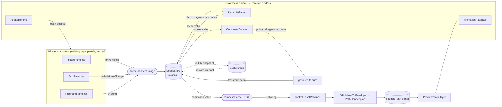

# Design: Unified Composer Canvas

## Overview

This feature replaces the mutually-exclusive image / text / freehand tabs in the
Draw view with a single shared **Composer Scene**: a layered, ordered list of
independently-transformable items that the user composes Figma-style on one
canvas, then sends to the machine as one continuous Etch-a-Sketch drawing
(Req 1, 12). The downstream pipeline is unchanged: each item still produces a
local-frame `Polyline[]` from its existing generator (`image_processor`,
`text_renderer`, `freehand_capture`); a new pure `composeScene(scene)` applies
each item's affine `Transform` and concatenates the results in Z-order; the flat
output is handed to the same `controller.setPolylines` →
`fitPolylinesToEnvelope` → `PathPlanner.plan` → wire-codec chain that exists
today (Req 9, 16).

The Draw view re-flows around three new affordances that match the user's
sketch and the explicit panel requirements:

- **Center**: a large **Composer Scene canvas** — the "digital twin". The
  drawable envelope is rendered as the existing dashed rectangle (visible
  preview of where strokes will land), every item is drawn in Z-order with its
  Transform applied, and a selection overlay (resize handles + rotation handle)
  is drawn around the selected item (Req 1.3, 3, 4, 5, 6, 13.2).
- **Left rail**: an **Items List** vertical stack (topmost item at top), with
  click-to-select, drag-to-reorder, and per-row delete (Req 17). Above the
  list sits the **Add menu** with three buttons — *Add image*, *Add text*,
  *Add freehand* — each of which opens the existing input panel as a
  modal/popover whose commit callback fires `addItem` instead of
  `controller.setPolylines` (Req 2, 12.1, 12.2).
- **Bottom-right** (overlaying the canvas area): an **Animation Playback**
  panel — Play, Pause, Stop, and a 0.25×–8× speed slider — that drives a
  visual stylus indicator over the *static* preview rendering (Req 18). It is
  rendering-only; nothing is transmitted to the controller (Req 18.10).

The existing top app shell (logo, Setup tab, Connect button) and the existing
bottom drawing-controls bar (E-STOP, Pause/Resume/Cancel, Speed slider) are
unchanged (Req 16.2).

## Architecture



Key design facts to lock in:

- **`composeScene` is a pure function**: no DOM, no signal reads, no I/O, no
  global state. It depends only on its `Scene` argument and returns a fresh
  `Polyline[]` (Req 10.1).
- **`SceneStore` is the single source of truth.** Every UI surface (canvas,
  items list, animation playback indicator track) subscribes to its signals;
  edits go *through* the store API so persistence and undo/redo are honoured
  uniformly (Req 14, 15).
- **`controller.setPolylines` and the planner are unchanged.** The composer is
  the *only* upstream caller of `setPolylines` after this feature ships, and it
  passes `composeScene(scene)` (Req 9.4, 9.5, 16.3). When the scene goes
  empty, `controller.clearPath` is called instead so the existing controller
  contract holds (Req 12.4).
- **No firmware, no wire-protocol, no codec, no planner change** (Req 16.1,
  16.3).

## Components and Interfaces

### 1. `web/src/composer/types.ts`

Owns the data model — pure types, no logic. Every shape is JSON-serialisable
(Req 10.3, 14).

```ts
import type { Polyline } from '../types';

/** Stable opaque item identifier. ULID-style string; generated by SceneStore. */
export type ItemId = string;

/** Per-item affine transform (Glossary; Req 9.2, 6.2). */
export interface Transform {
  /** Translation in scene units. */
  x: number;
  y: number;
  /** Scale factors. Defaults `1, 1`. Invariant: `|sx| > 0 && |sy| > 0` (Req 5.4). */
  sx: number;
  sy: number;
  /** Counter-clockwise rotation about the item's local origin, normalised `[0, 2π)` (Req 6.2). */
  rotationRad: number;
}

export interface BaseItem {
  id: ItemId;
  transform: Transform;
  /** Local-frame polylines, as produced by the source generator. */
  content: Polyline[];
}

export interface Image_Item extends BaseItem {
  kind: 'image';
  /** Source metadata persisted with the snapshot (Req 14.4). */
  source: { filename: string; sizeBytes: number };
}

export interface Text_Item extends BaseItem {
  kind: 'text';
  source: {
    text: string;
    fontName: string;
    fontSizeMm: number;
    letterSpacingPct: number;
  };
}

export interface Freehand_Item extends BaseItem {
  kind: 'freehand';
  source: { capturedAtMs: number };
}

export type Item = Image_Item | Text_Item | Freehand_Item;

/**
 * The Composer Scene. `items[0]` is bottommost (drawn first / behind);
 * `items[items.length - 1]` is topmost (drawn last / in front).
 * Items List displays this array reversed so topmost is at the top of the
 * panel (Req 17.1).
 */
export interface Scene {
  schemaVersion: 1;
  items: Item[];
  selectedId: ItemId | null;
}

export const EMPTY_SCENE: Scene;
export function makeIdentityTransform(): Transform;
```

This module owns the **shapes** only. It does not own the affine math, the
mutators, persistence, or any rendering.

### 2. `web/src/composer/compose.ts`

Owns the pure composition function and the affine math. No signals, no DOM,
no I/O (Req 10.1).

```ts
import type { Point, Polyline } from '../types';
import type { Item, Scene, Transform } from './types';

/**
 * Compose the Scene into a flat `Polyline[]` ready for `controller.setPolylines`.
 *
 * For each item in `scene.items` (in array order = Z-order, lowest-index first),
 * apply `T(p) = R(rotationRad) · S(sx, sy) · p + (x, y)` to every point in
 * every local-frame polyline, then concatenate the results.
 *
 * Defensive: any input polyline with fewer than 2 points is skipped (the
 * planner would skip it anyway).
 *
 * Pure: depends only on its `scene` argument.
 *
 * @see Requirements 9.1, 9.2, 9.3, 10.1, 10.2
 */
export function composeScene(scene: Scene): Polyline[];

/** Apply an item's Transform to a single local-frame point. */
export function applyTransform(t: Transform, p: Point): Point;

/** Apply an item's Transform to every point of a single polyline (allocates a new array). */
export function applyTransformToPolyline(t: Transform, poly: Polyline): Polyline;

/**
 * Bounding box of an item's *transformed* content. Used by the canvas for
 * hit-testing and selection-overlay rendering. Pure.
 */
export function itemBoundingBox(item: Item): { minX: number; minY: number; maxX: number; maxY: number };
```

This module does **not** know about signals, history, or local storage.

### 3. `web/src/composer/scene_store.ts`

Owns reactive state and the canonical mutation API. Wraps a `signal<Scene>`,
records bounded history, persists on rest, and exposes a derived
`composed: signal<Polyline[]>`.

```ts
import { type ReadonlySignal, type Signal } from '@preact/signals';
import type { Polyline } from '../types';
import type { Item, ItemId, Scene, Transform } from './types';

export interface SceneStoreOptions {
  /** Persistence adapter; defaults to `createLocalStoragePersistence()`. */
  persistence?: ScenePersistence;
  /** Maximum history depth for undo/redo (Req 15.1). Default 50. */
  historyLimit?: number;
}

export interface SceneStore {
  /** Live Scene; subscribers re-render reactively. */
  readonly scene: ReadonlySignal<Scene>;
  /** Currently-selected item, derived (Req 3). */
  readonly selectedItem: ReadonlySignal<Item | null>;
  /** `composeScene(scene.value)`, memoised — recomputed only when scene changes (Req 11.2). */
  readonly composed: ReadonlySignal<Polyline[]>;
  /** Whether undo/redo would do anything (Req 15.2, 15.3). */
  readonly canUndo: ReadonlySignal<boolean>;
  readonly canRedo: ReadonlySignal<boolean>;

  // --- mutators (each commits exactly one history entry on rest) ---

  /**
   * Append a new item with a freshly-generated id and a default Transform
   * placed within the visible viewport (Req 2.4). Selects it (Req 2.4).
   * Returns the new item's id.
   */
  addItem(spec:
    | { kind: 'image'; content: Polyline[]; source: Image_Item['source'] }
    | { kind: 'text'; content: Polyline[]; source: Text_Item['source'] }
    | { kind: 'freehand'; content: Polyline[]; source: Freehand_Item['source'] }
  ): ItemId;

  removeItem(id: ItemId): void;
  updateTransform(id: ItemId, patch: Partial<Transform>): void;
  /** Move `id` to the supplied Z-order index (clamped to valid range). */
  reorder(id: ItemId, toIndex: number): void;
  bringForward(id: ItemId): void; // Req 7.2
  sendBackward(id: ItemId): void; // Req 7.3
  select(id: ItemId | null): void;

  /** Empty the Scene and the persisted snapshot in one step (Req 14.5). */
  clear(): void;

  // --- gesture lifecycle (intermediate updates do not push history) ---

  /** Begin a coalesced gesture; subsequent `updateTransform` calls until `endGesture` form a single history entry (Req 15.4). */
  beginGesture(id: ItemId, kind: 'move' | 'resize' | 'rotate'): void;
  endGesture(): void;
  cancelGesture(): void; // restore pre-gesture transform

  // --- history ---

  undo(): void; // Req 15.2
  redo(): void; // Req 15.3
}

export function createSceneStore(opts?: SceneStoreOptions): SceneStore;
```

The store is responsible for: id generation, default-transform placement on
add, normalising `rotationRad` into `[0, 2π)` on commit, clamping `|sx|, |sy| >
SCALE_MIN`, debouncing persistence to gesture rest, and wiring intermediate
gesture updates to a single history entry.

### 4. `web/src/composer/persistence.ts`

```ts
import type { Scene } from './types';

export interface ScenePersistence {
  load(): Scene | null;
  save(scene: Scene): void;
  clear(): void;
}

export function createLocalStoragePersistence(opts?: {
  /** localStorage key; defaults to `'eas:composer:scene:v1'`. */
  key?: string;
  /** Schema version expected on load; defaults to `1`. */
  schemaVersion?: 1;
  /**
   * Soft maximum serialised snapshot size in bytes. Saves whose JSON length
   * would exceed this are skipped (the in-memory Scene is unaffected) and a
   * non-blocking notice is surfaced via `onTooLarge`. Defaults to
   * `MAX_SNAPSHOT_BYTES` (≈ 2 MB), well below typical per-origin
   * localStorage quotas (~5 MB on most browsers) (Req 14.6).
   */
  maxBytes?: number;
  /**
   * Called when a save would exceed `maxBytes` OR the underlying storage
   * throws (quota / disabled / private-browsing). Receives a stable
   * machine-readable reason and the user-facing message. The SceneStore wires
   * this to a non-blocking notice surface; in-memory Scene state is preserved
   * (Req 14.6, 14.7).
   */
  onTooLarge?: (reason: 'too-large' | 'storage-error', message: string) => void;
}): ScenePersistence;

/** Soft cap on serialised snapshot size (≈ 2 MB; Req 14.6). */
export const MAX_SNAPSHOT_BYTES: number;

/** User-facing notice text used by both the size-cap and storage-error paths. */
export const SNAPSHOT_TOO_LARGE_MESSAGE: string;

/**
 * Pure (de)serialisation. `parse` returns `null` for malformed input or a
 * mismatched `schemaVersion`; never throws to the caller (Req 14.3).
 */
export function serialiseScene(scene: Scene): string;
export function parseScene(raw: string): Scene | null;
```

Owns: JSON shape, schema-version gate, throw-safety. Does **not** own when to
save (the SceneStore decides — only when no gesture is active, Req 14.1).

### 5. `web/src/ui/composer/ComposerCanvas.tsx`

Replaces the body of the existing Draw-view canvas surface. It:

1. Reads `sceneStore.scene` to render every item in Z-order with its
   Transform applied (Req 1.3).
2. Renders the dashed drawable-envelope rectangle on top, exactly as the
   existing `Canvas.tsx` does today, so the user sees the digital twin.
3. Renders the selection overlay (eight resize handles + a rotation handle)
   around the selected item's transformed bounding box (Req 3.3).
4. Routes pointer events through `gestures.ts`, dispatching
   `beginGesture` / `updateTransform` / `endGesture` to the store.
5. Picks an SVG render path — one `<g>` per item, polylines as `<polyline>`s,
   item-level `transform` attribute = the affine — to get crisp lines, easy
   per-item hit-testing, and free integration with the existing connector
   styling (rationale in Risks/tradeoffs).

```ts
export interface ComposerCanvasProps {
  store: SceneStore;
  /** Drawable envelope (mm) used to render the dashed envelope rectangle. */
  envelopeMm: { w: number; h: number };
  /** Optional class for the outer wrapper. */
  class?: string;
}
export function ComposerCanvas(props: ComposerCanvasProps): preact.JSX.Element;
```

It does **not** own: planner output rendering, animation playback, anything
machine-side. Those stay in `Preview.tsx` / `AnimationPlayback.tsx`.

### 6. `web/src/ui/composer/ItemsListPanel.tsx`

Left-rail vertical stack. One row per item, *topmost on top* (the panel
displays `[...store.scene.value.items].reverse()`, Req 17.1).

Per-row label format (Req 17.2, with 32-char truncation + single-character
ellipsis per Req 17.3):

- `Image: <source.filename>`
- `Text: <source.text>`
- `Freehand stroke`

Selected row is rendered in a visually distinct state; the rest are
unselected (Req 17.5).

```ts
export interface ItemsListPanelProps {
  store: SceneStore;
  /** Slot for the AddItemMenu (rendered above the list — see Req 12.1). */
  addMenu?: preact.JSX.Element;
}
export function ItemsListPanel(props: ItemsListPanelProps): preact.JSX.Element;
```

Pointer events handled inside the panel:

- Click row → `store.select(id)` (Req 17.4).
- Drag-row gesture: a tracked drop indicator that does *not* mutate the
  scene until pointer-up (Req 17.7); on drop, `store.reorder(id, toIndex)`.
- Per-row delete button → `store.removeItem(id)` (Req 17.8).

Empty state (`scene.items.length === 0`): renders the literal placeholder
text "No items yet — add an image, text, or a freehand drawing to get
started" and **no** rows (Req 17.9).

### 7. `web/src/ui/composer/AddItemMenu.tsx`

Three buttons rendered at the top of the items list (the natural placement —
adjacent to the list, never competes with the central canvas, and sits in the
existing left-side aside slot from `App.tsx`):

```ts
export interface AddItemMenuProps {
  store: SceneStore;
  /** For test injection; defaults to the real renderer/vectoriser/capture. */
  panels?: {
    image?: preact.ComponentType<{ onCommit: (polylines: Polyline[], src: Image_Item['source']) => void; onCancel: () => void }>;
    text?: preact.ComponentType<{ onCommit: (polylines: Polyline[], src: Text_Item['source']) => void; onCancel: () => void }>;
    freehand?: preact.ComponentType<{ onCommit: (polylines: Polyline[], src: Freehand_Item['source']) => void; onCancel: () => void }>;
  };
}
export function AddItemMenu(props: AddItemMenuProps): preact.JSX.Element;
```

Each button toggles a popover/modal that hosts the existing
`ImagePanel` / `TextPanel` / `FreehandPanel` *unmodified except for the commit
callback* (Req 12.2, 16.4):

- `ImagePanel.onPolylines(polys)` → modal commits → `store.addItem({ kind: 'image', content: polys, source: { filename, sizeBytes } })`.
- `TextPanel.onPolylinesChange(polys)` → preview only inside the modal; on the modal's "Add to scene" button → `store.addItem({ kind: 'text', content: polys, source: {...} })`.
- `FreehandPanel.onSend(polys)` → modal commits → `store.addItem({ kind: 'freehand', content: polys, source: { capturedAtMs: Date.now() } })`.

Image vectorisation failure surfaces through the existing
`controller.setImageError` channel; no item is added (Req 2.6).

### 8. `web/src/ui/composer/AnimationPlayback.tsx`

Bottom-right floating panel. Reads `store.composed` (the same `Polyline[]`
the planner consumed, post-transform) and renders an animated indicator on a
transparent overlay above the static preview drawing.

```ts
export type PlaybackState = 'stopped' | 'playing' | 'paused';

export interface AnimationPlaybackProps {
  /** Live composed polylines, in drawing order, including connectors. */
  composed: ReadonlySignal<Polyline[]>;
  /**
   * Live machine-side ETA from the existing planner pipeline (the same
   * figure the static Preview already shows). Rendered as the "Machine ETA"
   * readout; not affected by the playback speed control (Req 18.13, 18.14).
   * Pass `stores.plannedPath`-derived milliseconds via a derived signal.
   */
  machineEtaMs: ReadonlySignal<number | null>;
  /** Initial speed multiplier; clamped to [0.25, 8]. Default 1. */
  initialSpeed?: number;
  /** Default rate (units/second along the composed path) at speed = 1. */
  baseUnitsPerSecond?: number;
  /** Optional class on the floating wrapper. */
  class?: string;
}
export function AnimationPlayback(props: AnimationPlaybackProps): preact.JSX.Element;
```

Behaviour (Req 18):

- Play (Req 18.2): start a `requestAnimationFrame` loop integrating
  `dt * speed * baseUnitsPerSecond` along the composed path; render the
  indicator at the cumulative position. Pause-resume preserves position
  (Req 18.7); Stop drops to `'stopped'` and removes the indicator (Req 18.8).
- Empty scene + Play (Req 18.4): no-op; control stays disabled when
  `composed.value.length === 0`.
- Speed control (Req 18.5): `<input type="range" min={0.25} max={8} step={0.25}>`;
  on change, the rAF loop reads the latest speed from a ref so changes take
  effect within one frame (≪ 100 ms).
- Scene-change auto-stop (Req 18.9): subscribe to `composed` changes via an
  `effect`; on change while playing/paused, transition to `'stopped'` and reset
  position to 0.
- Determinism (Req 18.11): the indicator track is a pure function of
  `composed`, `speed`, and elapsed-time-since-play; given the same scene and
  speed, the position-vs-time mapping is identical. (Drift from `rAF`
  scheduling jitter is bounded by `dt`; the *position function*
  `pos(t) = baseUnitsPerSecond * speed * t` is deterministic.)
- Confined to the SPA (Req 18.10): does **not** import `controller`. Cannot
  call `setPolylines` / `draw`.
- Dual-readout (Req 18.13, 18.14): the panel renders two side-by-side
  readouts above the transport controls — **"Preview duration"**, derived
  from `pathLength(composed.value) / (baseUnitsPerSecond × speed)`, and
  **"Machine ETA"**, read directly from the `machineEtaMs` signal which
  mirrors the existing static-Preview ETA (driven by the planner's
  step-count and the SPEED slider feed rate). The "Preview speed" slider
  rebinds only the first readout; the second never reacts to it. The two
  labels are explicit ("Preview duration" / "Machine ETA: real draw time")
  so the user cannot confuse playback rate with physical drawing time.

### 9. `web/src/composer/gestures.ts`

Pure helpers — no DOM, no signals — for converting pointer-event coordinates
into Transform deltas. Keeps the math testable in isolation.

```ts
import type { Point } from '../types';
import type { Transform } from './types';

/** Translate by raw pointer delta in scene units (Req 4.2). */
export function moveTransform(t: Transform, dxScene: number, dyScene: number): Transform;

/**
 * Resize from a corner handle. `pivot` is the opposite corner of the bounding
 * box (kept fixed). `pointerScene` is the live pointer position. When `aspectLock`
 * is true (Shift held), the aspect ratio at gesture-start is preserved (Req 5.3).
 */
export function resizeFromCorner(
  t0: Transform,
  bbox0: { minX: number; minY: number; maxX: number; maxY: number },
  corner: 'tl' | 'tr' | 'bl' | 'br',
  pointerScene: Point,
  aspectLock: boolean,
): Transform;

/** Resize from an edge handle — only one axis (Req 5.2). */
export function resizeFromEdge(
  t0: Transform,
  bbox0: { minX: number; minY: number; maxX: number; maxY: number },
  edge: 't' | 'b' | 'l' | 'r',
  pointerScene: Point,
): Transform;

/**
 * Rotate around the item's local origin to the angle implied by
 * `pointerScene` relative to `pivotScene`. When `snap15deg` is true, the
 * resulting angle is rounded to the nearest 15° (Req 6.3). Output is
 * normalised into `[0, 2π)` (Req 6.2).
 */
export function rotateToPointer(
  t0: Transform,
  pivotScene: Point,
  pointerScene: Point,
  snap15deg: boolean,
): Transform;

/** Clamp `sx` and `sy` so neither falls below `SCALE_MIN` (Req 5.4). */
export const SCALE_MIN: number; // e.g. 1e-3
export function clampScale(t: Transform): Transform;

/** Normalise `rotationRad` into `[0, 2π)` (Req 6.2). */
export function normaliseRotation(t: Transform): Transform;
```

## Data Models

### Scene / Item / Transform

(Verbatim from `types.ts` above; this is the single canonical definition.)

- `Scene = { schemaVersion: 1; items: Item[]; selectedId: ItemId | null }`
- `Item = Image_Item | Text_Item | Freehand_Item`, each carrying:
  - `id: ItemId` — opaque, ULID-style string
  - `transform: Transform`
  - `content: Polyline[]` — local-frame polylines, untransformed
  - `kind` discriminator and `source` metadata
- `Transform = { x, y, sx, sy, rotationRad }`, with invariants
  `|sx| > SCALE_MIN ∧ |sy| > SCALE_MIN` and `rotationRad ∈ [0, 2π)`.

### Affine math

For every point `p` of every local-frame polyline of an item with transform
`(x, y, sx, sy, θ)`:

```
T(p) = R(θ) · S(sx, sy) · p + (x, y)
     = ( cos(θ)·sx·p.x − sin(θ)·sy·p.y + x ,
         sin(θ)·sx·p.x + cos(θ)·sy·p.y + y )
```

Rotation is counter-clockwise about the item's local origin (= the local
origin of `content`, i.e. `(0, 0)` in the generator's own frame). This is the
single shared definition; `composeScene`, `gestures.ts`, and the canvas
selection overlay all use it.

### LocalStorage schema

- **Key** (default): `eas:composer:scene:v1`.
- **Value**: `JSON.stringify(scene)` where `scene.schemaVersion === 1`.
- **Migration policy**: a stored snapshot whose `schemaVersion` does not
  match the current version is treated as malformed — `parseScene` returns
  `null`, the store starts empty, and no error is surfaced to the user
  (Req 14.3).
- **Future versions**: a `migrate(raw, fromVersion)` helper added to
  `persistence.ts` will be the only place per-version migration logic lives.

```jsonc
{
  "schemaVersion": 1,
  "selectedId": "01J…",
  "items": [
    {
      "id": "01J…",
      "kind": "image",
      "transform": { "x": 0, "y": 0, "sx": 1, "sy": 1, "rotationRad": 0 },
      "content": [[{ "x": 0, "y": 0 }, { "x": 10, "y": 0 }]],
      "source": { "filename": "logo.png", "sizeBytes": 12345 }
    }
  ]
}
```

## Correctness Properties


*A property is a characteristic or behavior that should hold true across all
valid executions of a system — essentially, a formal statement about what the
system should do. Properties serve as the bridge between human-readable
specifications and machine-verifiable correctness guarantees.*

The Composer is a strong fit for property-based testing: `composeScene`,
`gestures.ts`, the SceneStore mutators, and `persistence.ts` are all pure (or
purely-state-modifying) functions over rich, structured input spaces, and the
correctness contract is universal in nature ("for all scenes…", "for all
transforms…", "for all sequences of edits…").

### Property 1: composeScene Z-order

*For any* `Scene`, the output of `composeScene(scene)` is the concatenation, in
ascending `items` index order, of `applyTransformToPolyline(item.transform, p)`
for every polyline `p` in `item.content`. Specifically: for any `i < j`, every
polyline contributed by `items[i]` appears at a strictly lower index in the
output than every polyline contributed by `items[j]`.

**Validates: Requirements 1.2, 1.3, 1.4, 9.1, 9.3**

### Property 2: composeScene affine correctness

*For any* item with `transform = (x, y, sx, sy, θ)` and *any* local-frame point
`p`, the corresponding output point equals
`R(θ) · S(sx, sy) · p + (x, y)`, i.e.:

```
out.x = cos(θ)·sx·p.x − sin(θ)·sy·p.y + x
out.y = sin(θ)·sx·p.x + cos(θ)·sy·p.y + y
```

(within IEEE-754 round-off bounds).

**Validates: Requirements 9.2, 1.3**

### Property 3: composeScene determinism and purity

*For any* `Scene` `s` and *any* deep clone `s'` structurally equal to `s`,
`composeScene(s)` and `composeScene(s')` produce structurally equal
`Polyline[]`. Calling `composeScene(s)` neither mutates `s` nor depends on
any external state (no DOM, no signals, no globals).

**Validates: Requirements 10.1, 10.2**

### Property 4: composeScene non-degenerate bounding box

*For any* `Scene` whose every item has at least two distinct content points
and a Transform with `|sx| > SCALE_MIN ∧ |sy| > SCALE_MIN`, the bounding box
of `composeScene(scene)` has `width > 0` AND `height > 0`.

**Validates: Requirements 9.7**

### Property 5: addItem postcondition

*For any* current `Scene` and *any* `addItem` call with kind `K` and content
`C`, after the call: (a) `scene.items.length` increases by exactly 1; (b) the
final item has `kind === K` and `content === C`; (c) every previously-existing
item is structurally unchanged at its prior index; (d) `scene.selectedId`
equals the new item's id; (e) the new item's transformed bounding box
intersects the current envelope rectangle.

**Validates: Requirements 1.1, 1.2, 1.4, 2.1, 2.2, 2.3, 2.4**

### Property 6: hit-test selects the topmost item

*For any* `Scene` and *any* point `p` lying inside the transformed bounding
boxes of a non-empty subset `S` of items, the hit-test routine used by
`ComposerCanvas` selects the item in `S` with the highest index in
`scene.items` (i.e. the topmost). When `p` lies in no transformed bounding
box, the routine returns `null` and clicking dispatches `select(null)`.

**Validates: Requirements 3.1, 3.2, 3.4**

### Property 7: transform laws (move / resize / rotate)

*For any* starting `Transform` `t0` and *any* gesture inputs:

- `moveTransform(t0, dx, dy)` produces a transform with
  `x = t0.x + dx`, `y = t0.y + dy`, and `sx`, `sy`, `rotationRad` unchanged.
- `resizeFromCorner(t0, bbox0, corner, p, aspectLock)` keeps the opposite
  corner of `bbox0` fixed under the new transform, and when `aspectLock` is
  true, `sx_new / sy_new === t0.sx / t0.sy`.
- The output of any resize helper, after `clampScale`, satisfies
  `|sx| ≥ SCALE_MIN ∧ |sy| ≥ SCALE_MIN`.
- `rotateToPointer(t0, pivot, p, snap=false)` produces a transform whose
  `rotationRad ∈ [0, 2π)` and equals `atan2(p − pivot)` mod 2π. With
  `snap=true`, the result is a multiple of `π/12` (15°).

**Validates: Requirements 4.2, 5.1, 5.2, 5.3, 5.4, 6.1, 6.2, 6.3, 8.1, 8.2, 8.3, 8.4, 8.5, 8.6**

### Property 8: Z-order reorder

*For any* `Scene` with at least one item, *any* `id` in the scene, and *any*
target index `k ∈ [0, items.length)`, after `reorder(id, k)` the item with
that id appears at index `k` and the relative order of all other items is
preserved. `bringForward` and `sendBackward` are special cases:
`bringForward(id)` when `id` is already topmost is a no-op, and likewise for
`sendBackward(id)` at the bottom.

**Validates: Requirements 7.2, 7.3, 7.4, 17.6**

### Property 9: Scene serialisation round-trip

*For any* `Scene` `s` produced by the SceneStore mutators, parsing
`serialiseScene(s)` returns a `Scene` structurally equal to `s` (same items in
the same order, same transforms, same content polylines, same source
metadata, same `selectedId`, same `schemaVersion`).

**Validates: Requirements 10.3, 14.1, 14.2, 14.4**

### Property 10: undo/redo round-trip

*For any* sequence of SceneStore edits `e_1, …, e_n` (mutators bracketed by
`beginGesture`/`endGesture` count as a single edit, Req 15.4), applying them
all and then calling `undo()` `n` times — bounded by `historyLimit` ≥ 20 —
produces a `Scene` structurally equal to the starting Scene. Calling `redo()`
`n` times immediately after returns the Scene to the state after `e_n`.

**Validates: Requirements 15.1, 15.2, 15.3, 15.4**

### Property 11: composed signal reactivity

*For any* sequence of mutations to the SceneStore that ends with no gesture
in progress, after the mutations settle, `composed.value` equals
`composeScene(scene.value)`.

**Validates: Requirements 13.1, 17.10**

### Property 12: empty scene drives clearPath

*For any* sequence of mutations that brings `scene.items.length` from a
positive number to zero, `controller.clearPath` is invoked at least once and
`controller.setPolylines` is not invoked with a non-empty polylines array
afterwards (until the next add).

**Validates: Requirements 12.4**

### Property 13: items list label format and truncation

*For any* `Item`, the label rendered by `ItemsListPanel` for that item:

- starts with `"Image: "` for image items, `"Text: "` for text items, and is
  exactly `"Freehand stroke"` for freehand items;
- has length ≤ 32 characters; if the unrestricted label would exceed 32, the
  rendered label has length exactly 32 and ends in a single ellipsis
  character (`"…"`).

For any `Scene`, the rendered DOM order of rows is `scene.items` reversed
(topmost item at the top of the list).

**Validates: Requirements 17.1, 17.2, 17.3**

### Property 14: AnimationPlayback determinism

*For any* composed `Polyline[]` `P`, *any* speed `s ∈ [0.25, 8]`, and *any*
two playback runs that begin at `t = 0` and observe identical
`(P, s, totalElapsed)`, the indicator position emitted at any sampled
`totalElapsed` is identical. Pausing at time `t_pause` and resuming after a
real-time gap of `Δ` produces the same position trajectory as a continuous
run, time-shifted by `Δ` for `t > t_pause`.

**Validates: Requirements 18.2, 18.7, 18.11**

### Property 15: AnimationPlayback dual-readout independence

*For any* `composed: Polyline[]`, *any* `machineEtaMs: number | null`, and
*any* sequence of changes to the "Preview speed" control: the rendered
"Machine ETA" readout is a function of `machineEtaMs` only and is byte-for-byte
identical across all speed-slider values; the rendered "Preview duration"
readout is a function of `composed` and the current speed and changes monotonically
when the speed changes. The two readouts are labelled "Preview duration" and
"Machine ETA: real draw time" respectively and are visually distinguishable.

**Validates: Requirements 18.13, 18.14**

### Property 16: Persistence size cap and storage-error safety

*For any* SceneStore mutation that comes to rest, IF the serialised snapshot
length exceeds `MAX_SNAPSHOT_BYTES`, the persistence adapter SHALL skip the
write, invoke `onTooLarge('too-large', SNAPSHOT_TOO_LARGE_MESSAGE)`, and
leave the in-memory `scene.value` byte-equal to the value that would have
been persisted. Likewise, IF the underlying `localStorage` write throws
(quota / disabled / private-browsing), the adapter SHALL invoke
`onTooLarge('storage-error', SNAPSHOT_TOO_LARGE_MESSAGE)` and the
SceneStore SHALL remain fully functional for further edits.

**Validates: Requirements 14.6, 14.7**

## Error Handling

| Failure | Handling | Source requirement |
| --- | --- | --- |
| Image vectorisation throws / returns `NoEdgesFound` | Modal commit is aborted; `controller.setImageError` is called with the renderer's message; `addItem` is **not** invoked. | Req 2.6 |
| Persisted snapshot is malformed JSON | `parseScene` returns `null`; SceneStore boots with `EMPTY_SCENE`; no error surfaced to the user. | Req 14.3 |
| Persisted snapshot has an unsupported `schemaVersion` | Same as above (treated as malformed). | Req 14.3 |
| Pointer event on a transform handle when no item is selected | Defensive no-op — handle elements are not rendered when no item is selected, and any stray event the gesture layer receives is dropped. | Req 3.5 (defensive) |
| `composeScene` with an item whose content polyline has fewer than 2 points | That polyline is skipped (the planner already drops it). | Defensive; Req 9.7 supports this |
| Image content polylines exceed `localStorage` quota during save | Catch the storage exception, treat the save as a no-op, surface the non-blocking `SNAPSHOT_TOO_LARGE_MESSAGE` via `onTooLarge('storage-error', …)`, and keep the in-memory Scene fully editable. The user's "Clear scene" action remains available as the recovery path. | Req 14.7 |
| Serialised snapshot exceeds `MAX_SNAPSHOT_BYTES` (≈ 2 MB) | Skip the persist; surface `SNAPSHOT_TOO_LARGE_MESSAGE` via `onTooLarge('too-large', …)`; in-memory Scene continues to function normally. | Req 14.6 |
| `localStorage` is unavailable (private mode / disabled) | Persistence adapter degrades to a no-op; the rest of the feature works for the session. | Req 14 (graceful) |

## Files changed

### New (under `web/src/composer/` and `web/src/ui/composer/`)

- `web/src/composer/types.ts`
- `web/src/composer/compose.ts`
- `web/src/composer/gestures.ts`
- `web/src/composer/scene_store.ts`
- `web/src/composer/persistence.ts`
- `web/src/composer/compose.props.test.ts`
- `web/src/composer/compose.test.ts`
- `web/src/composer/gestures.props.test.ts`
- `web/src/composer/scene_store.props.test.ts`
- `web/src/composer/persistence.props.test.ts`
- `web/src/ui/composer/ComposerCanvas.tsx` and `.test.tsx`
- `web/src/ui/composer/ItemsListPanel.tsx` and `.test.tsx`
- `web/src/ui/composer/AddItemMenu.tsx` and `.test.tsx`
- `web/src/ui/composer/AnimationPlayback.tsx` and `.test.tsx`

### Changed

- `web/src/ui/App.tsx` — Draw view restructures: the `app__tabs` aside is
  replaced by `<ItemsListPanel addMenu={<AddItemMenu …/>} />`; the
  central `<Canvas …/>` is replaced by `<ComposerCanvas …/>` while the
  existing `<Preview …/>` slot remains; `<AnimationPlayback …/>` is
  positioned bottom-right inside `app__canvas-area`. The "Send to machine"
  click handler is updated to `controller.setPolylines(sceneStore.composed.value, opts)`
  before `controller.draw()` (Req 9.4).
- `web/src/ui/Canvas.tsx` — kept as a thin **rendering helper** for static
  step-space planned-path drawing (`drawPath`, `drawableSteps` projection)
  used by both `ComposerCanvas` (envelope + planner-output overlay) and
  `Preview`. Its component is no longer rendered at the top level of the Draw
  view — `ComposerCanvas` replaces that role. The `findOutOfBoundsStepSegments`
  / `formatDuration` / `formatStepCount` exports stay so `Preview.tsx` and
  any test that depends on them keeps building.
- `web/src/ui/ImagePanel.tsx`, `web/src/ui/TextPanel.tsx`,
  `web/src/ui/FreehandPanel.tsx` — **input UIs are unchanged**. Only their
  hosts change: when invoked through `AddItemMenu`, the commit callback
  pushes the resulting polylines to `sceneStore.addItem` instead of
  `controller.setPolylines`. The existing direct-Send affordances inside
  these panels are removed (their commit becomes "Add to scene" + close
  modal). Their public prop types are otherwise stable.
- `web/src/main.ts` — instantiates the `SceneStore` once and threads it into
  `<App store={…} controller={controller} />`.

### Unchanged (and explicitly so)

- `web/src/app/controller.ts` — `setPolylines`, `clearPath`, `draw`, and all
  control-channel helpers retain their current signatures (Req 9.4, 9.5,
  12.3, 16.2, 16.3).
- `web/src/path/planner.ts`, `web/src/path/scale.ts`, `web/src/path/bounds.ts`,
  `web/src/path/ramp.ts`, `web/src/path/stitch.ts`, `web/src/path/rdp.ts`,
  `web/src/path/nn_order.ts` — planner pipeline (Req 9.6, 16.3).
- `web/src/types.ts` — `Point`, `Polyline`, `PlannedPath` (Req 16.3).
- `web/src/codec/**`, `web/src/net/**` — wire codecs and transport (Req 16.1, 16.3).
- `firmware/**` — no firmware changes (Req 16.1).
- `web/src/image/**`, `web/src/text/**`, `web/src/freehand/**` — generators
  reused as-is (Req 16.4).

## Testing strategy

### Unit and property tests

- **`compose.props.test.ts`** (fast-check) — Properties 1, 2, 3, 4 from the
  Correctness Properties section. Generates random Scenes with up to 10
  items and up to 50 points per polyline; min 100 iterations per property
  (the project's standard). Each test is tagged
  `// Feature: unified-composer-canvas, Property N: <text>`.
- **`gestures.props.test.ts`** — Property 7 (move / resize / rotate laws),
  including aspect-lock invariance and `clampScale` minimum.
- **`scene_store.props.test.ts`** — Properties 5, 8, 10, 11, 12. A simple
  command/state-machine test (fast-check `commands`) covers the undo/redo
  round-trip and bounded history.
- **`persistence.props.test.ts`** — Property 9 (round-trip) plus negative
  examples for Req 14.3.

### Component tests (Preact + happy-dom)

- **`ComposerCanvas.test.tsx`** — selection by click, topmost wins for
  overlapping items (Req 3.2), pointer-drag dispatches translate, corner
  drag dispatches resize with the opposite corner fixed, rotation handle
  dispatches rotation, Shift modifier triggers aspect-lock and 15° snap,
  empty-canvas click clears selection.
- **`ItemsListPanel.test.tsx`** — empty placeholder render (Req 17.9), label
  format + truncation (Property 13), click-to-select (Req 17.4),
  drag-to-reorder mutates only on drop (Req 17.6, 17.7), per-row delete
  (Req 17.8), reactivity to direct-canvas mutations (Req 17.10).
- **`AddItemMenu.test.tsx`** — each Add button opens its modal; commit calls
  `addItem` with the right kind/content/source; cancel does not call
  `addItem`; image vectorisation failure path (Req 2.6) calls
  `setImageError` and not `addItem`.
- **`AnimationPlayback.test.tsx`** — Play / Pause / Stop transitions
  (Req 18.6–18.8), empty-scene Play disabled (Req 18.4), speed control range
  + within-100-ms effect (Req 18.5), scene-change auto-stop (Req 18.9), no
  controller method called (Req 18.10), determinism by sampling the
  indicator position at fixed elapsed times (Property 14).

### Visual / pipeline smoke tests

- A small fixture set: one image-only scene, one text-only scene, one
  freehand-only scene, and one mixed three-item scene with non-identity
  transforms. For each, snapshot `composeScene(scene)` shape and the
  resulting `PathPlanner.plan` step count. These pin down "the composer
  drives the existing pipeline correctly" (Req 9.6).

### Performance smoke

- A standalone benchmark harness builds a Scene with 10 items × 500 points
  each (5 000 total points), simulates 200 sequential pointer-move events
  driving a translate gesture, and measures the mean wall-clock time per
  event including a single `composeScene` call. Asserts mean ≤ 16 ms on a
  current desktop browser (Req 11.1, 11.2). A second harness asserts the
  AnimationPlayback overlay maintains an average frame interval ≤ 33 ms
  (≥ 30 fps, Req 18.12) on the same fixture.

### Property test conventions

- Library: `fast-check` (already in the project).
- Iterations: minimum 100 per property (already the project standard).
- Tag format: `// Feature: unified-composer-canvas, Property N: <text>` on
  the `it(...)` line, mirroring this design's property numbering.

## Risks and tradeoffs

- **UX migration**. Returning users expect the three tabs. Mitigation: the
  Add menu reuses the existing tab labels ("Image" → "Add image", "Text" →
  "Add text", "Freehand" → "Add freehand") and renders the *same* input
  panel UI in the popover. The conceptual change is isolated to "where the
  result lands" — instead of replacing the canvas, it adds an item.
- **Render strategy: SVG vs Canvas2D**. We pick **SVG** for `ComposerCanvas`:
  per-item `<g transform=…>` keeps the affine math at the renderer level (no
  per-frame re-projection of every polyline in JS), DOM-based hit-testing is
  free for selection, and lines stay crisp at any zoom. The tradeoff is GC
  pressure when scenes get large; the 5 000-point benchmark gates this. If
  profiling shows SVG can't hit the Req 11.1 budget on the target browsers,
  we fall back to a Canvas2D path for `ComposerCanvas` only — `composeScene`
  output and the SceneStore are unchanged.
- **`localStorage` size**. An Image_Item containing a vectorised photograph
  can easily reach a few hundred kilobytes; a Scene with several such items
  can approach the per-origin localStorage limit (~5 MB on most browsers).
  Mitigation: a configurable soft cap (`MAX_SNAPSHOT_BYTES`, ≈ 2 MB,
  Req 14.6) is checked before every save; oversized snapshots are skipped
  with a non-blocking notice rather than crashing on quota; saves are also
  wrapped in try/catch so a `QuotaExceededError` (or any I/O failure on
  storage-disabled / private-browsing contexts) is treated as a no-op
  (Req 14.7). The user's "Clear scene" action remains the recovery path
  (Req 14.5). The in-memory Scene is never affected by persistence
  failures.
- **Connector cost**. Composing many items can balloon the inter-item
  connector travel (the stylus cannot lift). The existing Preview already
  shows total step count and time; no auto-optimisation is added — the user
  rearranges items via the Items List or Send-Backward / Bring-Forward
  controls (Req 13.1, 7.2, 7.3).
- **Animation playback ≠ machine timing**. Playback rate is set by
  `baseUnitsPerSecond × speed`, *independent* of the firmware feed rate.
  This is intentional: Req 18 explicitly defines the animation as a
  structural visualisation, not a real-time trace. The mitigation is the
  dual readout (Req 18.13, 18.14): the panel always shows **two** labelled
  values — "Preview duration" (driven by the speed slider) and "Machine
  ETA: real draw time" (from the planner's step-count / SPEED slider feed
  rate, and unaffected by the speed slider). Users see both at a glance, so
  the visual preview rate cannot be misread as the physical drawing time.
- **Undo across drawing sessions**. Edits made while the machine is drawing
  do not stop or alter the in-flight planned path (Req 15.5). The composer
  achieves this trivially because it never calls `setPolylines` during a
  gesture or mid-drawing — the existing controller's "Send to machine"
  action is the only point that snapshots `composed.value` into
  `setPolylines`.
- **History granularity**. We commit one undo entry per gesture (Req 15.4).
  The tradeoff is that fine-grained mid-gesture states are not undoable; the
  alternative (one entry per pointer move) would blow past the 20-step
  budget within seconds.
