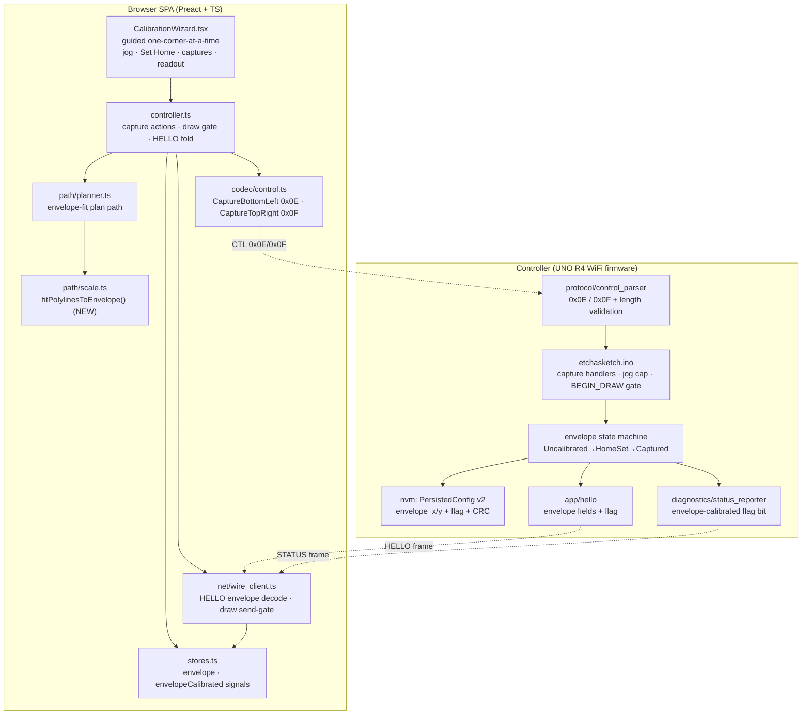

# Design Document

## Overview

This feature replaces the dangerous hard-coded gear-math scaling (`mm_per_rev`) with a **measured Step_Envelope** captured by a dummy-proof, two-corner, jog-by-eye calibration. Today the browser converts mm→steps with the fixed `DEFAULT_MM_PER_REV_X/Y = 3.4` constant (`web/src/constants.ts`), yielding ~117.6 steps/mm and ~17,900 steps across the 152 mm axis — far more travel than the machine physically has, so the motors slam the axes into their mechanical limits.

The fix introduces a **Visual_Calibration** flow:

1. The user jogs the stylus by eye to the **bottom-left** corner and captures it. The Controller sets logical home `(0,0)` and begins measuring its own accumulated step counts (`Home_Set_State`).
2. The user jogs to the **top-right** corner and captures it. The Controller records its own accumulated `|position|` since home as `Envelope_X_Steps` / `Envelope_Y_Steps` (`Envelope_Captured_State`). The envelope is measured **only** from the Controller's own counters, never from a value the SPA supplies.
3. With a valid envelope, drawings are **fit into the Step_Envelope** in step space — aspect-preserving, centered, letterboxed — and the measured envelope **replaces** the `mm_per_rev` gear math for the final mm→steps stage. There is **no silent fallback** to gear math: while no valid envelope exists, drawing is blocked.

The envelope is persisted in firmware NVM beside the existing backlash fields, surfaced in HELLO and STATUS the same way the existing `calibrated` flag and backlash values are, and gated so drawing is blocked until the machine is `Envelope_Calibrated`. A fixed per-session **Jog_Travel_Cap** in firmware refuses jogs that would drive an axis past a generous step limit, active even before any corner is captured. The flow assumes square, orthogonal axes (no skew correction) and reuses the existing jog controls, Set Home action, and STATUS position readout. Re-flashing firmware to adopt the new NVM record version is acceptable.

This design follows the precedent established by the backlash feature: a single-source-of-truth wire layout shared between firmware and SPA, fixed-offset NVM/HELLO/STATUS fields pinned by `static_assert`, and host-testable parsing/serialisation cores.

### Goals

- Capture a real travel envelope in motor steps with no physical measuring tools (Req 1, 2).
- Fit drawings into the measured envelope, aspect-preserving, replacing gear math when calibrated (Req 3).
- Block drawing until envelope-calibrated, with no fallback to the unsafe scaling (Req 4, 5).
- A fixed jog travel safety cap, active even before any capture (Req 6).
- Persist the envelope across reboots; bump the NVM version; surface it in HELLO/STATUS (Req 7, 8).
- Two new CTL kinds with a single-source-of-truth wire layout (Req 9, 11).
- Re-calibration at any time, clearing the prior envelope (Req 10).

### Non-Goals

- Skew / non-orthogonal axis correction (Req 1.8 — axes treated as square).
- Backward-compatible NVM migration of an envelope (Req 7.5 — older record version → envelope absent; re-flash is acceptable).
- Changing the existing frame envelope, Drawing_Command, or unrelated CTL kinds.
- Auto-detecting limits via stall/endstop sensing (the user jogs by eye).

## Architecture



### Calibration State Machine

The Controller owns the authoritative calibration state. It is derived from two persisted bits (`NVM_FLAG_CALIBRATED` = home set, `NVM_FLAG_ENVELOPE_CALIBRATED` = valid envelope captured) plus the in-RAM measurement baseline.

```mermaid
stateDiagram-v2
    [*] --> Uncalibrated
    Uncalibrated --> HomeSet: Capture_Bottom_Left\n(set home 0,0; snapshot baseline)
    HomeSet --> EnvelopeCalibrated: Capture_Top_Right\n(env = |pos|, valid x>0 && y>0)\npersist
    HomeSet --> HomeSet: Capture_Top_Right invalid\n(NACK, envelope stays cleared)
    EnvelopeCalibrated --> HomeSet: Capture_Bottom_Left (re-home)\nclear envelope + flag, persist
    EnvelopeCalibrated --> EnvelopeCalibrated: Capture_Top_Right\n(replace envelope, persist)
    Uncalibrated --> Uncalibrated: Capture_Top_Right\n(NACK: home not set)
    note right of EnvelopeCalibrated
        Drawing_Gate OPEN only here
        (Home_Set_State AND Envelope_Captured_State)
    end note
```



Key transitions:

- **Capture_Bottom_Left** (CTL `0x0E`): set logical home `(0,0)`, snapshot the current position as the measurement baseline, set `CALIBRATED`, and **clear** `ENVELOPE_CALIBRATED` (re-home clears the prior envelope — Req 10.1). Persist. This reuses the existing `SET_HOME` machinery plus the envelope clear.
- **Capture_Top_Right** (CTL `0x0F`): compute `env_x = |position.x - baseline.x|`, `env_y = |position.y - baseline.y|`. Since home is `(0,0)` and `SET_HOME` zeroes the planner position, `env = |position|`. If not in `HomeSet`, NACK `EnvelopeHomeNotSet` (Req 1.7). If `env_x == 0 || env_y == 0`, NACK `EnvelopeInvalid` and leave `ENVELOPE_CALIBRATED` cleared (Req 2.2). Otherwise store the envelope, set `ENVELOPE_CALIBRATED`, persist (Req 2.1, 2.3, 7.2).
- **Drawing_Gate**: `BEGIN_DRAW` and `CMD` are accepted only when `ENVELOPE_CALIBRATED` (which structurally implies `CALIBRATED`). Note this **tightens** the existing gate, which today checks only `CALIBRATED` (home set). See §"Drawing Gate".

### Coordinate-Flow Decision: Envelope-Fit Replaces Gear Math

Today the planner input flows: source geometry → `fitPolylinesToDrawable()` (fit into 152×105 **mm**) → `scaleAndClamp()` (mm→steps via `FULL_STEPS_PER_KNOB_REV / mm_per_rev`, clamp to `DRAWABLE_MM`) → step coords.

When an envelope is calibrated, the new flow bypasses the mm→steps gear stage entirely:

```
source geometry (arbitrary units)
        │
        ▼
fitPolylinesToEnvelope(polylines, {w: Envelope_X_Steps, h: Envelope_Y_Steps}, opts)
        │   uniform scale + center + letterbox, directly in STEP space
        ▼
integer step coords already in [0, Envelope_axis]   ← no mm_per_rev, no DRAWABLE_MM clamp
        │
        ▼
RDP simplify (ε in steps) → stitch → auto-return → Drawing_Command stream
```

The decision: **fit-to-envelope is a step-space sibling of `fitPolylinesToDrawable`**. Rather than fitting into an mm rectangle and then converting, it fits directly into the measured step rectangle `(Envelope_X_Steps, Envelope_Y_Steps)`. The mm→steps `scaleAndClamp` stage is replaced by integer rounding at the fit boundary. This keeps the downstream pipeline (RDP/stitch/auto-return/`toCommands`) identical — it already operates in step space — and removes any dependence on `mm_per_rev` or `DRAWABLE_MM` for calibrated drawing. The legacy `fitPolylinesToDrawable` + `scaleAndClamp` path remains in the tree for the (now-blocked) uncalibrated state and for tests, but is never used to emit a real drawing while the gate is engaged.

## Components and Interfaces

### Component Inventory

| Layer | File | Change |
|---|---|---|
| Web codec | `web/src/codec/control.ts` | Add `captureBottomLeft` / `captureTopRight` kinds (`0x0E`/`0x0F`), no-payload encoders |
| Web scale | `web/src/path/scale.ts` | Add `fitPolylinesToEnvelope()` (step-space fit) |
| Web planner | `web/src/path/planner.ts` | Add envelope-fit plan path (bypass `scaleAndClamp` gear stage) |
| Web stores | `web/src/app/stores.ts` | Add `envelope` + `envelopeCalibrated` signals |
| Web controller | `web/src/app/controller.ts` | Wire capture actions; fold HELLO envelope; gate `draw()` on `envelopeCalibrated` |
| Web wire client | `web/src/net/wire_client.ts` | Decode envelope fields/flag from HELLO+STATUS; gate sends on `envelopeCalibrated` |
| Web UI | `web/src/ui/CalibrationWizard.tsx` | Guided two-corner capture; distinct Home_Set / Envelope_Captured / complete indicators |
| FW parser | `firmware/src/protocol/control_parser.{h,cpp}` | Add `CAPTURE_BOTTOM_LEFT`/`CAPTURE_TOP_RIGHT` kinds + length validation |
| FW sketch | `firmware/etchasketch.ino` | Capture handlers, envelope clear on re-home, BEGIN_DRAW gate, jog cap |
| FW types | `firmware/src/types.h` | `PersistedConfig` envelope fields + flag bit, `NVM_VERSION` bump, static_asserts, CRC range |
| FW HELLO | `firmware/src/app/hello.{h,cpp}` | Envelope fields + flag in payload |
| FW STATUS | `firmware/src/diagnostics/status_reporter.{h,cpp}` | Envelope-calibrated flag bit |

### Web: New CTL Encoders (`codec/control.ts`)

Two new no-payload kinds are added. They are no-payload because **the Controller measures its own step counts** (Req 1.6) — the SPA sends only the trigger.

```ts
export const CtlKind = Object.freeze({
    // ... existing 0x01..0x0D ...
    CAPTURE_BOTTOM_LEFT: 0x0e,
    CAPTURE_TOP_RIGHT: 0x0f,
} as const);

export type ControlMessage =
    | /* ... existing variants ... */
    | { kind: 'captureBottomLeft' }
    | { kind: 'captureTopRight' };

// in encodeControl():
case 'captureBottomLeft':
    return Uint8Array.of(CtlKind.CAPTURE_BOTTOM_LEFT);
case 'captureTopRight':
    return Uint8Array.of(CtlKind.CAPTURE_TOP_RIGHT);
```

### Web: Envelope-Fit (`path/scale.ts`)

A step-space sibling of `fitPolylinesToDrawable`. It maps arbitrary source geometry into the measured step rectangle, preserving aspect ratio, centering, and letterboxing — and rounds to integer steps at the boundary so the output is wire-ready and provably within `[0, envelope]`.

```ts
/** A measured travel envelope in motor steps. */
export interface StepEnvelope {
    x: number; // Envelope_X_Steps  (> 0)
    y: number; // Envelope_Y_Steps  (> 0)
}

export interface FitToEnvelopeOptions {
    /** Fraction of the envelope to fill (0–1). Defaults to 1.0 (fill to edges). */
    margin?: number;
    /** Flip Y for screen-space sources (image/SVG/freehand). Text stays +Y up. */
    flipY?: boolean;
}

/**
 * Uniformly scale + center a set of polylines so they fit inside the measured
 * Step_Envelope, preserving aspect ratio (letterbox, no stretch), emitting
 * INTEGER step coordinates clamped to the inclusive [0, envelope] bounds.
 *
 * Replaces fitPolylinesToDrawable + scaleAndClamp for calibrated drawing:
 * there is no mm_per_rev conversion — the fit lands directly in step space.
 *
 * @see Requirements 3.2, 3.3, 3.4
 */
export function fitPolylinesToEnvelope(
    polylines: Polyline[],
    env: StepEnvelope,
    opts: FitToEnvelopeOptions = {},
): { x: number; y: number }[][];
```

Algorithm (mirrors the existing fit, in step space):

1. Compute the source bounding box `(minX,minY)-(maxX,maxY)` across all points.
2. `targetW = env.x * fill`, `targetH = env.y * fill` (default `fill = 1.0`).
3. Uniform scale `s = min(targetW/srcW, targetH/srcH)` (degenerate extent → `s = 1`). **One scale factor for both axes** preserves aspect ratio.
4. Center: `offX = (env.x - srcW*s)/2`, `offY = (env.y - srcH*s)/2`.
5. For each point emit `round(offX + (p.x-minX)*s)` and the Y analog (with optional flip), then **clamp to `[0, env.x]` / `[0, env.y]`** so rounding at the edge can never produce an out-of-bounds coordinate (Req 3.4).

The clamp is a defensive integer clamp after rounding; with `fill ≤ 1` and centering, the pre-clamp value is already within bounds up to a ½-step rounding margin, so the clamp only ever adjusts an extreme edge vertex by at most one step.

### Web: Planner Envelope-Fit Path (`path/planner.ts`)

`PathPlanner.plan` gains an envelope-fit branch selected by a new option. When an envelope is supplied, the per-polyline stage uses `fitPolylinesToEnvelope` (already integer step space) and **skips `scaleAndClamp`** entirely; `drawableSteps` is reported as the envelope itself.

```ts
export interface PlanOptions {
    // ... existing ...
    /**
     * When set, fit the drawing into this measured Step_Envelope (step space)
     * instead of the mm gear-math path. Bypasses mmPerRev/DRAWABLE_MM.
     * @see Requirements 3.1, 3.2
     */
    envelopeSteps?: { x: number; y: number };
}
```

When `envelopeSteps` is present, `mmPerRevX/Y` are ignored for scaling (Req 3.1), RDP runs on the fitted integer polylines (ε still in steps), and `drawableSteps = envelopeSteps`. `toCommands` is unchanged — it already emits home-relative deltas from step coords.

### Web: Stores (`app/stores.ts`)

```ts
export interface StepEnvelope { x: number; y: number }

export interface AppStores {
    // ... existing ...
    /** Measured travel envelope in steps, or null when not captured (Req 8.3). */
    envelope: Signal<StepEnvelope | null>;
    /** Whether a valid Step_Envelope is calibrated (Drawing_Gate, Req 4, 8.5). */
    envelopeCalibrated: Signal<boolean>;
}
// createStores(): envelope: signal(null), envelopeCalibrated: signal(false)
```

`calibrated` (home set) is retained and distinct from `envelopeCalibrated` so the UI can show **which** step remains (Req 4.5).

### Web: Controller (`app/controller.ts`)

- Two new outbound actions:
  ```ts
  captureBottomLeft(): void  // sendControl({kind:'captureBottomLeft'}); optimistic homeSet, clear envelope
  captureTopRight(): void    // sendControl({kind:'captureTopRight'})
  ```
  HELLO/STATUS are authoritative; optimistic UI updates are corrected on the next frame.
- HELLO fold (`home` event) now also sets `stores.envelope` and `stores.envelopeCalibrated` from the decoded fields (Req 8.3).
- STATUS fold sets `stores.envelopeCalibrated` from the new flag bit (Req 8.2, 8.4).
- `draw()` is gated on `stores.envelopeCalibrated`: if false it does not emit `BEGIN_DRAW` and surfaces a calibration-required message. The plan is built with `envelopeSteps: stores.envelope.value` so emitted coords are envelope-fit (Req 3.1, 4.1).

### Web: Wire Client (`net/wire_client.ts`)

- The send-gate predicate becomes `envelopeCalibrated` rather than `calibrated`: `sendCommand` and `sendControl({kind:'beginDraw'})` reject with `WireError('notCalibrated', …)` unless an envelope is calibrated (Req 4.1, 5.1). This is the browser mirror of the firmware authority.
- `onHello` decodes the new envelope fields and flag (see Data Models for offsets) and updates the gate flag; the `home` event payload gains `envelope` and `envelopeCalibrated`.
- `onStatus` reads the new STATUS flag bit and updates the gate flag.
- A new firmware ERROR/NACK reason for "envelope required" maps to a `fault` event kind so the UI can prompt calibration (mirrors the existing `homeRequired` handling).

### Web: CalibrationWizard (`ui/CalibrationWizard.tsx`)

A **guided one-corner-at-a-time** flow (chosen for dummy-proofing over a free-form two-button panel):

1. **Step 1 — Bottom-left.** Reuse jog (+X/-X/+Y/-Y, step presets), Set Home, position readout. Prompt: "Jog to the bottom-left corner, then capture it." Primary button: **Capture bottom-left** → `onCaptureBottomLeft`.
2. **Step 2 — Top-right** (enabled only in `Home_Set_State`). Prompt: "Now jog to the top-right corner, then capture it." Primary button: **Capture top-right** → `onCaptureTopRight`.
3. **Complete.** When `envelopeCalibrated`, show a distinct "Calibration complete — envelope NNNN × NNNN steps" indicator and enable drawing.

Distinct visual states (Req 4.5, 8.5): `data-testid` markers `calib-state-uncalibrated`, `calib-state-home-set`, `calib-state-envelope-captured`, plus `capture-bottom-left` / `capture-top-right` buttons and an `calibration-complete` indicator. The existing Set Home / Re-home / jog controls are reused; "Capture bottom-left" is the calibration-flow superset of Set Home (sets home AND begins envelope measurement).

### Firmware: Control Parser (`protocol/control_parser.{h,cpp}`)

Two new kinds, both no-payload (length == 1):

```cpp
enum class ControlKind : std::uint8_t {
  // ... 0x01..0x0D ...
  CAPTURE_BOTTOM_LEFT = 0x0E,
  CAPTURE_TOP_RIGHT   = 0x0F,
};
```

`isKnownControlKind` gains both codes. Both are added to the parameterless branch in `parseControl` (validated to `len == LEN_PARAMLESS == 1`, else `BadLength` — Req 9.3). No new range checks. The header's byte-layout table is extended with the two rows as the single source of truth shared with `web/src/codec/control.ts` (Req 9.4, 11.2).

### Firmware: Sketch Handlers (`etchasketch.ino`)

**Envelope state helpers** (beside `isCalibrated`):

```cpp
bool isEnvelopeCalibrated() {
  return (g_nvm.get().flags & NVM_FLAG_ENVELOPE_CALIBRATED) != 0;
}
```

**Capture_Bottom_Left** (reuses SET_HOME, adds envelope clear):

```cpp
case protocol::ControlKind::CAPTURE_BOTTOM_LEFT:
  g_planner.setHome();          // logical position -> (0,0); measurement baseline
  g_backlash.onHome();
  g_nvm.mutate([](PersistedConfig& cfg) {
    cfg.logical_pos_x = 0;
    cfg.logical_pos_y = 0;
    cfg.flags = static_cast<uint8_t>(cfg.flags | NVM_FLAG_CALIBRATED);
    cfg.flags = static_cast<uint8_t>(cfg.flags & ~NVM_FLAG_ENVELOPE_CALIBRATED); // re-home clears envelope (10.1)
    cfg.envelope_x_steps = 0;
    cfg.envelope_y_steps = 0;
  });
  g_status.setCalibrated(true);
  g_status.setEnvelopeCalibrated(false);
  g_status.setPosition(g_planner.position());
  sendAck(0);                    // CTL ACK semantics (Req 9.2)
  sendState(diagnostics::StatusState::Idle);
  break;
```

**Capture_Top_Right** (measures the Controller's own counts; validates; persists):

```cpp
case protocol::ControlKind::CAPTURE_TOP_RIGHT: {
  if (!isCalibrated()) {                 // not in Home_Set_State (Req 1.7)
    sendNack(0, protocol::NackReason::EnvelopeHomeNotSet);
    break;
  }
  const Position p = g_planner.position();      // home is (0,0), so env = |p|
  const int32_t ex = p.x_steps < 0 ? -p.x_steps : p.x_steps;
  const int32_t ey = p.y_steps < 0 ? -p.y_steps : p.y_steps;
  if (ex <= 0 || ey <= 0) {              // invalid envelope (Req 2.1, 2.2)
    sendNack(0, protocol::NackReason::EnvelopeInvalid);
    break;
  }
  g_nvm.mutate([ex, ey](PersistedConfig& cfg) {
    cfg.envelope_x_steps = static_cast<uint32_t>(ex);
    cfg.envelope_y_steps = static_cast<uint32_t>(ey);
    cfg.flags = static_cast<uint8_t>(cfg.flags | NVM_FLAG_ENVELOPE_CALIBRATED);
  });
  g_status.setEnvelopeCalibrated(true);
  sendAck(0);
  sendState(diagnostics::StatusState::Idle);
  break;
}
```

**Drawing gate** (tighten existing gate from `isCalibrated` to `isEnvelopeCalibrated`):

- `handleCmdFrame`: replace `if (!isCalibrated())` with `if (!isEnvelopeCalibrated())` → `sendNack(cmd.seq, NackReason::EnvelopeRequired)` (Req 4.1, 5.1).
- `BEGIN_DRAW` handler: add a guard at the top — if `!isEnvelopeCalibrated()`, `sendNack(0, NackReason::EnvelopeRequired)` and do **not** arm the draw (Req 4.4). This is the authoritative block; the SPA gate is advisory.

**Jog travel cap** (in the `JOG` handler, active regardless of calibration — Req 6):

```cpp
case protocol::ControlKind::JOG: {
  const Position cur = g_planner.position();
  const int32_t delta = int32_t(msg.jog.dir) * int32_t(msg.jog.steps);
  const int32_t nx = (msg.jog.axis == Axis::X) ? cur.x_steps + delta : cur.x_steps;
  const int32_t ny = (msg.jog.axis == Axis::Y) ? cur.y_steps + delta : cur.y_steps;
  if (nx >  JOG_TRAVEL_CAP_STEPS || nx < -JOG_TRAVEL_CAP_STEPS ||
      ny >  JOG_TRAVEL_CAP_STEPS || ny < -JOG_TRAVEL_CAP_STEPS) {
    sendNack(0, protocol::NackReason::JogTravelCap);   // refuse; do not move (Req 6.3)
    break;
  }
  // ... existing jog submit ...
}
```

`JOG_TRAVEL_CAP_STEPS` is a fixed per-session constant in `types.h`, larger than any plausible envelope (the 152 mm axis at the legacy 117.6 steps/mm is ~17,900 steps; the cap is set generously above any realistic envelope, e.g. `40000`, while still bounding a runaway). The cap is bounded relative to home `(0,0)`; before any capture, home defaults to the boot position so the cap still bounds accumulated travel from power-on (Req 6.2, 6.4).

**HELLO population** (`sendHello`): set the new `HelloFields` envelope members from `cfg.envelope_x_steps/y` and `NVM_FLAG_ENVELOPE_CALIBRATED`.

### Firmware: HELLO (`app/hello.{h,cpp}`)

Add envelope fields and flag bit to the payload (see Data Models §HELLO for byte offsets). The payload grows from 32 to 41 bytes; `HELLO_PAYLOAD_SIZE` is bumped and the host serialiser test + web decoder updated in lockstep (Req 8.1, 11.1).

### Firmware: STATUS (`diagnostics/status_reporter.{h,cpp}`)

Add a flag bit mirroring the existing `STATUS_FLAG_CALIBRATED`:

```cpp
inline constexpr std::uint8_t STATUS_FLAG_ENVELOPE_CALIBRATED = 0x04;  // bit2
void setEnvelopeCalibrated(bool v);  // set/clear bit2 in snap_.flags
```

No layout change — the flag occupies an existing reserved bit in the STATUS flags byte (offset 13). Web decoder reads bit2 (Req 8.2).

## Data Models

### PersistedConfig v2 (`firmware/src/types.h`)

The record grows to hold two `u32` envelope step counts. Layout is appended after the existing fields; `record_crc32` moves and the record size grows. **Old `version == 1` records are rejected by `readAndValidate_` (version mismatch → defaults), so the envelope is treated absent and Visual_Calibration is required** (Req 5.3, 7.5). The new flag bit lives in the existing `flags` byte.

New constants:

```cpp
inline constexpr std::uint16_t NVM_VERSION = 2;                 // bumped (Req 7.4)
inline constexpr std::uint8_t  NVM_FLAG_ENVELOPE_CALIBRATED = 0x04;  // bit2
inline constexpr std::int32_t  JOG_TRAVEL_CAP_STEPS = 40000;    // fixed per-axis cap (Req 6.1)
```

New record layout (envelope fields inserted before the moved `flags`/`_pad1`/`record_crc32` tail; the WiFi/backlash/mm/pos fields keep their offsets):

```
Offset Size Field              Notes
  0     4   magic              "ESK1"
  4     2   version            = 2
  6     2   reserved           0
  8    33   wifi_ssid          (unchanged)
 41     1   _pad0
 42    64   wifi_password      (unchanged)
106     2   backlash_x_steps   (unchanged)
108     2   backlash_y_steps   (unchanged)
110     4   mm_per_rev_x       f32 (retained; NOT used for calibrated drawing)
114     4   mm_per_rev_y       f32 (retained; legacy/uncalibrated only)
118     4   logical_pos_x      i32
122     4   logical_pos_y      i32
126     4   envelope_x_steps   u32   NEW (Req 7.1)
130     4   envelope_y_steps   u32   NEW (Req 7.1)
134     1   flags              u8    bit0 calibrated, bit1 unclean, bit2 envelope-calibrated
135     1   _pad1
136     4   record_crc32       covers bytes [0..136)
```

- `NVM_RECORD_SIZE` becomes `140`; `NVM_RECORD_CRC_RANGE` becomes `136` (the new fields are inside CRC coverage — Req 7.4).
- `static_assert`s are added/updated for `sizeof(PersistedConfig) == 140`, the two new field offsets (`envelope_x_steps @ 126`, `envelope_y_steps @ 130`), and the moved `flags @ 134` / `_pad1 @ 135` / `record_crc32 @ 136` (Req 7.4, 11.3).
- `loadDefaults_` zeroes the envelope fields and leaves `ENVELOPE_CALIBRATED` clear, so a fresh/old/corrupt record reports not-envelope-calibrated and keeps the gate engaged (Req 5.2, 5.3).

> Note: `mm_per_rev_x/y` are retained in the record for layout stability and possible diagnostics, but per Req 5.1 they are **never** used to scale a drawing while the gate decides on the envelope.

### HELLO Frame (`app/hello.{h,cpp}`) — extended payload

The §4.8 payload is extended by 9 bytes (two `u32` + the flag rides in the existing flags byte). New layout:

```
Offset Size Field             Type   Notes
  0     4   firmware_version  u32
  4     2   max_sps           u16
  6     2   reserved          u16
  8     2   backlash_x        u16
 10     2   backlash_y        u16
 12     4   mm_per_rev_x      f32
 16     4   mm_per_rev_y      f32
 20     4   logical_x_steps   i32
 24     4   logical_y_steps   i32
 28     1   flags             u8    bit0 calibrated, bit1 unclean, bit2 envelope-calibrated
 29     1   reserved          u8
 30     2   buffer_capacity   u16
 32     4   envelope_x_steps  u32   NEW (Req 8.1)
 36     4   envelope_y_steps  u32   NEW (Req 8.1)
                                    Total payload = 40 bytes
```

`HELLO_PAYLOAD_SIZE` becomes `40`. `HELLO_FLAG_ENVELOPE_CALIBRATED = 0x04`. `HelloFields` gains `envelope_x_steps`, `envelope_y_steps`, `envelope_calibrated`. The web decoder (`wire_client.onHello`) reads offsets 32/36 and bit2 of the flags byte; its current minimum-length check (`payload.length < 29`) is raised accordingly while remaining tolerant of a longer payload.

### STATUS Frame — flag bit only

No size change. Offset 13 (`flags`) gains `bit2 = envelope-calibrated`. Existing bit0 (calibrated) and bit1 (buffer-full) are unchanged (Req 8.2).

### CTL Wire Layout (single source of truth)

Appended to the `control_parser.h` table and mirrored in `control.ts`:

```
kind  name                 total len  payload
0x0E  CAPTURE_BOTTOM_LEFT      1       (none) — controller sets home + baseline
0x0F  CAPTURE_TOP_RIGHT        1       (none) — controller records |position| as envelope
```

### NACK Reason Codes (`protocol/command_parser.h`)

Extend the enum (wire-stable; mirrored in the web decoder):

```cpp
enum class NackReason : std::uint8_t {
  Parse = 0x01, Crc = 0x02, Range = 0x03, BufferFull = 0x04, NotReady = 0x05,
  EnvelopeRequired    = 0x06,  // BEGIN_DRAW/CMD while not envelope-calibrated (4.4, 5.1)
  EnvelopeHomeNotSet  = 0x07,  // Capture_Top_Right before home set (1.7)
  EnvelopeInvalid     = 0x08,  // measured envelope has a zero/non-positive axis (2.2)
  JogTravelCap        = 0x09,  // jog would exceed the fixed cap (6.3)
};
```

## Error Handling

The Controller is the authority for every calibration error; the SPA mirrors the same checks for fast feedback but never relaxes them. All firmware rejections reuse the existing `NACK { u32 seq, u8 reason }` payload (with `seq = 0` for the parameterless capture/jog control messages, since they carry no command sequence), so no new error-frame layout is introduced.

| Condition | Detector | Response | Requirement |
|---|---|---|---|
| `Capture_Top_Right` while not in `Home_Set_State` | firmware capture handler | `NACK EnvelopeHomeNotSet`; envelope stays cleared | 1.7 |
| Measured envelope has a zero/non-positive axis | firmware capture handler | `NACK EnvelopeInvalid`; `ENVELOPE_CALIBRATED` stays cleared | 2.1, 2.2 |
| `BEGIN_DRAW` / `CMD` while not envelope-calibrated | firmware draw gate | `NACK EnvelopeRequired`; draw not armed; **no gear-math fallback** | 4.1, 4.4, 5.1 |
| Jog would cross the fixed travel cap | firmware JOG handler | `NACK JogTravelCap`; axis not moved | 6.3 |
| New CTL kind with a non-empty payload | firmware control parser | `BadLength` → ignored/NACK per existing CTL semantics | 9.3 |
| NVM record absent / corrupt CRC / older version | `NVMManager::readAndValidate_` | surface defaults: envelope absent, gate engaged, require Visual_Calibration | 5.2, 5.3, 7.5 |

On the SPA side, a blocked `draw()` (envelope not calibrated) resolves without sending `BEGIN_DRAW` and routes a calibration-required message to the UI; an `EnvelopeRequired` NACK/ERROR from the Controller maps to a `fault`-style event so the wizard re-surfaces the remaining calibration step (mirrors the existing `homeRequired` handling). Optimistic UI state set on capture is always reconciled by the next authoritative HELLO/STATUS frame.

## Correctness Properties

*A property is a characteristic or behavior that should hold true across all valid executions of a system — essentially, a formal statement about what the system should do. Properties serve as the bridge between human-readable specifications and machine-verifiable correctness guarantees.*

These properties target the input-varying logic this feature introduces: the step-space envelope fit, the calibration gate predicate, the firmware jog cap and envelope measurement, and the round-trip of the envelope through NVM and HELLO. UI presentation, build-time `static_assert`s, and the live radio/motion behavior are covered by example/component/integration/HIL tests, not properties.

### Property 1: Fit-to-envelope stays in bounds and preserves aspect ratio

*For any* set of source polylines and *any* valid `StepEnvelope` with `x > 0` and `y > 0`, every coordinate emitted by `fitPolylinesToEnvelope` is an integer within the inclusive bounds `[0, x]` on the X axis and `[0, y]` on the Y axis, and the X and Y scale factors are equal (a single uniform scale), so the drawing's aspect ratio is preserved (centered, letterboxed, never stretched).

**Validates: Requirements 3.2, 3.3, 3.4**

*Host/unit-testable (TS, `path/scale.ts`).*

### Property 2: Drawing gate blocks unless envelope-calibrated, with no fallback

*For any* calibration state expressed as the pair `(homeSet, envelopeCaptured)`, the start of drawing is permitted if and only if both are true; in every other combination (`uncalibrated`, home-set-only, captured-but-home-cleared) both the SPA send-gate and the firmware `BEGIN_DRAW`/`CMD` handler reject the attempt, and no drawing coordinate is ever produced via gear-math scaling.

**Validates: Requirements 4.1, 4.2, 4.3, 5.1, 5.2, 5.3**

*Host/unit-testable (TS wire-client gate + firmware control/command dispatch with a state model).*

### Property 3: Jog travel cap is never exceeded

*For any* sequence of jog commands (any axis, any direction, any step counts), applied from home, the Controller's accumulated logical position on each axis never exceeds `±JOG_TRAVEL_CAP_STEPS`; any jog that would cross the cap is refused with a `JogTravelCap` NACK and leaves the position unchanged, and this holds even before any corner has been captured.

**Validates: Requirements 6.1, 6.2, 6.3, 6.4**

*Host/unit-testable (firmware jog-cap logic extracted as a pure check over an in-memory position).*

### Property 4: Envelope round-trips through NVM and HELLO unchanged

*For any* valid envelope `(envelope_x_steps, envelope_y_steps)` with both axes `> 0` and the envelope-calibrated flag set, persisting the `PersistedConfig` record and reading it back yields identical envelope values and flag, and serialising the values into a HELLO payload and decoding them on the web side yields identical values and flag.

**Validates: Requirements 7.2, 7.3, 8.1, 8.3**

*Host/unit-testable (firmware NVM write/read round-trip; firmware `serializeHello` ↔ TS `onHello` cross-check).*

### Property 5: Envelope accepted iff both axes are positive

*For any* measured accumulated count pair `(mx, my)` at the moment of a `Capture_Top_Right`, the Controller enters `Envelope_Captured_State` and persists the envelope if and only if `mx > 0` and `my > 0`; otherwise it rejects with `EnvelopeInvalid` and leaves the envelope-captured state cleared.

**Validates: Requirements 2.1, 2.2, 2.3**

*Host/unit-testable (firmware capture validation as a pure function of measured counts).*

### Property 6: Envelope equals the Controller's own accumulated travel

*For any* sequence of within-cap jogs issued after a `Capture_Bottom_Left`, a subsequent `Capture_Top_Right` records an envelope equal to the absolute value of the Controller's net accumulated step displacement on each axis since the bottom-left capture — independent of any value supplied by the SPA.

**Validates: Requirements 1.5, 1.6**

*Host/unit-testable (firmware position model + capture); end-to-end confirmation is HIL.*

### Property 7: New CTL kinds validate length and round-trip

*For any* byte payload presented as a `Capture_Bottom_Left` or `Capture_Top_Right` message, the firmware control parser returns `Ok` if and only if the payload is exactly one byte (the kind byte) and returns `BadLength` otherwise; and for the well-formed case, encoding the message on the web side and parsing it in firmware yields the matching kind.

**Validates: Requirements 9.1, 9.2, 9.3, 9.4**

*Host/unit-testable (firmware `parseControl`; TS `encodeControl` ↔ firmware parse cross-check).*

## Testing Strategy

### Dual approach

- **Property tests** cover the input-varying logic above (fit math, gate predicate, jog cap, NVM/HELLO round-trip, capture validation, CTL length validation). Minimum 100 iterations per property; each test is tagged `Feature: visual-corner-calibration, Property N: <text>`.
- **Example / unit tests** cover specific transitions and edge cases: `Capture_Top_Right` before home (NACK `EnvelopeHomeNotSet`), re-home clears the envelope, `BEGIN_DRAW` NACK when not envelope-calibrated, old NVM version → envelope absent, STATUS bit2 set/clear, degenerate (single-point / zero-extent) fit input.
- **Component tests** (Preact) cover `CalibrationWizard`: distinct `Home_Set` vs `Envelope_Captured` indicators, the guided two-step enablement, and the "calibration complete" indicator (Req 4.5, 8.5).
- **HIL / integration tests** cover what properties cannot: real jog-by-eye capture on the assembled machine, the motors honoring the jog cap, persistence surviving an actual power cycle, and end-to-end "fit a drawing into the measured envelope and it lands on the canvas." These run with 1–3 representative cases, not randomized iteration.

### Host-testable vs HIL summary

| Property | Where | Layer |
|---|---|---|
| P1 fit bounds + aspect | host unit | TS `path/scale.ts` |
| P2 draw gate (no fallback) | host unit | TS wire-client + FW dispatch model |
| P3 jog cap | host unit | FW jog-cap pure check |
| P4 envelope round-trip | host unit | FW NVM + `serializeHello` ↔ TS decode |
| P5 envelope validity | host unit | FW capture validation |
| P6 envelope = accumulated travel | host unit + **HIL** | FW position model; physical confirm |
| P7 CTL length + round-trip | host unit | FW `parseControl` + TS encode |

### Property test configuration

- TS: fast-check, ≥ 100 runs per property, generators for arbitrary polylines, envelopes (`x,y ∈ [1, 60000]`), and `(homeSet, envelopeCaptured)` state pairs.
- Firmware host (`platform = native`, Catch2 + RapidCheck): generators for jog sequences (bounded counts/directions), measured count pairs (including zero/negative), and envelope values; NVM round-trip over the new record; `parseControl` over arbitrary-length payloads for `0x0E`/`0x0F`.
- Cross-check: a shared fixture asserts firmware `serializeHello` bytes decode identically in the TS `onHello`, pinning the single-source-of-truth layout (Req 11.1, 11.2).
